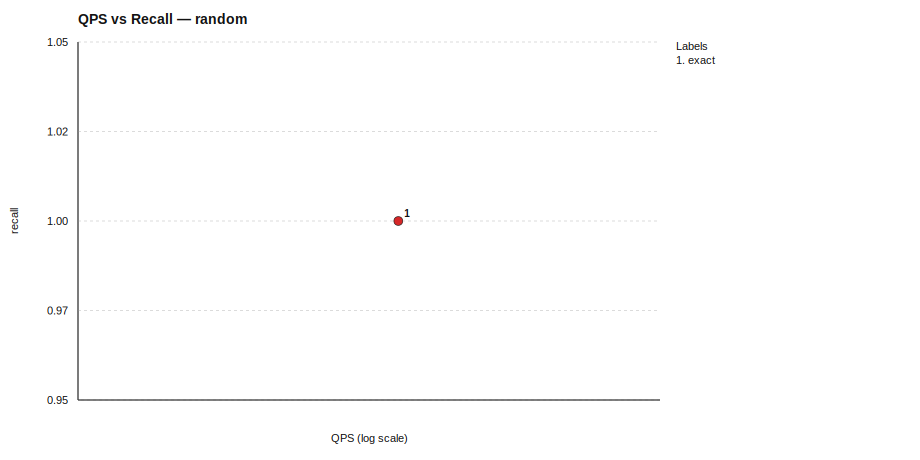

# One-Page Benchmark Summary (QPS vs Recall)

*Generated on: 2026-03-05 06:54:24*
*Run directory: `benchmark_results/benchmark_20260305_065424`*

## Dataset: random

| Algorithm | Recall | QPS | Mean Query Time (ms) | Build Time (s) | Status |
|---|---:|---:|---:|---:|---|
| exact | 1.0000 | 29576.41 | 0.034 | 0.00 | ok |

### Algorithm Implementation Details

| Algorithm | Type | Metric | Indexer | Searcher |
|---|---|---|---|---|
| exact | Composite | l2 | BruteForceIndexer (metric=l2) | LinearSearcher (metric=l2) |

### Dataset Details

- Config: `benchmark_results/benchmark_20260305_065424/random/random_config.yaml`
- metric: `l2`
- topk: `5`
- n_queries: `16`
- repeat: `1`
- seed: `42`
- dataset_options.dimensions: `16`
- dataset_options.ground_truth_k: `10`
- dataset_options.seed: `9`
- dataset_options.test_size: `32`
- dataset_options.train_size: `256`

## Brief Takeaways

- `random`: best recall `exact` (1.0000), best QPS `exact` (29576.41)
