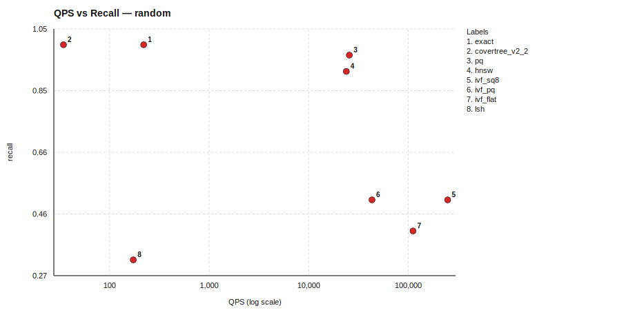
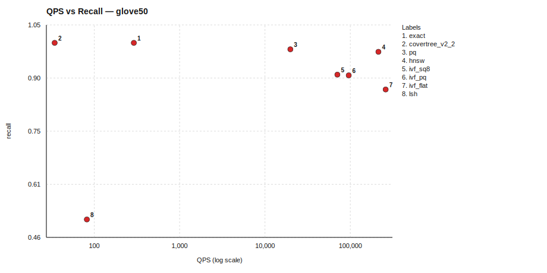
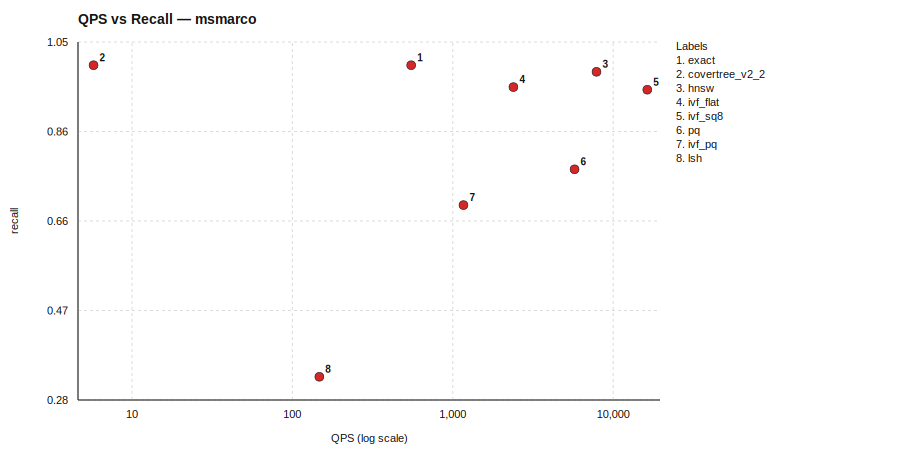

# One-Page Benchmark Summary (QPS vs Recall)

*Generated on: 2026-03-05 07:18:10*
*Run directory: `benchmark_results/benchmark_20260305_070532`*

## Dataset: random

| Algorithm | Recall | QPS | Mean Query Time (ms) | Build Time (s) | Status |
|---|---:|---:|---:|---:|---|
| exact | 1.0000 | 220.03 | 4.545 | 0.00 | ok |
| covertree_v2_2 | 1.0000 | 34.40 | 29.070 | 350.70 | ok |
| pq | 0.9672 | 25605.52 | 0.039 | 12.88 | ok |
| hnsw | 0.9156 | 23886.41 | 0.042 | 0.37 | ok |
| ivf_sq8 | 0.5090 | 248897.04 | 0.004 | 0.17 | ok |
| ivf_pq | 0.5090 | 43245.47 | 0.023 | 12.96 | ok |
| ivf_flat | 0.4105 | 111696.85 | 0.009 | 0.19 | ok |
| lsh | 0.3191 | 172.98 | 5.781 | 0.40 | ok |

### Algorithm Implementation Details

| Algorithm | Type | Metric | Indexer | Searcher |
|---|---|---|---|---|
| covertree_v2_2 | CoverTreeV2_2 | l2 | N/A | N/A |
| exact | Composite | l2 | BruteForceIndexer (metric=l2) | LinearSearcher (metric=l2) |
| hnsw | Composite | l2 | HNSWIndexer (M=16, efConstruction=200, efSearch=100, metric=l2) | FaissSearcher (metric=l2, nprobe=10) |
| ivf_flat | Composite | l2 | FaissIVFIndexer (index_type=IVF100,Flat, metric=l2, nprobe=10) | FaissSearcher (metric=l2, nprobe=10) |
| ivf_pq | Composite | l2 | FaissFactoryIndexer (index_key=IVF256,PQ64, metric=l2, nprobe=24) | FaissSearcher (metric=l2, nprobe=24) |
| ivf_sq8 | Composite | l2 | FaissFactoryIndexer (index_key=IVF256,SQ8, metric=l2, nprobe=24) | FaissSearcher (metric=l2, nprobe=24) |
| lsh | Composite | l2 | LSHIndexer (bucket_width=20, hash_size=4, metric=l2, num_tables=12, ...) | LSHSearcher (candidate_multiplier=64, fallback_to_bruteforce=False, metric=l2) |
| pq | Composite | l2 | FaissFactoryIndexer (index_key=PQ64, metric=l2) | FaissSearcher (metric=l2, nprobe=24) |

### Dataset Details

- Config: `benchmark_results/benchmark_20260305_070532/random/random_config.yaml`
- metric: `l2`
- topk: `20`
- n_queries: `256`
- repeat: `2`
- seed: `42`
- dataset_options.dimensions: `64`
- dataset_options.ground_truth_k: `200`
- dataset_options.seed: `7`
- dataset_options.test_size: `512`
- dataset_options.train_size: `20000`

## Dataset: glove50

| Algorithm | Recall | QPS | Mean Query Time (ms) | Build Time (s) | Status |
|---|---:|---:|---:|---:|---|
| exact | 1.0000 | 290.68 | 3.440 | 0.00 | ok |
| covertree_v2_2 | 1.0000 | 34.32 | 29.142 | 267.39 | ok |
| pq | 0.9820 | 19836.72 | 0.050 | 11.87 | ok |
| hnsw | 0.9750 | 213467.56 | 0.005 | 0.16 | ok |
| ivf_sq8 | 0.9113 | 70534.18 | 0.014 | 0.11 | ok |
| ivf_pq | 0.9094 | 95835.58 | 0.010 | 11.98 | ok |
| ivf_flat | 0.8699 | 259546.01 | 0.004 | 0.05 | ok |
| lsh | 0.5074 | 81.85 | 12.217 | 0.48 | ok |

### Algorithm Implementation Details

| Algorithm | Type | Metric | Indexer | Searcher |
|---|---|---|---|---|
| covertree_v2_2 | CoverTreeV2_2 | l2 | N/A | N/A |
| exact | Composite | l2 | BruteForceIndexer (metric=l2) | LinearSearcher (metric=l2) |
| hnsw | Composite | l2 | HNSWIndexer (M=16, efConstruction=200, efSearch=100, metric=l2) | FaissSearcher (metric=l2, nprobe=10) |
| ivf_flat | Composite | l2 | FaissIVFIndexer (index_type=IVF100,Flat, metric=l2, nprobe=10) | FaissSearcher (metric=l2, nprobe=10) |
| ivf_pq | Composite | l2 | FaissFactoryIndexer (index_key=IVF256,PQ50, metric=l2, nprobe=24) | FaissSearcher (metric=l2, nprobe=24) |
| ivf_sq8 | Composite | l2 | FaissFactoryIndexer (index_key=IVF256,SQ8, metric=l2, nprobe=24) | FaissSearcher (metric=l2, nprobe=24) |
| lsh | Composite | l2 | LSHIndexer (bucket_width=20, hash_size=4, metric=l2, num_tables=12, ...) | LSHSearcher (candidate_multiplier=64, fallback_to_bruteforce=False, metric=l2) |
| pq | Composite | l2 | FaissFactoryIndexer (index_key=PQ50, metric=l2) | FaissSearcher (metric=l2, nprobe=24) |

### Dataset Details

- Config: `benchmark_results/benchmark_20260305_070532/glove50/glove50_config.yaml`
- metric: `l2`
- topk: `20`
- n_queries: `256`
- repeat: `2`
- seed: `42`
- dataset_options.ground_truth_k: `200`
- dataset_options.seed: `11`
- dataset_options.test_size: `256`
- dataset_options.train_limit: `20000`

## Dataset: msmarco

| Algorithm | Recall | QPS | Mean Query Time (ms) | Build Time (s) | Status |
|---|---:|---:|---:|---:|---|
| exact | 1.0000 | 550.41 | 1.817 | 0.86 | ok |
| covertree_v2_2 | 1.0000 | 5.76 | 173.610 | 4387.85 | ok |
| hnsw | 0.9857 | 7871.56 | 0.127 | 7.96 | ok |
| ivf_flat | 0.9529 | 2387.49 | 0.419 | 0.60 | ok |
| ivf_sq8 | 0.9471 | 16321.16 | 0.061 | 2.07 | ok |
| pq | 0.7757 | 5742.81 | 0.174 | 15.97 | ok |
| ivf_pq | 0.6986 | 1165.73 | 0.858 | 18.01 | ok |
| lsh | 0.3286 | 147.29 | 6.789 | 2.78 | ok |

### Algorithm Implementation Details

| Algorithm | Type | Metric | Indexer | Searcher |
|---|---|---|---|---|
| covertree_v2_2 | CoverTreeV2_2 | cosine | N/A | N/A |
| exact | Composite | cosine | BruteForceIndexer (metric=cosine) | LinearSearcher (metric=cosine) |
| hnsw | Composite | cosine | HNSWIndexer (M=16, efConstruction=200, efSearch=100, metric=cosine) | FaissSearcher (metric=cosine, nprobe=32) |
| ivf_flat | Composite | cosine | FaissIVFIndexer (index_type=IVF100,Flat, metric=cosine, nprobe=10) | FaissSearcher (metric=cosine, nprobe=32) |
| ivf_pq | Composite | cosine | FaissFactoryIndexer (index_key=IVF256,PQ64, metric=cosine, nprobe=48) | FaissSearcher (metric=cosine, nprobe=48) |
| ivf_sq8 | Composite | cosine | FaissFactoryIndexer (index_key=IVF256,SQ8, metric=cosine, nprobe=48) | FaissSearcher (metric=cosine, nprobe=48) |
| lsh | Composite | cosine | LSHIndexer (hash_size=8, metric=cosine, num_tables=24, seed=42) | LSHSearcher (candidate_multiplier=128, fallback_to_bruteforce=False, metric=cosine) |
| pq | Composite | cosine | FaissFactoryIndexer (index_key=PQ64, metric=cosine) | FaissSearcher (metric=cosine, nprobe=48) |

### Dataset Details

- Config: `benchmark_results/benchmark_20260305_070532/msmarco/msmarco_config.yaml`
- metric: `cosine`
- topk: `20`
- n_queries: `200`
- repeat: `2`
- seed: `42`
- dataset_options.base_limit: `100000`
- dataset_options.cache_dir: `/storage/ice-shared/cs8903onl/vectordb-retrieval/results/cache`
- dataset_options.embedded_dataset_dir: `/storage/ice-shared/cs8903onl/vectordb-retrieval/datasets/msmarco_v1_embeddings`
- dataset_options.ground_truth_k: `200`
- dataset_options.query_limit: `200`
- dataset_options.use_memmap_cache: `True`
- dataset_options.use_preembedded: `True`

## Brief Takeaways

- `random`: best recall `exact` (1.0000), best QPS `ivf_sq8` (248897.04)
- `glove50`: best recall `exact` (1.0000), best QPS `ivf_flat` (259546.01)
- `msmarco`: best recall `exact` (1.0000), best QPS `ivf_sq8` (16321.16)
