# One-Page Benchmark Summary (QPS vs Recall)

*Generated on: 2026-03-18 18:47:05*
*Run directory: `benchmark_results/benchmark_20260318_182425`*

## Dataset: random

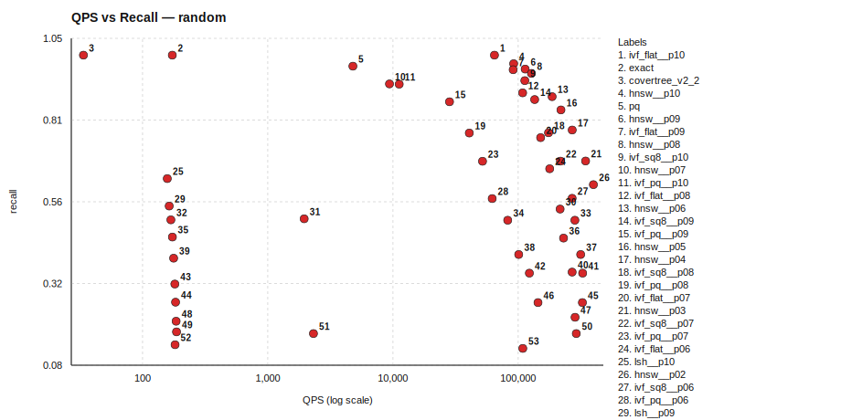

### Tradeoff Curves by Algorithm

#### covertree_v2_2 (1 points)

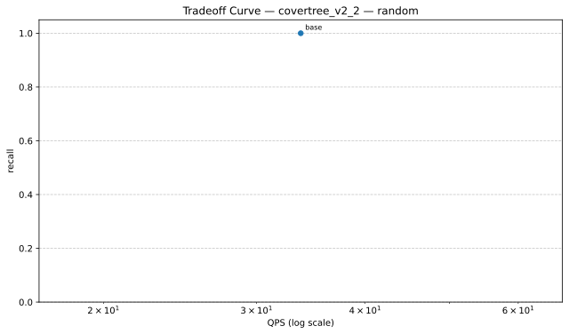

| Variant | QPS | Recall | Parameters |
|---|---:|---:|---|
| base | 33.73 | 1.0000 | baseline |

Data: `./random/tradeoff_curves/tradeoff_random_covertree_v2_2.json`

#### exact (1 points)

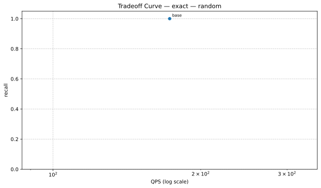

| Variant | QPS | Recall | Parameters |
|---|---:|---:|---|
| base | 172.91 | 1.0000 | baseline |

Data: `./random/tradeoff_curves/tradeoff_random_exact.json`

#### hnsw (10 points)

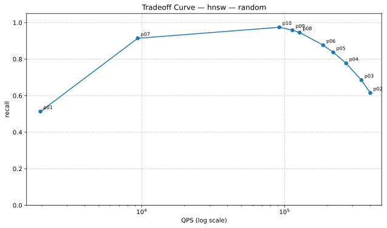

| Variant | QPS | Recall | Parameters |
|---|---:|---:|---|
| p01 | 1954.11 | 0.5133 | indexer.efSearch=16 |
| p02 | 399160.53 | 0.6148 | indexer.efSearch=24 |
| p03 | 345699.24 | 0.6852 | indexer.efSearch=32 |
| p04 | 270259.71 | 0.7773 | indexer.efSearch=48 |
| p05 | 219668.95 | 0.8371 | indexer.efSearch=64 |
| p06 | 186802.68 | 0.8766 | indexer.efSearch=80 |
| p07 | 9385.69 | 0.9145 | indexer.efSearch=100 |
| p08 | 127735.17 | 0.9457 | indexer.efSearch=128 |
| p09 | 113767.94 | 0.9586 | indexer.efSearch=160 |
| p10 | 92063.95 | 0.9746 | indexer.efSearch=200 |

Data: `./random/tradeoff_curves/tradeoff_random_hnsw.json`

#### ivf_flat (10 points)

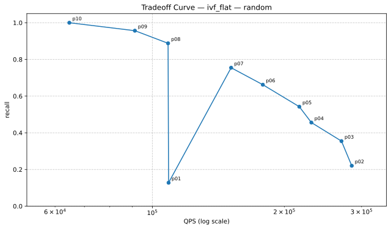

| Variant | QPS | Recall | Parameters |
|---|---:|---:|---|
| p01 | 108909.81 | 0.1277 | searcher.nprobe=2 |
| p02 | 284887.72 | 0.2203 | searcher.nprobe=4 |
| p03 | 269920.02 | 0.3547 | searcher.nprobe=8 |
| p04 | 230466.16 | 0.4559 | searcher.nprobe=12 |
| p05 | 216349.35 | 0.5422 | searcher.nprobe=16 |
| p06 | 178629.48 | 0.6621 | searcher.nprobe=24 |
| p07 | 151231.24 | 0.7547 | searcher.nprobe=32 |
| p08 | 108612.36 | 0.8879 | searcher.nprobe=48 |
| p09 | 91242.51 | 0.9566 | searcher.nprobe=64 |
| p10 | 64683.24 | 1.0000 | searcher.nprobe=96 |

Data: `./random/tradeoff_curves/tradeoff_random_ivf_flat.json`

#### ivf_pq (10 points)

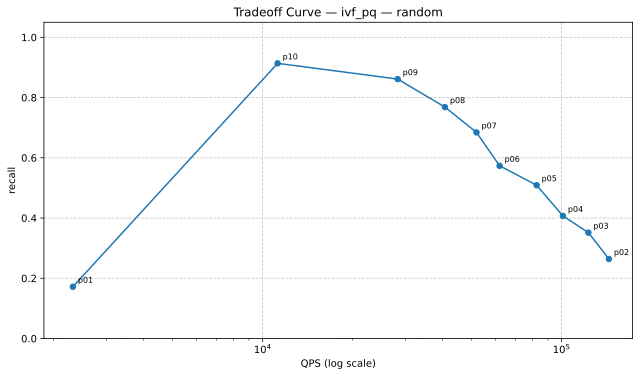

| Variant | QPS | Recall | Parameters |
|---|---:|---:|---|
| p01 | 2318.35 | 0.1719 | searcher.nprobe=4 |
| p02 | 144049.08 | 0.2641 | searcher.nprobe=8 |
| p03 | 122966.31 | 0.3516 | searcher.nprobe=12 |
| p04 | 101039.03 | 0.4070 | searcher.nprobe=16 |
| p05 | 82532.04 | 0.5090 | searcher.nprobe=24 |
| p06 | 62044.48 | 0.5734 | searcher.nprobe=32 |
| p07 | 51941.85 | 0.6844 | searcher.nprobe=48 |
| p08 | 40722.94 | 0.7684 | searcher.nprobe=64 |
| p09 | 28306.27 | 0.8613 | searcher.nprobe=96 |
| p10 | 11222.57 | 0.9137 | searcher.nprobe=128 |

Data: `./random/tradeoff_curves/tradeoff_random_ivf_pq.json`

#### ivf_sq8 (10 points)

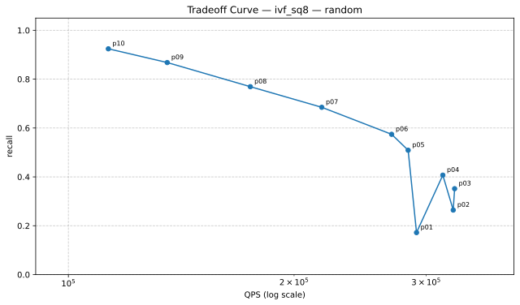

| Variant | QPS | Recall | Parameters |
|---|---:|---:|---|
| p01 | 291302.72 | 0.1719 | searcher.nprobe=4 |
| p02 | 326067.97 | 0.2641 | searcher.nprobe=8 |
| p03 | 327460.15 | 0.3516 | searcher.nprobe=12 |
| p04 | 315806.42 | 0.4070 | searcher.nprobe=16 |
| p05 | 283908.47 | 0.5090 | searcher.nprobe=24 |
| p06 | 269852.18 | 0.5742 | searcher.nprobe=32 |
| p07 | 217753.36 | 0.6848 | searcher.nprobe=48 |
| p08 | 174848.04 | 0.7691 | searcher.nprobe=64 |
| p09 | 135470.83 | 0.8680 | searcher.nprobe=96 |
| p10 | 113061.16 | 0.9242 | searcher.nprobe=128 |

Data: `./random/tradeoff_curves/tradeoff_random_ivf_sq8.json`

#### lsh (10 points)

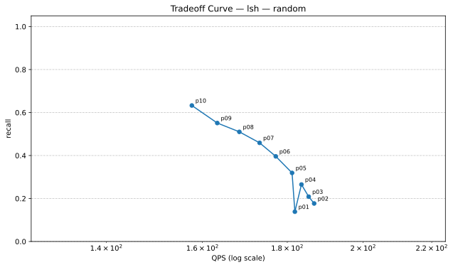

| Variant | QPS | Recall | Parameters |
|---|---:|---:|---|
| p01 | 181.91 | 0.1387 | searcher.candidate_multiplier=16 |
| p02 | 186.85 | 0.1770 | searcher.candidate_multiplier=24 |
| p03 | 185.44 | 0.2086 | searcher.candidate_multiplier=32 |
| p04 | 183.58 | 0.2652 | searcher.candidate_multiplier=48 |
| p05 | 181.20 | 0.3191 | searcher.candidate_multiplier=64 |
| p06 | 177.15 | 0.3961 | searcher.candidate_multiplier=96 |
| p07 | 173.22 | 0.4590 | searcher.candidate_multiplier=128 |
| p08 | 168.41 | 0.5102 | searcher.candidate_multiplier=160 |
| p09 | 163.32 | 0.5512 | searcher.candidate_multiplier=192 |
| p10 | 157.66 | 0.6328 | searcher.candidate_multiplier=256 |

Data: `./random/tradeoff_curves/tradeoff_random_lsh.json`

#### pq (1 points)

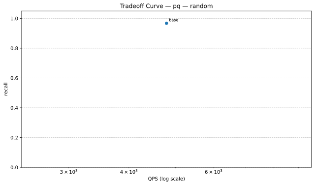

| Variant | QPS | Recall | Parameters |
|---|---:|---:|---|
| base | 4788.06 | 0.9672 | baseline |

Data: `./random/tradeoff_curves/tradeoff_random_pq.json`

| Algorithm | Recall | QPS | Mean Query Time (ms) | Build Time (s) | Status |
|---|---:|---:|---:|---:|---|
| ivf_flat__p10 | 1.0000 | 64683.24 | 0.015 | 0.05 | ok |
| exact | 1.0000 | 172.91 | 5.783 | 0.00 | ok |
| covertree_v2_2 | 1.0000 | 33.73 | 29.649 | 357.37 | ok |
| hnsw__p10 | 0.9746 | 92063.95 | 0.011 | 0.26 | ok |
| pq | 0.9672 | 4788.06 | 0.209 | 13.21 | ok |
| hnsw__p09 | 0.9586 | 113767.94 | 0.009 | 0.26 | ok |
| ivf_flat__p09 | 0.9566 | 91242.51 | 0.011 | 0.05 | ok |
| hnsw__p08 | 0.9457 | 127735.17 | 0.008 | 0.35 | ok |
| ivf_sq8__p10 | 0.9242 | 113061.16 | 0.009 | 0.11 | ok |
| hnsw__p07 | 0.9145 | 9385.69 | 0.107 | 0.38 | ok |
| ivf_pq__p10 | 0.9137 | 11222.57 | 0.089 | 13.19 | ok |
| ivf_flat__p08 | 0.8879 | 108612.36 | 0.009 | 0.05 | ok |
| hnsw__p06 | 0.8766 | 186802.68 | 0.005 | 0.27 | ok |
| ivf_sq8__p09 | 0.8680 | 135470.83 | 0.007 | 0.11 | ok |
| ivf_pq__p09 | 0.8613 | 28306.27 | 0.035 | 13.35 | ok |
| hnsw__p05 | 0.8371 | 219668.95 | 0.005 | 0.27 | ok |
| hnsw__p04 | 0.7773 | 270259.71 | 0.004 | 0.27 | ok |
| ivf_sq8__p08 | 0.7691 | 174848.04 | 0.006 | 0.11 | ok |
| ivf_pq__p08 | 0.7684 | 40722.94 | 0.025 | 13.20 | ok |
| ivf_flat__p07 | 0.7547 | 151231.24 | 0.007 | 0.05 | ok |
| hnsw__p03 | 0.6852 | 345699.24 | 0.003 | 0.26 | ok |
| ivf_sq8__p07 | 0.6848 | 217753.36 | 0.005 | 0.11 | ok |
| ivf_pq__p07 | 0.6844 | 51941.85 | 0.019 | 13.24 | ok |
| ivf_flat__p06 | 0.6621 | 178629.48 | 0.006 | 0.05 | ok |
| lsh__p10 | 0.6328 | 157.66 | 6.343 | 0.28 | ok |
| hnsw__p02 | 0.6148 | 399160.53 | 0.003 | 0.27 | ok |
| ivf_sq8__p06 | 0.5742 | 269852.18 | 0.004 | 0.11 | ok |
| ivf_pq__p06 | 0.5734 | 62044.48 | 0.016 | 12.74 | ok |
| lsh__p09 | 0.5512 | 163.32 | 6.123 | 0.28 | ok |
| ivf_flat__p05 | 0.5422 | 216349.35 | 0.005 | 0.05 | ok |
| hnsw__p01 | 0.5133 | 1954.11 | 0.512 | 0.55 | ok |
| lsh__p08 | 0.5102 | 168.41 | 5.938 | 0.28 | ok |
| ivf_sq8__p05 | 0.5090 | 283908.47 | 0.004 | 0.11 | ok |
| ivf_pq__p05 | 0.5090 | 82532.04 | 0.012 | 12.83 | ok |
| lsh__p07 | 0.4590 | 173.22 | 5.773 | 0.28 | ok |
| ivf_flat__p04 | 0.4559 | 230466.16 | 0.004 | 0.05 | ok |
| ivf_sq8__p04 | 0.4070 | 315806.42 | 0.003 | 0.11 | ok |
| ivf_pq__p04 | 0.4070 | 101039.03 | 0.010 | 13.10 | ok |
| lsh__p06 | 0.3961 | 177.15 | 5.645 | 0.28 | ok |
| ivf_flat__p03 | 0.3547 | 269920.02 | 0.004 | 0.05 | ok |
| ivf_sq8__p03 | 0.3516 | 327460.15 | 0.003 | 0.11 | ok |
| ivf_pq__p03 | 0.3516 | 122966.31 | 0.008 | 13.03 | ok |
| lsh__p05 | 0.3191 | 181.20 | 5.519 | 0.28 | ok |
| lsh__p04 | 0.2652 | 183.58 | 5.447 | 0.28 | ok |
| ivf_sq8__p02 | 0.2641 | 326067.97 | 0.003 | 0.11 | ok |
| ivf_pq__p02 | 0.2641 | 144049.08 | 0.007 | 12.80 | ok |
| ivf_flat__p02 | 0.2203 | 284887.72 | 0.004 | 0.05 | ok |
| lsh__p03 | 0.2086 | 185.44 | 5.393 | 0.28 | ok |
| lsh__p02 | 0.1770 | 186.85 | 5.352 | 0.28 | ok |
| ivf_sq8__p01 | 0.1719 | 291302.72 | 0.003 | 0.24 | ok |
| ivf_pq__p01 | 0.1719 | 2318.35 | 0.431 | 12.94 | ok |
| lsh__p01 | 0.1387 | 181.91 | 5.497 | 0.40 | ok |
| ivf_flat__p01 | 0.1277 | 108909.81 | 0.009 | 0.35 | ok |

### Algorithm Implementation Details

| Algorithm | Type | Metric | Indexer | Searcher |
|---|---|---|---|---|
| covertree_v2_2 | CoverTreeV2_2 | l2 | N/A | N/A |
| exact | Composite | l2 | BruteForceIndexer (metric=l2) | LinearSearcher (metric=l2) |
| hnsw__p01 | Composite | l2 | HNSWIndexer (M=16, efConstruction=200, efSearch=16, metric=l2) | FaissSearcher (metric=l2, nprobe=10) |
| hnsw__p02 | Composite | l2 | HNSWIndexer (M=16, efConstruction=200, efSearch=24, metric=l2) | FaissSearcher (metric=l2, nprobe=10) |
| hnsw__p03 | Composite | l2 | HNSWIndexer (M=16, efConstruction=200, efSearch=32, metric=l2) | FaissSearcher (metric=l2, nprobe=10) |
| hnsw__p04 | Composite | l2 | HNSWIndexer (M=16, efConstruction=200, efSearch=48, metric=l2) | FaissSearcher (metric=l2, nprobe=10) |
| hnsw__p05 | Composite | l2 | HNSWIndexer (M=16, efConstruction=200, efSearch=64, metric=l2) | FaissSearcher (metric=l2, nprobe=10) |
| hnsw__p06 | Composite | l2 | HNSWIndexer (M=16, efConstruction=200, efSearch=80, metric=l2) | FaissSearcher (metric=l2, nprobe=10) |
| hnsw__p07 | Composite | l2 | HNSWIndexer (M=16, efConstruction=200, efSearch=100, metric=l2) | FaissSearcher (metric=l2, nprobe=10) |
| hnsw__p08 | Composite | l2 | HNSWIndexer (M=16, efConstruction=200, efSearch=128, metric=l2) | FaissSearcher (metric=l2, nprobe=10) |
| hnsw__p09 | Composite | l2 | HNSWIndexer (M=16, efConstruction=200, efSearch=160, metric=l2) | FaissSearcher (metric=l2, nprobe=10) |
| hnsw__p10 | Composite | l2 | HNSWIndexer (M=16, efConstruction=200, efSearch=200, metric=l2) | FaissSearcher (metric=l2, nprobe=10) |
| ivf_flat__p01 | Composite | l2 | FaissIVFIndexer (index_type=IVF100,Flat, metric=l2, nprobe=10) | FaissSearcher (metric=l2, nprobe=2) |
| ivf_flat__p02 | Composite | l2 | FaissIVFIndexer (index_type=IVF100,Flat, metric=l2, nprobe=10) | FaissSearcher (metric=l2, nprobe=4) |
| ivf_flat__p03 | Composite | l2 | FaissIVFIndexer (index_type=IVF100,Flat, metric=l2, nprobe=10) | FaissSearcher (metric=l2, nprobe=8) |
| ivf_flat__p04 | Composite | l2 | FaissIVFIndexer (index_type=IVF100,Flat, metric=l2, nprobe=10) | FaissSearcher (metric=l2, nprobe=12) |
| ivf_flat__p05 | Composite | l2 | FaissIVFIndexer (index_type=IVF100,Flat, metric=l2, nprobe=10) | FaissSearcher (metric=l2, nprobe=16) |
| ivf_flat__p06 | Composite | l2 | FaissIVFIndexer (index_type=IVF100,Flat, metric=l2, nprobe=10) | FaissSearcher (metric=l2, nprobe=24) |
| ivf_flat__p07 | Composite | l2 | FaissIVFIndexer (index_type=IVF100,Flat, metric=l2, nprobe=10) | FaissSearcher (metric=l2, nprobe=32) |
| ivf_flat__p08 | Composite | l2 | FaissIVFIndexer (index_type=IVF100,Flat, metric=l2, nprobe=10) | FaissSearcher (metric=l2, nprobe=48) |
| ivf_flat__p09 | Composite | l2 | FaissIVFIndexer (index_type=IVF100,Flat, metric=l2, nprobe=10) | FaissSearcher (metric=l2, nprobe=64) |
| ivf_flat__p10 | Composite | l2 | FaissIVFIndexer (index_type=IVF100,Flat, metric=l2, nprobe=10) | FaissSearcher (metric=l2, nprobe=96) |
| ivf_pq__p01 | Composite | l2 | FaissFactoryIndexer (index_key=IVF256,PQ64, metric=l2, nprobe=24) | FaissSearcher (metric=l2, nprobe=4) |
| ivf_pq__p02 | Composite | l2 | FaissFactoryIndexer (index_key=IVF256,PQ64, metric=l2, nprobe=24) | FaissSearcher (metric=l2, nprobe=8) |
| ivf_pq__p03 | Composite | l2 | FaissFactoryIndexer (index_key=IVF256,PQ64, metric=l2, nprobe=24) | FaissSearcher (metric=l2, nprobe=12) |
| ivf_pq__p04 | Composite | l2 | FaissFactoryIndexer (index_key=IVF256,PQ64, metric=l2, nprobe=24) | FaissSearcher (metric=l2, nprobe=16) |
| ivf_pq__p05 | Composite | l2 | FaissFactoryIndexer (index_key=IVF256,PQ64, metric=l2, nprobe=24) | FaissSearcher (metric=l2, nprobe=24) |
| ivf_pq__p06 | Composite | l2 | FaissFactoryIndexer (index_key=IVF256,PQ64, metric=l2, nprobe=24) | FaissSearcher (metric=l2, nprobe=32) |
| ivf_pq__p07 | Composite | l2 | FaissFactoryIndexer (index_key=IVF256,PQ64, metric=l2, nprobe=24) | FaissSearcher (metric=l2, nprobe=48) |
| ivf_pq__p08 | Composite | l2 | FaissFactoryIndexer (index_key=IVF256,PQ64, metric=l2, nprobe=24) | FaissSearcher (metric=l2, nprobe=64) |
| ivf_pq__p09 | Composite | l2 | FaissFactoryIndexer (index_key=IVF256,PQ64, metric=l2, nprobe=24) | FaissSearcher (metric=l2, nprobe=96) |
| ivf_pq__p10 | Composite | l2 | FaissFactoryIndexer (index_key=IVF256,PQ64, metric=l2, nprobe=24) | FaissSearcher (metric=l2, nprobe=128) |
| ivf_sq8__p01 | Composite | l2 | FaissFactoryIndexer (index_key=IVF256,SQ8, metric=l2, nprobe=24) | FaissSearcher (metric=l2, nprobe=4) |
| ivf_sq8__p02 | Composite | l2 | FaissFactoryIndexer (index_key=IVF256,SQ8, metric=l2, nprobe=24) | FaissSearcher (metric=l2, nprobe=8) |
| ivf_sq8__p03 | Composite | l2 | FaissFactoryIndexer (index_key=IVF256,SQ8, metric=l2, nprobe=24) | FaissSearcher (metric=l2, nprobe=12) |
| ivf_sq8__p04 | Composite | l2 | FaissFactoryIndexer (index_key=IVF256,SQ8, metric=l2, nprobe=24) | FaissSearcher (metric=l2, nprobe=16) |
| ivf_sq8__p05 | Composite | l2 | FaissFactoryIndexer (index_key=IVF256,SQ8, metric=l2, nprobe=24) | FaissSearcher (metric=l2, nprobe=24) |
| ivf_sq8__p06 | Composite | l2 | FaissFactoryIndexer (index_key=IVF256,SQ8, metric=l2, nprobe=24) | FaissSearcher (metric=l2, nprobe=32) |
| ivf_sq8__p07 | Composite | l2 | FaissFactoryIndexer (index_key=IVF256,SQ8, metric=l2, nprobe=24) | FaissSearcher (metric=l2, nprobe=48) |
| ivf_sq8__p08 | Composite | l2 | FaissFactoryIndexer (index_key=IVF256,SQ8, metric=l2, nprobe=24) | FaissSearcher (metric=l2, nprobe=64) |
| ivf_sq8__p09 | Composite | l2 | FaissFactoryIndexer (index_key=IVF256,SQ8, metric=l2, nprobe=24) | FaissSearcher (metric=l2, nprobe=96) |
| ivf_sq8__p10 | Composite | l2 | FaissFactoryIndexer (index_key=IVF256,SQ8, metric=l2, nprobe=24) | FaissSearcher (metric=l2, nprobe=128) |
| lsh__p01 | Composite | l2 | LSHIndexer (bucket_width=20, hash_size=4, metric=l2, num_tables=12, ...) | LSHSearcher (candidate_multiplier=16, fallback_to_bruteforce=False, metric=l2) |
| lsh__p02 | Composite | l2 | LSHIndexer (bucket_width=20, hash_size=4, metric=l2, num_tables=12, ...) | LSHSearcher (candidate_multiplier=24, fallback_to_bruteforce=False, metric=l2) |
| lsh__p03 | Composite | l2 | LSHIndexer (bucket_width=20, hash_size=4, metric=l2, num_tables=12, ...) | LSHSearcher (candidate_multiplier=32, fallback_to_bruteforce=False, metric=l2) |
| lsh__p04 | Composite | l2 | LSHIndexer (bucket_width=20, hash_size=4, metric=l2, num_tables=12, ...) | LSHSearcher (candidate_multiplier=48, fallback_to_bruteforce=False, metric=l2) |
| lsh__p05 | Composite | l2 | LSHIndexer (bucket_width=20, hash_size=4, metric=l2, num_tables=12, ...) | LSHSearcher (candidate_multiplier=64, fallback_to_bruteforce=False, metric=l2) |
| lsh__p06 | Composite | l2 | LSHIndexer (bucket_width=20, hash_size=4, metric=l2, num_tables=12, ...) | LSHSearcher (candidate_multiplier=96, fallback_to_bruteforce=False, metric=l2) |
| lsh__p07 | Composite | l2 | LSHIndexer (bucket_width=20, hash_size=4, metric=l2, num_tables=12, ...) | LSHSearcher (candidate_multiplier=128, fallback_to_bruteforce=False, metric=l2) |
| lsh__p08 | Composite | l2 | LSHIndexer (bucket_width=20, hash_size=4, metric=l2, num_tables=12, ...) | LSHSearcher (candidate_multiplier=160, fallback_to_bruteforce=False, metric=l2) |
| lsh__p09 | Composite | l2 | LSHIndexer (bucket_width=20, hash_size=4, metric=l2, num_tables=12, ...) | LSHSearcher (candidate_multiplier=192, fallback_to_bruteforce=False, metric=l2) |
| lsh__p10 | Composite | l2 | LSHIndexer (bucket_width=20, hash_size=4, metric=l2, num_tables=12, ...) | LSHSearcher (candidate_multiplier=256, fallback_to_bruteforce=False, metric=l2) |
| pq | Composite | l2 | FaissFactoryIndexer (index_key=PQ64, metric=l2) | FaissSearcher (metric=l2, nprobe=24) |

### Dataset Details

- Config: `benchmark_results/benchmark_20260318_182425/random/random_config.yaml`
- metric: `l2`
- topk: `20`
- n_queries: `256`
- repeat: `2`
- seed: `42`
- dataset_options.dimensions: `64`
- dataset_options.ground_truth_k: `200`
- dataset_options.seed: `7`
- dataset_options.test_size: `512`
- dataset_options.train_size: `20000`

## Dataset: glove50

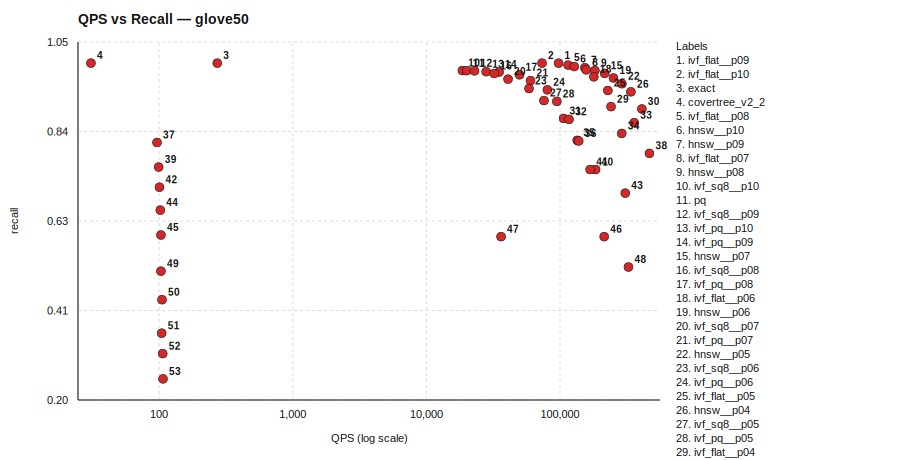

### Tradeoff Curves by Algorithm

#### covertree_v2_2 (1 points)

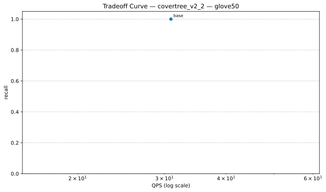

| Variant | QPS | Recall | Parameters |
|---|---:|---:|---|
| base | 30.91 | 1.0000 | baseline |

Data: `./glove50/tradeoff_curves/tradeoff_glove50_covertree_v2_2.json`

#### exact (1 points)

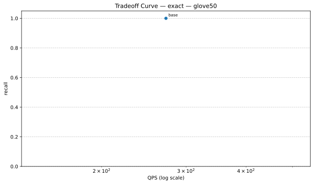

| Variant | QPS | Recall | Parameters |
|---|---:|---:|---|
| base | 272.46 | 1.0000 | baseline |

Data: `./glove50/tradeoff_curves/tradeoff_glove50_exact.json`

#### hnsw (10 points)

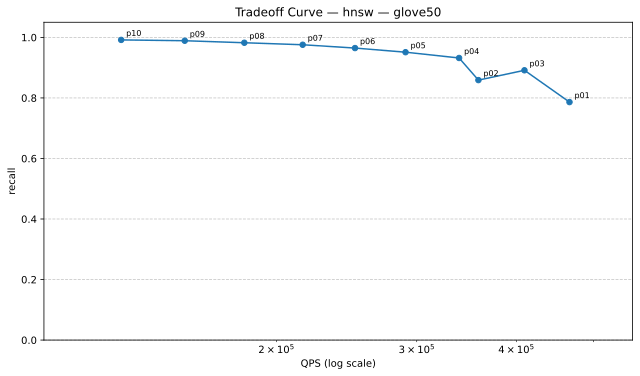

| Variant | QPS | Recall | Parameters |
|---|---:|---:|---|
| p01 | 466438.67 | 0.7863 | indexer.efSearch=16 |
| p02 | 358511.46 | 0.8590 | indexer.efSearch=24 |
| p03 | 409512.52 | 0.8914 | indexer.efSearch=32 |
| p04 | 339040.68 | 0.9320 | indexer.efSearch=48 |
| p05 | 290435.98 | 0.9512 | indexer.efSearch=64 |
| p06 | 250991.54 | 0.9648 | indexer.efSearch=80 |
| p07 | 215784.13 | 0.9758 | indexer.efSearch=100 |
| p08 | 182299.12 | 0.9824 | indexer.efSearch=128 |
| p09 | 153479.39 | 0.9891 | indexer.efSearch=160 |
| p10 | 127719.97 | 0.9918 | indexer.efSearch=200 |

Data: `./glove50/tradeoff_curves/tradeoff_glove50_hnsw.json`

#### ivf_flat (10 points)

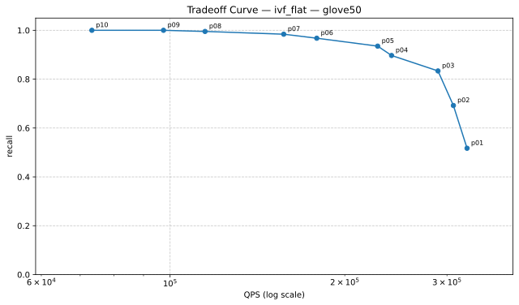

| Variant | QPS | Recall | Parameters |
|---|---:|---:|---|
| p01 | 324884.06 | 0.5172 | searcher.nprobe=2 |
| p02 | 307750.59 | 0.6922 | searcher.nprobe=4 |
| p03 | 289496.31 | 0.8336 | searcher.nprobe=8 |
| p04 | 240803.28 | 0.8969 | searcher.nprobe=12 |
| p05 | 227873.90 | 0.9352 | searcher.nprobe=16 |
| p06 | 178956.97 | 0.9676 | searcher.nprobe=24 |
| p07 | 156979.80 | 0.9840 | searcher.nprobe=32 |
| p08 | 114887.85 | 0.9953 | searcher.nprobe=48 |
| p09 | 97426.90 | 1.0000 | searcher.nprobe=64 |
| p10 | 73322.99 | 1.0000 | searcher.nprobe=96 |

Data: `./glove50/tradeoff_curves/tradeoff_glove50_ivf_flat.json`

#### ivf_pq (10 points)

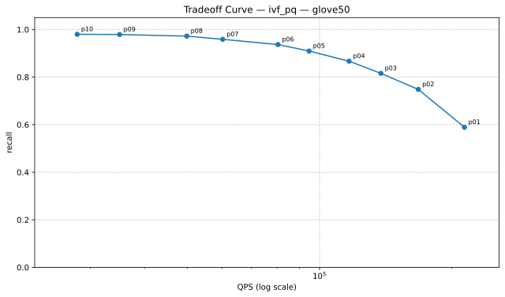

| Variant | QPS | Recall | Parameters |
|---|---:|---:|---|
| p01 | 213978.04 | 0.5891 | searcher.nprobe=4 |
| p02 | 167955.86 | 0.7480 | searcher.nprobe=8 |
| p03 | 137977.62 | 0.8156 | searcher.nprobe=12 |
| p04 | 116761.83 | 0.8668 | searcher.nprobe=16 |
| p05 | 94652.84 | 0.9094 | searcher.nprobe=24 |
| p06 | 80393.97 | 0.9367 | searcher.nprobe=32 |
| p07 | 60143.50 | 0.9586 | searcher.nprobe=48 |
| p08 | 49802.50 | 0.9723 | searcher.nprobe=64 |
| p09 | 35008.37 | 0.9789 | searcher.nprobe=96 |
| p10 | 28016.02 | 0.9797 | searcher.nprobe=128 |

Data: `./glove50/tradeoff_curves/tradeoff_glove50_ivf_pq.json`

#### ivf_sq8 (10 points)

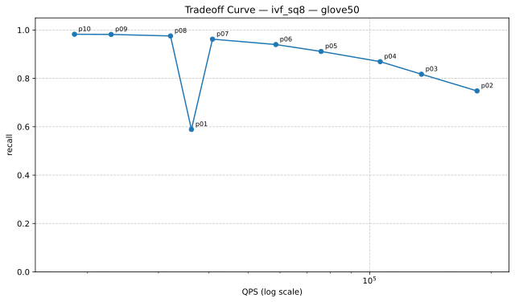

| Variant | QPS | Recall | Parameters |
|---|---:|---:|---|
| p01 | 36204.12 | 0.5891 | searcher.nprobe=4 |
| p02 | 184555.14 | 0.7480 | searcher.nprobe=8 |
| p03 | 134419.36 | 0.8172 | searcher.nprobe=12 |
| p04 | 106216.42 | 0.8691 | searcher.nprobe=16 |
| p05 | 75839.94 | 0.9113 | searcher.nprobe=24 |
| p06 | 58594.37 | 0.9398 | searcher.nprobe=32 |
| p07 | 40826.69 | 0.9621 | searcher.nprobe=48 |
| p08 | 32134.49 | 0.9754 | searcher.nprobe=64 |
| p09 | 22905.03 | 0.9816 | searcher.nprobe=96 |
| p10 | 18586.82 | 0.9824 | searcher.nprobe=128 |

Data: `./glove50/tradeoff_curves/tradeoff_glove50_ivf_sq8.json`

#### lsh (10 points)

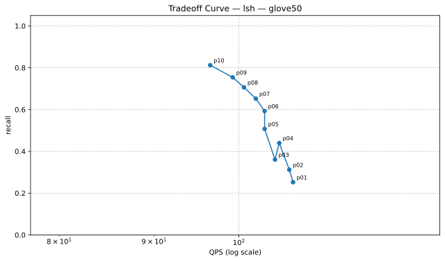

| Variant | QPS | Recall | Parameters |
|---|---:|---:|---|
| p01 | 106.96 | 0.2523 | searcher.candidate_multiplier=16 |
| p02 | 106.46 | 0.3121 | searcher.candidate_multiplier=24 |
| p03 | 104.59 | 0.3605 | searcher.candidate_multiplier=32 |
| p04 | 105.14 | 0.4398 | searcher.candidate_multiplier=48 |
| p05 | 103.25 | 0.5074 | searcher.candidate_multiplier=64 |
| p06 | 103.24 | 0.5930 | searcher.candidate_multiplier=96 |
| p07 | 102.13 | 0.6520 | searcher.candidate_multiplier=128 |
| p08 | 100.64 | 0.7063 | searcher.candidate_multiplier=160 |
| p09 | 99.23 | 0.7539 | searcher.candidate_multiplier=192 |
| p10 | 96.50 | 0.8121 | searcher.candidate_multiplier=256 |

Data: `./glove50/tradeoff_curves/tradeoff_glove50_lsh.json`

#### pq (1 points)

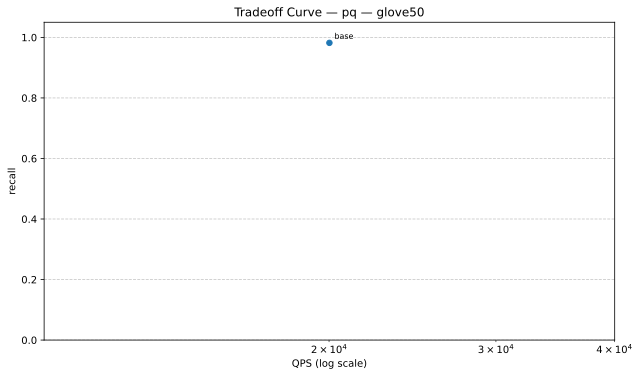

| Variant | QPS | Recall | Parameters |
|---|---:|---:|---|
| base | 20017.56 | 0.9820 | baseline |

Data: `./glove50/tradeoff_curves/tradeoff_glove50_pq.json`

| Algorithm | Recall | QPS | Mean Query Time (ms) | Build Time (s) | Status |
|---|---:|---:|---:|---:|---|
| ivf_flat__p09 | 1.0000 | 97426.90 | 0.010 | 0.04 | ok |
| ivf_flat__p10 | 1.0000 | 73322.99 | 0.014 | 0.04 | ok |
| exact | 1.0000 | 272.46 | 3.670 | 0.00 | ok |
| covertree_v2_2 | 1.0000 | 30.91 | 32.348 | 285.69 | ok |
| ivf_flat__p08 | 0.9953 | 114887.85 | 0.009 | 0.04 | ok |
| hnsw__p10 | 0.9918 | 127719.97 | 0.008 | 0.16 | ok |
| hnsw__p09 | 0.9891 | 153479.39 | 0.007 | 0.16 | ok |
| ivf_flat__p07 | 0.9840 | 156979.80 | 0.006 | 0.04 | ok |
| hnsw__p08 | 0.9824 | 182299.12 | 0.005 | 0.16 | ok |
| ivf_sq8__p10 | 0.9824 | 18586.82 | 0.054 | 0.10 | ok |
| pq | 0.9820 | 20017.56 | 0.050 | 11.98 | ok |
| ivf_sq8__p09 | 0.9816 | 22905.03 | 0.044 | 0.10 | ok |
| ivf_pq__p10 | 0.9797 | 28016.02 | 0.036 | 12.36 | ok |
| ivf_pq__p09 | 0.9789 | 35008.37 | 0.029 | 12.30 | ok |
| hnsw__p07 | 0.9758 | 215784.13 | 0.005 | 0.16 | ok |
| ivf_sq8__p08 | 0.9754 | 32134.49 | 0.031 | 0.10 | ok |
| ivf_pq__p08 | 0.9723 | 49802.50 | 0.020 | 12.31 | ok |
| ivf_flat__p06 | 0.9676 | 178956.97 | 0.006 | 0.04 | ok |
| hnsw__p06 | 0.9648 | 250991.54 | 0.004 | 0.16 | ok |
| ivf_sq8__p07 | 0.9621 | 40826.69 | 0.024 | 0.10 | ok |
| ivf_pq__p07 | 0.9586 | 60143.50 | 0.017 | 12.43 | ok |
| hnsw__p05 | 0.9512 | 290435.98 | 0.003 | 0.16 | ok |
| ivf_sq8__p06 | 0.9398 | 58594.37 | 0.017 | 0.10 | ok |
| ivf_pq__p06 | 0.9367 | 80393.97 | 0.012 | 12.34 | ok |
| ivf_flat__p05 | 0.9352 | 227873.90 | 0.004 | 0.04 | ok |
| hnsw__p04 | 0.9320 | 339040.68 | 0.003 | 0.16 | ok |
| ivf_sq8__p05 | 0.9113 | 75839.94 | 0.013 | 0.10 | ok |
| ivf_pq__p05 | 0.9094 | 94652.84 | 0.011 | 12.33 | ok |
| ivf_flat__p04 | 0.8969 | 240803.28 | 0.004 | 0.04 | ok |
| hnsw__p03 | 0.8914 | 409512.52 | 0.002 | 0.16 | ok |
| ivf_sq8__p04 | 0.8691 | 106216.42 | 0.009 | 0.10 | ok |
| ivf_pq__p04 | 0.8668 | 116761.83 | 0.009 | 12.34 | ok |
| hnsw__p02 | 0.8590 | 358511.46 | 0.003 | 0.16 | ok |
| ivf_flat__p03 | 0.8336 | 289496.31 | 0.003 | 0.04 | ok |
| ivf_sq8__p03 | 0.8172 | 134419.36 | 0.007 | 0.10 | ok |
| ivf_pq__p03 | 0.8156 | 137977.62 | 0.007 | 12.36 | ok |
| lsh__p10 | 0.8121 | 96.50 | 10.363 | 0.27 | ok |
| hnsw__p01 | 0.7863 | 466438.67 | 0.002 | 0.16 | ok |
| lsh__p09 | 0.7539 | 99.23 | 10.077 | 0.28 | ok |
| ivf_sq8__p02 | 0.7480 | 184555.14 | 0.005 | 0.10 | ok |
| ivf_pq__p02 | 0.7480 | 167955.86 | 0.006 | 12.37 | ok |
| lsh__p08 | 0.7063 | 100.64 | 9.937 | 0.27 | ok |
| ivf_flat__p02 | 0.6922 | 307750.59 | 0.003 | 0.04 | ok |
| lsh__p07 | 0.6520 | 102.13 | 9.792 | 0.28 | ok |
| lsh__p06 | 0.5930 | 103.24 | 9.686 | 0.27 | ok |
| ivf_pq__p01 | 0.5891 | 213978.04 | 0.005 | 12.42 | ok |
| ivf_sq8__p01 | 0.5891 | 36204.12 | 0.028 | 0.10 | ok |
| ivf_flat__p01 | 0.5172 | 324884.06 | 0.003 | 0.04 | ok |
| lsh__p05 | 0.5074 | 103.25 | 9.685 | 0.27 | ok |
| lsh__p04 | 0.4398 | 105.14 | 9.511 | 0.27 | ok |
| lsh__p03 | 0.3605 | 104.59 | 9.561 | 0.27 | ok |
| lsh__p02 | 0.3121 | 106.46 | 9.393 | 0.27 | ok |
| lsh__p01 | 0.2523 | 106.96 | 9.349 | 0.41 | ok |

### Algorithm Implementation Details

| Algorithm | Type | Metric | Indexer | Searcher |
|---|---|---|---|---|
| covertree_v2_2 | CoverTreeV2_2 | l2 | N/A | N/A |
| exact | Composite | l2 | BruteForceIndexer (metric=l2) | LinearSearcher (metric=l2) |
| hnsw__p01 | Composite | l2 | HNSWIndexer (M=16, efConstruction=200, efSearch=16, metric=l2) | FaissSearcher (metric=l2, nprobe=10) |
| hnsw__p02 | Composite | l2 | HNSWIndexer (M=16, efConstruction=200, efSearch=24, metric=l2) | FaissSearcher (metric=l2, nprobe=10) |
| hnsw__p03 | Composite | l2 | HNSWIndexer (M=16, efConstruction=200, efSearch=32, metric=l2) | FaissSearcher (metric=l2, nprobe=10) |
| hnsw__p04 | Composite | l2 | HNSWIndexer (M=16, efConstruction=200, efSearch=48, metric=l2) | FaissSearcher (metric=l2, nprobe=10) |
| hnsw__p05 | Composite | l2 | HNSWIndexer (M=16, efConstruction=200, efSearch=64, metric=l2) | FaissSearcher (metric=l2, nprobe=10) |
| hnsw__p06 | Composite | l2 | HNSWIndexer (M=16, efConstruction=200, efSearch=80, metric=l2) | FaissSearcher (metric=l2, nprobe=10) |
| hnsw__p07 | Composite | l2 | HNSWIndexer (M=16, efConstruction=200, efSearch=100, metric=l2) | FaissSearcher (metric=l2, nprobe=10) |
| hnsw__p08 | Composite | l2 | HNSWIndexer (M=16, efConstruction=200, efSearch=128, metric=l2) | FaissSearcher (metric=l2, nprobe=10) |
| hnsw__p09 | Composite | l2 | HNSWIndexer (M=16, efConstruction=200, efSearch=160, metric=l2) | FaissSearcher (metric=l2, nprobe=10) |
| hnsw__p10 | Composite | l2 | HNSWIndexer (M=16, efConstruction=200, efSearch=200, metric=l2) | FaissSearcher (metric=l2, nprobe=10) |
| ivf_flat__p01 | Composite | l2 | FaissIVFIndexer (index_type=IVF100,Flat, metric=l2, nprobe=10) | FaissSearcher (metric=l2, nprobe=2) |
| ivf_flat__p02 | Composite | l2 | FaissIVFIndexer (index_type=IVF100,Flat, metric=l2, nprobe=10) | FaissSearcher (metric=l2, nprobe=4) |
| ivf_flat__p03 | Composite | l2 | FaissIVFIndexer (index_type=IVF100,Flat, metric=l2, nprobe=10) | FaissSearcher (metric=l2, nprobe=8) |
| ivf_flat__p04 | Composite | l2 | FaissIVFIndexer (index_type=IVF100,Flat, metric=l2, nprobe=10) | FaissSearcher (metric=l2, nprobe=12) |
| ivf_flat__p05 | Composite | l2 | FaissIVFIndexer (index_type=IVF100,Flat, metric=l2, nprobe=10) | FaissSearcher (metric=l2, nprobe=16) |
| ivf_flat__p06 | Composite | l2 | FaissIVFIndexer (index_type=IVF100,Flat, metric=l2, nprobe=10) | FaissSearcher (metric=l2, nprobe=24) |
| ivf_flat__p07 | Composite | l2 | FaissIVFIndexer (index_type=IVF100,Flat, metric=l2, nprobe=10) | FaissSearcher (metric=l2, nprobe=32) |
| ivf_flat__p08 | Composite | l2 | FaissIVFIndexer (index_type=IVF100,Flat, metric=l2, nprobe=10) | FaissSearcher (metric=l2, nprobe=48) |
| ivf_flat__p09 | Composite | l2 | FaissIVFIndexer (index_type=IVF100,Flat, metric=l2, nprobe=10) | FaissSearcher (metric=l2, nprobe=64) |
| ivf_flat__p10 | Composite | l2 | FaissIVFIndexer (index_type=IVF100,Flat, metric=l2, nprobe=10) | FaissSearcher (metric=l2, nprobe=96) |
| ivf_pq__p01 | Composite | l2 | FaissFactoryIndexer (index_key=IVF256,PQ50, metric=l2, nprobe=24) | FaissSearcher (metric=l2, nprobe=4) |
| ivf_pq__p02 | Composite | l2 | FaissFactoryIndexer (index_key=IVF256,PQ50, metric=l2, nprobe=24) | FaissSearcher (metric=l2, nprobe=8) |
| ivf_pq__p03 | Composite | l2 | FaissFactoryIndexer (index_key=IVF256,PQ50, metric=l2, nprobe=24) | FaissSearcher (metric=l2, nprobe=12) |
| ivf_pq__p04 | Composite | l2 | FaissFactoryIndexer (index_key=IVF256,PQ50, metric=l2, nprobe=24) | FaissSearcher (metric=l2, nprobe=16) |
| ivf_pq__p05 | Composite | l2 | FaissFactoryIndexer (index_key=IVF256,PQ50, metric=l2, nprobe=24) | FaissSearcher (metric=l2, nprobe=24) |
| ivf_pq__p06 | Composite | l2 | FaissFactoryIndexer (index_key=IVF256,PQ50, metric=l2, nprobe=24) | FaissSearcher (metric=l2, nprobe=32) |
| ivf_pq__p07 | Composite | l2 | FaissFactoryIndexer (index_key=IVF256,PQ50, metric=l2, nprobe=24) | FaissSearcher (metric=l2, nprobe=48) |
| ivf_pq__p08 | Composite | l2 | FaissFactoryIndexer (index_key=IVF256,PQ50, metric=l2, nprobe=24) | FaissSearcher (metric=l2, nprobe=64) |
| ivf_pq__p09 | Composite | l2 | FaissFactoryIndexer (index_key=IVF256,PQ50, metric=l2, nprobe=24) | FaissSearcher (metric=l2, nprobe=96) |
| ivf_pq__p10 | Composite | l2 | FaissFactoryIndexer (index_key=IVF256,PQ50, metric=l2, nprobe=24) | FaissSearcher (metric=l2, nprobe=128) |
| ivf_sq8__p01 | Composite | l2 | FaissFactoryIndexer (index_key=IVF256,SQ8, metric=l2, nprobe=24) | FaissSearcher (metric=l2, nprobe=4) |
| ivf_sq8__p02 | Composite | l2 | FaissFactoryIndexer (index_key=IVF256,SQ8, metric=l2, nprobe=24) | FaissSearcher (metric=l2, nprobe=8) |
| ivf_sq8__p03 | Composite | l2 | FaissFactoryIndexer (index_key=IVF256,SQ8, metric=l2, nprobe=24) | FaissSearcher (metric=l2, nprobe=12) |
| ivf_sq8__p04 | Composite | l2 | FaissFactoryIndexer (index_key=IVF256,SQ8, metric=l2, nprobe=24) | FaissSearcher (metric=l2, nprobe=16) |
| ivf_sq8__p05 | Composite | l2 | FaissFactoryIndexer (index_key=IVF256,SQ8, metric=l2, nprobe=24) | FaissSearcher (metric=l2, nprobe=24) |
| ivf_sq8__p06 | Composite | l2 | FaissFactoryIndexer (index_key=IVF256,SQ8, metric=l2, nprobe=24) | FaissSearcher (metric=l2, nprobe=32) |
| ivf_sq8__p07 | Composite | l2 | FaissFactoryIndexer (index_key=IVF256,SQ8, metric=l2, nprobe=24) | FaissSearcher (metric=l2, nprobe=48) |
| ivf_sq8__p08 | Composite | l2 | FaissFactoryIndexer (index_key=IVF256,SQ8, metric=l2, nprobe=24) | FaissSearcher (metric=l2, nprobe=64) |
| ivf_sq8__p09 | Composite | l2 | FaissFactoryIndexer (index_key=IVF256,SQ8, metric=l2, nprobe=24) | FaissSearcher (metric=l2, nprobe=96) |
| ivf_sq8__p10 | Composite | l2 | FaissFactoryIndexer (index_key=IVF256,SQ8, metric=l2, nprobe=24) | FaissSearcher (metric=l2, nprobe=128) |
| lsh__p01 | Composite | l2 | LSHIndexer (bucket_width=20, hash_size=4, metric=l2, num_tables=12, ...) | LSHSearcher (candidate_multiplier=16, fallback_to_bruteforce=False, metric=l2) |
| lsh__p02 | Composite | l2 | LSHIndexer (bucket_width=20, hash_size=4, metric=l2, num_tables=12, ...) | LSHSearcher (candidate_multiplier=24, fallback_to_bruteforce=False, metric=l2) |
| lsh__p03 | Composite | l2 | LSHIndexer (bucket_width=20, hash_size=4, metric=l2, num_tables=12, ...) | LSHSearcher (candidate_multiplier=32, fallback_to_bruteforce=False, metric=l2) |
| lsh__p04 | Composite | l2 | LSHIndexer (bucket_width=20, hash_size=4, metric=l2, num_tables=12, ...) | LSHSearcher (candidate_multiplier=48, fallback_to_bruteforce=False, metric=l2) |
| lsh__p05 | Composite | l2 | LSHIndexer (bucket_width=20, hash_size=4, metric=l2, num_tables=12, ...) | LSHSearcher (candidate_multiplier=64, fallback_to_bruteforce=False, metric=l2) |
| lsh__p06 | Composite | l2 | LSHIndexer (bucket_width=20, hash_size=4, metric=l2, num_tables=12, ...) | LSHSearcher (candidate_multiplier=96, fallback_to_bruteforce=False, metric=l2) |
| lsh__p07 | Composite | l2 | LSHIndexer (bucket_width=20, hash_size=4, metric=l2, num_tables=12, ...) | LSHSearcher (candidate_multiplier=128, fallback_to_bruteforce=False, metric=l2) |
| lsh__p08 | Composite | l2 | LSHIndexer (bucket_width=20, hash_size=4, metric=l2, num_tables=12, ...) | LSHSearcher (candidate_multiplier=160, fallback_to_bruteforce=False, metric=l2) |
| lsh__p09 | Composite | l2 | LSHIndexer (bucket_width=20, hash_size=4, metric=l2, num_tables=12, ...) | LSHSearcher (candidate_multiplier=192, fallback_to_bruteforce=False, metric=l2) |
| lsh__p10 | Composite | l2 | LSHIndexer (bucket_width=20, hash_size=4, metric=l2, num_tables=12, ...) | LSHSearcher (candidate_multiplier=256, fallback_to_bruteforce=False, metric=l2) |
| pq | Composite | l2 | FaissFactoryIndexer (index_key=PQ50, metric=l2) | FaissSearcher (metric=l2, nprobe=24) |

### Dataset Details

- Config: `benchmark_results/benchmark_20260318_182425/glove50/glove50_config.yaml`
- metric: `l2`
- topk: `20`
- n_queries: `256`
- repeat: `2`
- seed: `42`
- dataset_options.ground_truth_k: `200`
- dataset_options.seed: `11`
- dataset_options.test_size: `256`
- dataset_options.train_limit: `20000`

## Dataset: msmarco

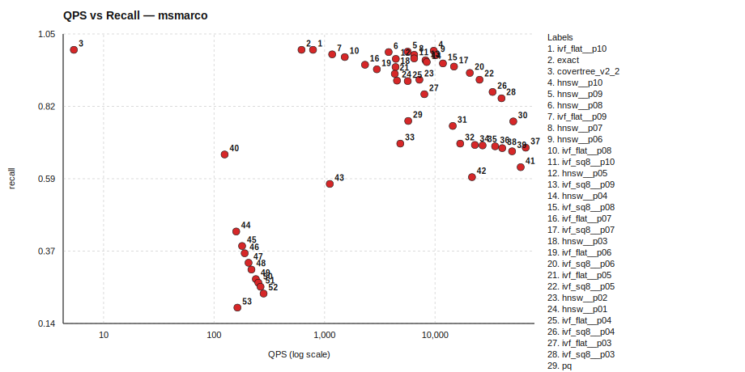

### Tradeoff Curves by Algorithm

#### covertree_v2_2 (1 points)

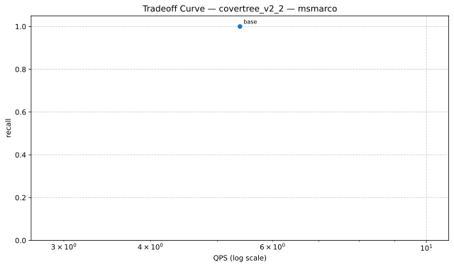

| Variant | QPS | Recall | Parameters |
|---|---:|---:|---|
| base | 5.38 | 1.0000 | baseline |

Data: `./msmarco/tradeoff_curves/tradeoff_msmarco_covertree_v2_2.json`

#### exact (1 points)

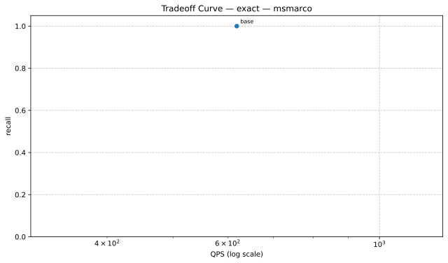

| Variant | QPS | Recall | Parameters |
|---|---:|---:|---|
| base | 618.76 | 1.0000 | baseline |

Data: `./msmarco/tradeoff_curves/tradeoff_msmarco_exact.json`

#### hnsw (10 points)

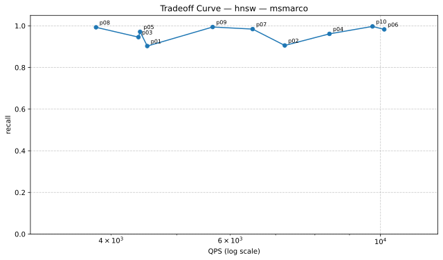

| Variant | QPS | Recall | Parameters |
|---|---:|---:|---|
| p01 | 4524.46 | 0.9029 | indexer.efSearch=16 |
| p02 | 7221.24 | 0.9057 | indexer.efSearch=24 |
| p03 | 4391.15 | 0.9457 | indexer.efSearch=32 |
| p04 | 8406.38 | 0.9614 | indexer.efSearch=48 |
| p05 | 4415.52 | 0.9714 | indexer.efSearch=64 |
| p06 | 10128.37 | 0.9829 | indexer.efSearch=80 |
| p07 | 6474.55 | 0.9843 | indexer.efSearch=100 |
| p08 | 3801.11 | 0.9929 | indexer.efSearch=128 |
| p09 | 5651.83 | 0.9943 | indexer.efSearch=160 |
| p10 | 9731.24 | 0.9971 | indexer.efSearch=200 |

Data: `./msmarco/tradeoff_curves/tradeoff_msmarco_hnsw.json`

#### ivf_flat (10 points)

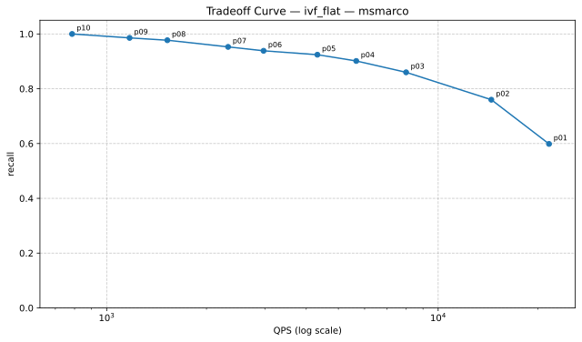

| Variant | QPS | Recall | Parameters |
|---|---:|---:|---|
| p01 | 21601.04 | 0.5986 | searcher.nprobe=2 |
| p02 | 14466.68 | 0.7600 | searcher.nprobe=4 |
| p03 | 8003.74 | 0.8600 | searcher.nprobe=8 |
| p04 | 5660.98 | 0.9014 | searcher.nprobe=12 |
| p05 | 4322.12 | 0.9243 | searcher.nprobe=16 |
| p06 | 2973.72 | 0.9386 | searcher.nprobe=24 |
| p07 | 2324.23 | 0.9529 | searcher.nprobe=32 |
| p08 | 1523.97 | 0.9771 | searcher.nprobe=48 |
| p09 | 1172.32 | 0.9857 | searcher.nprobe=64 |
| p10 | 786.26 | 1.0000 | searcher.nprobe=96 |

Data: `./msmarco/tradeoff_curves/tradeoff_msmarco_ivf_flat.json`

#### ivf_pq (10 points)

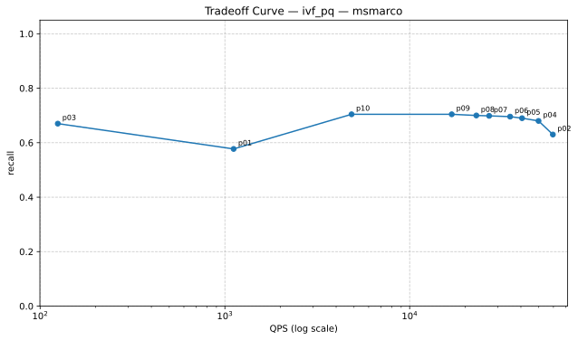

| Variant | QPS | Recall | Parameters |
|---|---:|---:|---|
| p01 | 1115.26 | 0.5771 | searcher.nprobe=4 |
| p02 | 59578.18 | 0.6300 | searcher.nprobe=8 |
| p03 | 124.65 | 0.6700 | searcher.nprobe=12 |
| p04 | 49822.04 | 0.6800 | searcher.nprobe=16 |
| p05 | 40569.47 | 0.6900 | searcher.nprobe=24 |
| p06 | 34973.35 | 0.6957 | searcher.nprobe=32 |
| p07 | 26923.55 | 0.6986 | searcher.nprobe=48 |
| p08 | 22953.74 | 0.7000 | searcher.nprobe=64 |
| p09 | 16894.03 | 0.7043 | searcher.nprobe=96 |
| p10 | 4847.87 | 0.7043 | searcher.nprobe=128 |

Data: `./msmarco/tradeoff_curves/tradeoff_msmarco_ivf_pq.json`

#### ivf_sq8 (10 points)

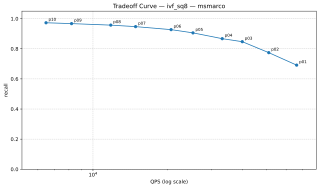

| Variant | QPS | Recall | Parameters |
|---|---:|---:|---|
| p01 | 66156.21 | 0.6914 | searcher.nprobe=4 |
| p02 | 51078.86 | 0.7743 | searcher.nprobe=8 |
| p03 | 39951.19 | 0.8471 | searcher.nprobe=12 |
| p04 | 33175.29 | 0.8671 | searcher.nprobe=16 |
| p05 | 25286.48 | 0.9057 | searcher.nprobe=24 |
| p06 | 20642.71 | 0.9271 | searcher.nprobe=32 |
| p07 | 14849.35 | 0.9471 | searcher.nprobe=48 |
| p08 | 11792.16 | 0.9571 | searcher.nprobe=64 |
| p09 | 8199.09 | 0.9671 | searcher.nprobe=96 |
| p10 | 6469.27 | 0.9729 | searcher.nprobe=128 |

Data: `./msmarco/tradeoff_curves/tradeoff_msmarco_ivf_sq8.json`

#### lsh (10 points)

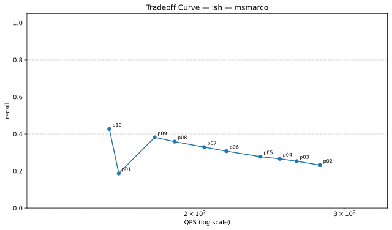

| Variant | QPS | Recall | Parameters |
|---|---:|---:|---|
| p01 | 162.74 | 0.1871 | searcher.candidate_multiplier=16 |
| p02 | 280.74 | 0.2314 | searcher.candidate_multiplier=24 |
| p03 | 263.45 | 0.2529 | searcher.candidate_multiplier=32 |
| p04 | 251.65 | 0.2657 | searcher.candidate_multiplier=48 |
| p05 | 238.86 | 0.2771 | searcher.candidate_multiplier=64 |
| p06 | 217.83 | 0.3071 | searcher.candidate_multiplier=96 |
| p07 | 205.11 | 0.3286 | searcher.candidate_multiplier=128 |
| p08 | 189.31 | 0.3586 | searcher.candidate_multiplier=160 |
| p09 | 179.34 | 0.3814 | searcher.candidate_multiplier=192 |
| p10 | 158.64 | 0.4271 | searcher.candidate_multiplier=256 |

Data: `./msmarco/tradeoff_curves/tradeoff_msmarco_lsh.json`

#### pq (1 points)

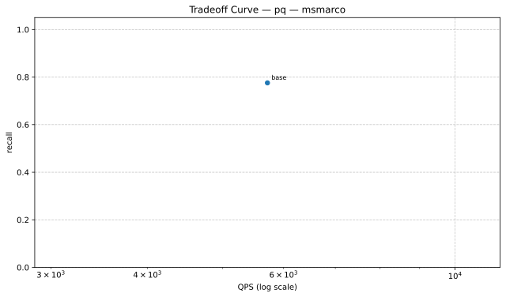

| Variant | QPS | Recall | Parameters |
|---|---:|---:|---|
| base | 5718.87 | 0.7757 | baseline |

Data: `./msmarco/tradeoff_curves/tradeoff_msmarco_pq.json`

| Algorithm | Recall | QPS | Mean Query Time (ms) | Build Time (s) | Status |
|---|---:|---:|---:|---:|---|
| ivf_flat__p10 | 1.0000 | 786.26 | 1.272 | 0.63 | ok |
| exact | 1.0000 | 618.76 | 1.616 | 0.94 | ok |
| covertree_v2_2 | 1.0000 | 5.38 | 185.730 | 4387.85 | ok |
| hnsw__p10 | 0.9971 | 9731.24 | 0.103 | 8.42 | ok |
| hnsw__p09 | 0.9943 | 5651.83 | 0.177 | 8.43 | ok |
| hnsw__p08 | 0.9929 | 3801.11 | 0.263 | 8.45 | ok |
| ivf_flat__p09 | 0.9857 | 1172.32 | 0.853 | 0.63 | ok |
| hnsw__p07 | 0.9843 | 6474.55 | 0.154 | 8.43 | ok |
| hnsw__p06 | 0.9829 | 10128.37 | 0.099 | 8.45 | ok |
| ivf_flat__p08 | 0.9771 | 1523.97 | 0.656 | 0.63 | ok |
| ivf_sq8__p10 | 0.9729 | 6469.27 | 0.155 | 2.10 | ok |
| hnsw__p05 | 0.9714 | 4415.52 | 0.226 | 8.46 | ok |
| ivf_sq8__p09 | 0.9671 | 8199.09 | 0.122 | 2.09 | ok |
| hnsw__p04 | 0.9614 | 8406.38 | 0.119 | 8.45 | ok |
| ivf_sq8__p08 | 0.9571 | 11792.16 | 0.085 | 2.08 | ok |
| ivf_flat__p07 | 0.9529 | 2324.23 | 0.430 | 0.63 | ok |
| ivf_sq8__p07 | 0.9471 | 14849.35 | 0.067 | 2.10 | ok |
| hnsw__p03 | 0.9457 | 4391.15 | 0.228 | 8.46 | ok |
| ivf_flat__p06 | 0.9386 | 2973.72 | 0.336 | 0.63 | ok |
| ivf_sq8__p06 | 0.9271 | 20642.71 | 0.048 | 2.11 | ok |
| ivf_flat__p05 | 0.9243 | 4322.12 | 0.231 | 0.63 | ok |
| ivf_sq8__p05 | 0.9057 | 25286.48 | 0.040 | 2.10 | ok |
| hnsw__p02 | 0.9057 | 7221.24 | 0.138 | 8.37 | ok |
| hnsw__p01 | 0.9029 | 4524.46 | 0.221 | 8.26 | ok |
| ivf_flat__p04 | 0.9014 | 5660.98 | 0.177 | 0.63 | ok |
| ivf_sq8__p04 | 0.8671 | 33175.29 | 0.030 | 2.07 | ok |
| ivf_flat__p03 | 0.8600 | 8003.74 | 0.125 | 0.63 | ok |
| ivf_sq8__p03 | 0.8471 | 39951.19 | 0.025 | 2.09 | ok |
| pq | 0.7757 | 5718.87 | 0.175 | 16.51 | ok |
| ivf_sq8__p02 | 0.7743 | 51078.86 | 0.020 | 2.10 | ok |
| ivf_flat__p02 | 0.7600 | 14466.68 | 0.069 | 0.63 | ok |
| ivf_pq__p09 | 0.7043 | 16894.03 | 0.059 | 17.42 | ok |
| ivf_pq__p10 | 0.7043 | 4847.87 | 0.206 | 17.52 | ok |
| ivf_pq__p08 | 0.7000 | 22953.74 | 0.044 | 17.71 | ok |
| ivf_pq__p07 | 0.6986 | 26923.55 | 0.037 | 17.74 | ok |
| ivf_pq__p06 | 0.6957 | 34973.35 | 0.029 | 17.67 | ok |
| ivf_sq8__p01 | 0.6914 | 66156.21 | 0.015 | 2.23 | ok |
| ivf_pq__p05 | 0.6900 | 40569.47 | 0.025 | 17.74 | ok |
| ivf_pq__p04 | 0.6800 | 49822.04 | 0.020 | 17.84 | ok |
| ivf_pq__p03 | 0.6700 | 124.65 | 8.022 | 18.35 | ok |
| ivf_pq__p02 | 0.6300 | 59578.18 | 0.017 | 17.86 | ok |
| ivf_flat__p01 | 0.5986 | 21601.04 | 0.046 | 0.63 | ok |
| ivf_pq__p01 | 0.5771 | 1115.26 | 0.897 | 17.85 | ok |
| lsh__p10 | 0.4271 | 158.64 | 6.304 | 2.78 | ok |
| lsh__p09 | 0.3814 | 179.34 | 5.576 | 2.79 | ok |
| lsh__p08 | 0.3586 | 189.31 | 5.282 | 2.78 | ok |
| lsh__p07 | 0.3286 | 205.11 | 4.875 | 2.78 | ok |
| lsh__p06 | 0.3071 | 217.83 | 4.591 | 2.79 | ok |
| lsh__p05 | 0.2771 | 238.86 | 4.187 | 2.78 | ok |
| lsh__p04 | 0.2657 | 251.65 | 3.974 | 2.78 | ok |
| lsh__p03 | 0.2529 | 263.45 | 3.796 | 2.77 | ok |
| lsh__p02 | 0.2314 | 280.74 | 3.562 | 2.88 | ok |
| lsh__p01 | 0.1871 | 162.74 | 6.145 | 3.15 | ok |

### Algorithm Implementation Details

| Algorithm | Type | Metric | Indexer | Searcher |
|---|---|---|---|---|
| covertree_v2_2 | CoverTreeV2_2 | cosine | N/A | N/A |
| exact | Composite | cosine | BruteForceIndexer (metric=cosine) | LinearSearcher (metric=cosine) |
| hnsw__p01 | Composite | cosine | HNSWIndexer (M=16, efConstruction=200, efSearch=16, metric=cosine) | FaissSearcher (metric=cosine, nprobe=32) |
| hnsw__p02 | Composite | cosine | HNSWIndexer (M=16, efConstruction=200, efSearch=24, metric=cosine) | FaissSearcher (metric=cosine, nprobe=32) |
| hnsw__p03 | Composite | cosine | HNSWIndexer (M=16, efConstruction=200, efSearch=32, metric=cosine) | FaissSearcher (metric=cosine, nprobe=32) |
| hnsw__p04 | Composite | cosine | HNSWIndexer (M=16, efConstruction=200, efSearch=48, metric=cosine) | FaissSearcher (metric=cosine, nprobe=32) |
| hnsw__p05 | Composite | cosine | HNSWIndexer (M=16, efConstruction=200, efSearch=64, metric=cosine) | FaissSearcher (metric=cosine, nprobe=32) |
| hnsw__p06 | Composite | cosine | HNSWIndexer (M=16, efConstruction=200, efSearch=80, metric=cosine) | FaissSearcher (metric=cosine, nprobe=32) |
| hnsw__p07 | Composite | cosine | HNSWIndexer (M=16, efConstruction=200, efSearch=100, metric=cosine) | FaissSearcher (metric=cosine, nprobe=32) |
| hnsw__p08 | Composite | cosine | HNSWIndexer (M=16, efConstruction=200, efSearch=128, metric=cosine) | FaissSearcher (metric=cosine, nprobe=32) |
| hnsw__p09 | Composite | cosine | HNSWIndexer (M=16, efConstruction=200, efSearch=160, metric=cosine) | FaissSearcher (metric=cosine, nprobe=32) |
| hnsw__p10 | Composite | cosine | HNSWIndexer (M=16, efConstruction=200, efSearch=200, metric=cosine) | FaissSearcher (metric=cosine, nprobe=32) |
| ivf_flat__p01 | Composite | cosine | FaissIVFIndexer (index_type=IVF100,Flat, metric=cosine, nprobe=10) | FaissSearcher (metric=cosine, nprobe=2) |
| ivf_flat__p02 | Composite | cosine | FaissIVFIndexer (index_type=IVF100,Flat, metric=cosine, nprobe=10) | FaissSearcher (metric=cosine, nprobe=4) |
| ivf_flat__p03 | Composite | cosine | FaissIVFIndexer (index_type=IVF100,Flat, metric=cosine, nprobe=10) | FaissSearcher (metric=cosine, nprobe=8) |
| ivf_flat__p04 | Composite | cosine | FaissIVFIndexer (index_type=IVF100,Flat, metric=cosine, nprobe=10) | FaissSearcher (metric=cosine, nprobe=12) |
| ivf_flat__p05 | Composite | cosine | FaissIVFIndexer (index_type=IVF100,Flat, metric=cosine, nprobe=10) | FaissSearcher (metric=cosine, nprobe=16) |
| ivf_flat__p06 | Composite | cosine | FaissIVFIndexer (index_type=IVF100,Flat, metric=cosine, nprobe=10) | FaissSearcher (metric=cosine, nprobe=24) |
| ivf_flat__p07 | Composite | cosine | FaissIVFIndexer (index_type=IVF100,Flat, metric=cosine, nprobe=10) | FaissSearcher (metric=cosine, nprobe=32) |
| ivf_flat__p08 | Composite | cosine | FaissIVFIndexer (index_type=IVF100,Flat, metric=cosine, nprobe=10) | FaissSearcher (metric=cosine, nprobe=48) |
| ivf_flat__p09 | Composite | cosine | FaissIVFIndexer (index_type=IVF100,Flat, metric=cosine, nprobe=10) | FaissSearcher (metric=cosine, nprobe=64) |
| ivf_flat__p10 | Composite | cosine | FaissIVFIndexer (index_type=IVF100,Flat, metric=cosine, nprobe=10) | FaissSearcher (metric=cosine, nprobe=96) |
| ivf_pq__p01 | Composite | cosine | FaissFactoryIndexer (index_key=IVF256,PQ64, metric=cosine, nprobe=48) | FaissSearcher (metric=cosine, nprobe=4) |
| ivf_pq__p02 | Composite | cosine | FaissFactoryIndexer (index_key=IVF256,PQ64, metric=cosine, nprobe=48) | FaissSearcher (metric=cosine, nprobe=8) |
| ivf_pq__p03 | Composite | cosine | FaissFactoryIndexer (index_key=IVF256,PQ64, metric=cosine, nprobe=48) | FaissSearcher (metric=cosine, nprobe=12) |
| ivf_pq__p04 | Composite | cosine | FaissFactoryIndexer (index_key=IVF256,PQ64, metric=cosine, nprobe=48) | FaissSearcher (metric=cosine, nprobe=16) |
| ivf_pq__p05 | Composite | cosine | FaissFactoryIndexer (index_key=IVF256,PQ64, metric=cosine, nprobe=48) | FaissSearcher (metric=cosine, nprobe=24) |
| ivf_pq__p06 | Composite | cosine | FaissFactoryIndexer (index_key=IVF256,PQ64, metric=cosine, nprobe=48) | FaissSearcher (metric=cosine, nprobe=32) |
| ivf_pq__p07 | Composite | cosine | FaissFactoryIndexer (index_key=IVF256,PQ64, metric=cosine, nprobe=48) | FaissSearcher (metric=cosine, nprobe=48) |
| ivf_pq__p08 | Composite | cosine | FaissFactoryIndexer (index_key=IVF256,PQ64, metric=cosine, nprobe=48) | FaissSearcher (metric=cosine, nprobe=64) |
| ivf_pq__p09 | Composite | cosine | FaissFactoryIndexer (index_key=IVF256,PQ64, metric=cosine, nprobe=48) | FaissSearcher (metric=cosine, nprobe=96) |
| ivf_pq__p10 | Composite | cosine | FaissFactoryIndexer (index_key=IVF256,PQ64, metric=cosine, nprobe=48) | FaissSearcher (metric=cosine, nprobe=128) |
| ivf_sq8__p01 | Composite | cosine | FaissFactoryIndexer (index_key=IVF256,SQ8, metric=cosine, nprobe=48) | FaissSearcher (metric=cosine, nprobe=4) |
| ivf_sq8__p02 | Composite | cosine | FaissFactoryIndexer (index_key=IVF256,SQ8, metric=cosine, nprobe=48) | FaissSearcher (metric=cosine, nprobe=8) |
| ivf_sq8__p03 | Composite | cosine | FaissFactoryIndexer (index_key=IVF256,SQ8, metric=cosine, nprobe=48) | FaissSearcher (metric=cosine, nprobe=12) |
| ivf_sq8__p04 | Composite | cosine | FaissFactoryIndexer (index_key=IVF256,SQ8, metric=cosine, nprobe=48) | FaissSearcher (metric=cosine, nprobe=16) |
| ivf_sq8__p05 | Composite | cosine | FaissFactoryIndexer (index_key=IVF256,SQ8, metric=cosine, nprobe=48) | FaissSearcher (metric=cosine, nprobe=24) |
| ivf_sq8__p06 | Composite | cosine | FaissFactoryIndexer (index_key=IVF256,SQ8, metric=cosine, nprobe=48) | FaissSearcher (metric=cosine, nprobe=32) |
| ivf_sq8__p07 | Composite | cosine | FaissFactoryIndexer (index_key=IVF256,SQ8, metric=cosine, nprobe=48) | FaissSearcher (metric=cosine, nprobe=48) |
| ivf_sq8__p08 | Composite | cosine | FaissFactoryIndexer (index_key=IVF256,SQ8, metric=cosine, nprobe=48) | FaissSearcher (metric=cosine, nprobe=64) |
| ivf_sq8__p09 | Composite | cosine | FaissFactoryIndexer (index_key=IVF256,SQ8, metric=cosine, nprobe=48) | FaissSearcher (metric=cosine, nprobe=96) |
| ivf_sq8__p10 | Composite | cosine | FaissFactoryIndexer (index_key=IVF256,SQ8, metric=cosine, nprobe=48) | FaissSearcher (metric=cosine, nprobe=128) |
| lsh__p01 | Composite | cosine | LSHIndexer (hash_size=8, metric=cosine, num_tables=24, seed=42) | LSHSearcher (candidate_multiplier=16, fallback_to_bruteforce=False, metric=cosine) |
| lsh__p02 | Composite | cosine | LSHIndexer (hash_size=8, metric=cosine, num_tables=24, seed=42) | LSHSearcher (candidate_multiplier=24, fallback_to_bruteforce=False, metric=cosine) |
| lsh__p03 | Composite | cosine | LSHIndexer (hash_size=8, metric=cosine, num_tables=24, seed=42) | LSHSearcher (candidate_multiplier=32, fallback_to_bruteforce=False, metric=cosine) |
| lsh__p04 | Composite | cosine | LSHIndexer (hash_size=8, metric=cosine, num_tables=24, seed=42) | LSHSearcher (candidate_multiplier=48, fallback_to_bruteforce=False, metric=cosine) |
| lsh__p05 | Composite | cosine | LSHIndexer (hash_size=8, metric=cosine, num_tables=24, seed=42) | LSHSearcher (candidate_multiplier=64, fallback_to_bruteforce=False, metric=cosine) |
| lsh__p06 | Composite | cosine | LSHIndexer (hash_size=8, metric=cosine, num_tables=24, seed=42) | LSHSearcher (candidate_multiplier=96, fallback_to_bruteforce=False, metric=cosine) |
| lsh__p07 | Composite | cosine | LSHIndexer (hash_size=8, metric=cosine, num_tables=24, seed=42) | LSHSearcher (candidate_multiplier=128, fallback_to_bruteforce=False, metric=cosine) |
| lsh__p08 | Composite | cosine | LSHIndexer (hash_size=8, metric=cosine, num_tables=24, seed=42) | LSHSearcher (candidate_multiplier=160, fallback_to_bruteforce=False, metric=cosine) |
| lsh__p09 | Composite | cosine | LSHIndexer (hash_size=8, metric=cosine, num_tables=24, seed=42) | LSHSearcher (candidate_multiplier=192, fallback_to_bruteforce=False, metric=cosine) |
| lsh__p10 | Composite | cosine | LSHIndexer (hash_size=8, metric=cosine, num_tables=24, seed=42) | LSHSearcher (candidate_multiplier=256, fallback_to_bruteforce=False, metric=cosine) |
| pq | Composite | cosine | FaissFactoryIndexer (index_key=PQ64, metric=cosine) | FaissSearcher (metric=cosine, nprobe=48) |

### Dataset Details

- Config: `benchmark_results/benchmark_20260318_182425/msmarco/msmarco_config.yaml`
- metric: `cosine`
- topk: `20`
- n_queries: `200`
- repeat: `2`
- seed: `42`
- dataset_options.base_limit: `100000`
- dataset_options.cache_dir: `/storage/ice-shared/cs8903onl/vectordb-retrieval/results/cache`
- dataset_options.embedded_dataset_dir: `/storage/ice-shared/cs8903onl/vectordb-retrieval/datasets/msmarco_v1_embeddings`
- dataset_options.ground_truth_k: `200`
- dataset_options.query_limit: `200`
- dataset_options.use_memmap_cache: `True`
- dataset_options.use_preembedded: `True`

## Brief Takeaways

- `random`: best recall `ivf_flat__p10` (1.0000), best QPS `hnsw__p02` (399160.53)
- `glove50`: best recall `ivf_flat__p09` (1.0000), best QPS `hnsw__p01` (466438.67)
- `msmarco`: best recall `ivf_flat__p10` (1.0000), best QPS `ivf_sq8__p01` (66156.21)
