# One-Page Benchmark Summary (QPS vs Recall)

*Generated on: 2026-03-19 10:44:05*
*Run directory: `benchmark_results/benchmark_20260319_102154`*

## Table of Contents

- [Dataset: random](#dataset-random)
- [Tradeoff Curves (random)](#tradeoff-random)
- [Dataset: glove50](#dataset-glove50)
- [Tradeoff Curves (glove50)](#tradeoff-glove50)
- [Dataset: msmarco](#dataset-msmarco)
- [Tradeoff Curves (msmarco)](#tradeoff-msmarco)

## Dataset: random

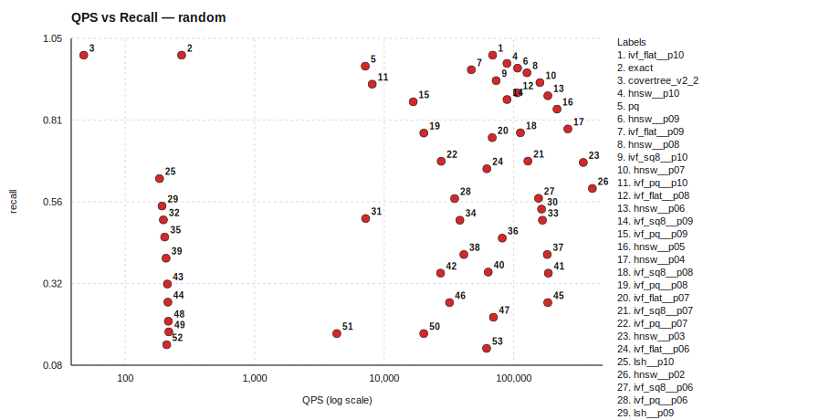

### Tradeoff Curves by Algorithm

_Pareto points are listed under `Pareto Points (Non-dominated Frontier)` for each algorithm._

#### covertree_v2_2 (1 points)

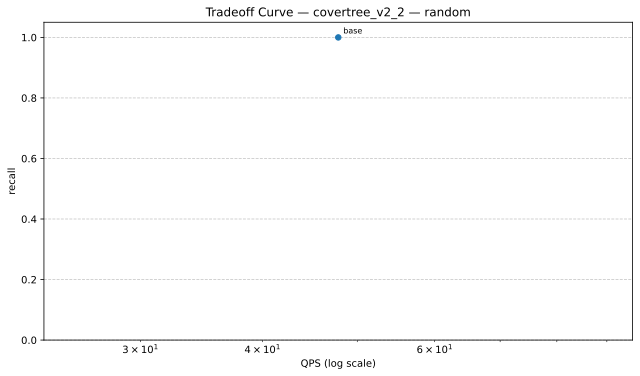

| Variant | QPS | Recall | Parameters |
|---|---:|---:|---|
| base | 47.81 | 1.0000 | baseline |

##### Pareto Points (Non-dominated Frontier)

| Variant | QPS | Recall | Parameters |
|---|---:|---:|---|
| base | 47.81 | 1.0000 | baseline |

Data: `./random/tradeoff_curves/tradeoff_random_covertree_v2_2.json`

#### exact (1 points)

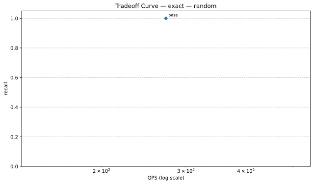

| Variant | QPS | Recall | Parameters |
|---|---:|---:|---|
| base | 272.44 | 1.0000 | baseline |

##### Pareto Points (Non-dominated Frontier)

| Variant | QPS | Recall | Parameters |
|---|---:|---:|---|
| base | 272.44 | 1.0000 | baseline |

Data: `./random/tradeoff_curves/tradeoff_random_exact.json`

#### hnsw (10 points)

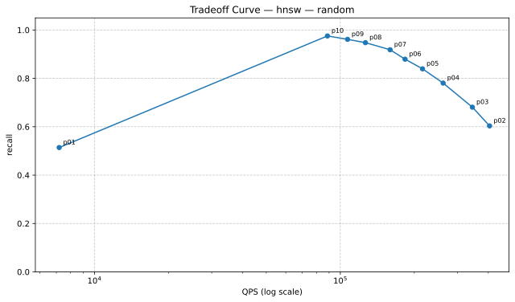

| Variant | QPS | Recall | Parameters |
|---|---:|---:|---|
| p01 | 7187.89 | 0.5141 | indexer.efSearch=16 |
| p02 | 404727.41 | 0.6035 | indexer.efSearch=24 |
| p03 | 344479.25 | 0.6809 | indexer.efSearch=32 |
| p04 | 261952.14 | 0.7805 | indexer.efSearch=48 |
| p05 | 215957.73 | 0.8395 | indexer.efSearch=64 |
| p06 | 183388.87 | 0.8793 | indexer.efSearch=80 |
| p07 | 159427.15 | 0.9184 | indexer.efSearch=100 |
| p08 | 126516.06 | 0.9477 | indexer.efSearch=128 |
| p09 | 107042.35 | 0.9613 | indexer.efSearch=160 |
| p10 | 88651.08 | 0.9754 | indexer.efSearch=200 |

##### Pareto Points (Non-dominated Frontier)

| Variant | QPS | Recall | Parameters |
|---|---:|---:|---|
| p10 | 88651.08 | 0.9754 | indexer.efSearch=200 |
| p09 | 107042.35 | 0.9613 | indexer.efSearch=160 |
| p08 | 126516.06 | 0.9477 | indexer.efSearch=128 |
| p07 | 159427.15 | 0.9184 | indexer.efSearch=100 |
| p06 | 183388.87 | 0.8793 | indexer.efSearch=80 |
| p05 | 215957.73 | 0.8395 | indexer.efSearch=64 |
| p04 | 261952.14 | 0.7805 | indexer.efSearch=48 |
| p03 | 344479.25 | 0.6809 | indexer.efSearch=32 |
| p02 | 404727.41 | 0.6035 | indexer.efSearch=24 |

Data: `./random/tradeoff_curves/tradeoff_random_hnsw.json`

#### ivf_flat (10 points)

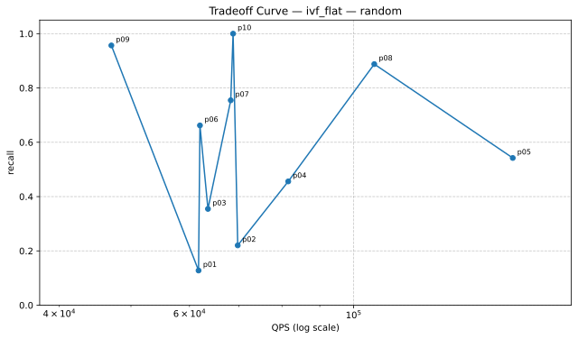

| Variant | QPS | Recall | Parameters |
|---|---:|---:|---|
| p01 | 61709.30 | 0.1277 | searcher.nprobe=2 |
| p02 | 69714.44 | 0.2203 | searcher.nprobe=4 |
| p03 | 63542.54 | 0.3547 | searcher.nprobe=8 |
| p04 | 81585.12 | 0.4559 | searcher.nprobe=12 |
| p05 | 164105.43 | 0.5422 | searcher.nprobe=16 |
| p06 | 61980.02 | 0.6621 | searcher.nprobe=24 |
| p07 | 68217.40 | 0.7547 | searcher.nprobe=32 |
| p08 | 106638.38 | 0.8879 | searcher.nprobe=48 |
| p09 | 47042.36 | 0.9566 | searcher.nprobe=64 |
| p10 | 68715.08 | 1.0000 | searcher.nprobe=96 |

##### Pareto Points (Non-dominated Frontier)

| Variant | QPS | Recall | Parameters |
|---|---:|---:|---|
| p10 | 68715.08 | 1.0000 | searcher.nprobe=96 |
| p08 | 106638.38 | 0.8879 | searcher.nprobe=48 |
| p05 | 164105.43 | 0.5422 | searcher.nprobe=16 |

Data: `./random/tradeoff_curves/tradeoff_random_ivf_flat.json`

#### ivf_pq (10 points)

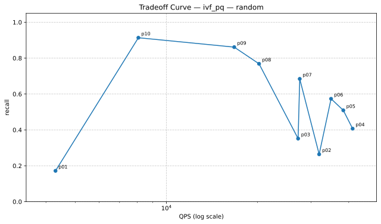

| Variant | QPS | Recall | Parameters |
|---|---:|---:|---|
| p01 | 4301.63 | 0.1719 | searcher.nprobe=4 |
| p02 | 31936.64 | 0.2641 | searcher.nprobe=8 |
| p03 | 27213.65 | 0.3516 | searcher.nprobe=12 |
| p04 | 41190.03 | 0.4070 | searcher.nprobe=16 |
| p05 | 38375.33 | 0.5090 | searcher.nprobe=24 |
| p06 | 34968.47 | 0.5734 | searcher.nprobe=32 |
| p07 | 27552.33 | 0.6844 | searcher.nprobe=48 |
| p08 | 20220.75 | 0.7684 | searcher.nprobe=64 |
| p09 | 16741.90 | 0.8613 | searcher.nprobe=96 |
| p10 | 8078.53 | 0.9137 | searcher.nprobe=128 |

##### Pareto Points (Non-dominated Frontier)

| Variant | QPS | Recall | Parameters |
|---|---:|---:|---|
| p10 | 8078.53 | 0.9137 | searcher.nprobe=128 |
| p09 | 16741.90 | 0.8613 | searcher.nprobe=96 |
| p08 | 20220.75 | 0.7684 | searcher.nprobe=64 |
| p07 | 27552.33 | 0.6844 | searcher.nprobe=48 |
| p06 | 34968.47 | 0.5734 | searcher.nprobe=32 |
| p05 | 38375.33 | 0.5090 | searcher.nprobe=24 |
| p04 | 41190.03 | 0.4070 | searcher.nprobe=16 |

Data: `./random/tradeoff_curves/tradeoff_random_ivf_pq.json`

#### ivf_sq8 (10 points)

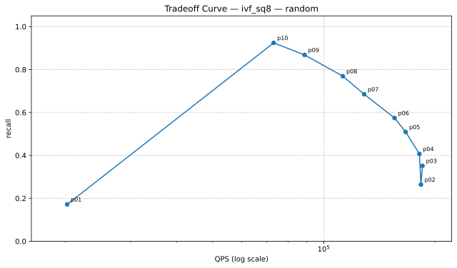

| Variant | QPS | Recall | Parameters |
|---|---:|---:|---|
| p01 | 20198.68 | 0.1719 | searcher.nprobe=4 |
| p02 | 183294.95 | 0.2641 | searcher.nprobe=8 |
| p03 | 185032.19 | 0.3516 | searcher.nprobe=12 |
| p04 | 181528.63 | 0.4070 | searcher.nprobe=16 |
| p05 | 166626.60 | 0.5090 | searcher.nprobe=24 |
| p06 | 155479.56 | 0.5742 | searcher.nprobe=32 |
| p07 | 128653.47 | 0.6848 | searcher.nprobe=48 |
| p08 | 112610.57 | 0.7691 | searcher.nprobe=64 |
| p09 | 88731.66 | 0.8680 | searcher.nprobe=96 |
| p10 | 73173.08 | 0.9242 | searcher.nprobe=128 |

##### Pareto Points (Non-dominated Frontier)

| Variant | QPS | Recall | Parameters |
|---|---:|---:|---|
| p10 | 73173.08 | 0.9242 | searcher.nprobe=128 |
| p09 | 88731.66 | 0.8680 | searcher.nprobe=96 |
| p08 | 112610.57 | 0.7691 | searcher.nprobe=64 |
| p07 | 128653.47 | 0.6848 | searcher.nprobe=48 |
| p06 | 155479.56 | 0.5742 | searcher.nprobe=32 |
| p05 | 166626.60 | 0.5090 | searcher.nprobe=24 |
| p04 | 181528.63 | 0.4070 | searcher.nprobe=16 |
| p03 | 185032.19 | 0.3516 | searcher.nprobe=12 |

Data: `./random/tradeoff_curves/tradeoff_random_ivf_sq8.json`

#### lsh (10 points)

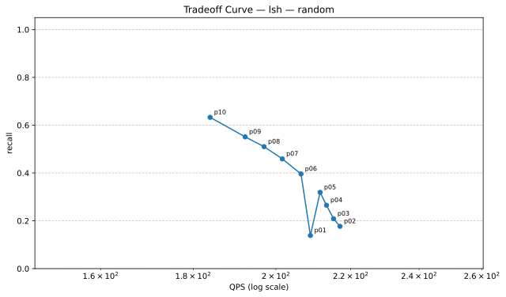

| Variant | QPS | Recall | Parameters |
|---|---:|---:|---|
| p01 | 208.98 | 0.1387 | searcher.candidate_multiplier=16 |
| p02 | 217.01 | 0.1770 | searcher.candidate_multiplier=24 |
| p03 | 215.23 | 0.2086 | searcher.candidate_multiplier=32 |
| p04 | 213.31 | 0.2652 | searcher.candidate_multiplier=48 |
| p05 | 211.58 | 0.3191 | searcher.candidate_multiplier=64 |
| p06 | 206.50 | 0.3961 | searcher.candidate_multiplier=96 |
| p07 | 201.65 | 0.4590 | searcher.candidate_multiplier=128 |
| p08 | 197.01 | 0.5102 | searcher.candidate_multiplier=160 |
| p09 | 192.32 | 0.5512 | searcher.candidate_multiplier=192 |
| p10 | 183.93 | 0.6328 | searcher.candidate_multiplier=256 |

##### Pareto Points (Non-dominated Frontier)

| Variant | QPS | Recall | Parameters |
|---|---:|---:|---|
| p10 | 183.93 | 0.6328 | searcher.candidate_multiplier=256 |
| p09 | 192.32 | 0.5512 | searcher.candidate_multiplier=192 |
| p08 | 197.01 | 0.5102 | searcher.candidate_multiplier=160 |
| p07 | 201.65 | 0.4590 | searcher.candidate_multiplier=128 |
| p06 | 206.50 | 0.3961 | searcher.candidate_multiplier=96 |
| p05 | 211.58 | 0.3191 | searcher.candidate_multiplier=64 |
| p04 | 213.31 | 0.2652 | searcher.candidate_multiplier=48 |
| p03 | 215.23 | 0.2086 | searcher.candidate_multiplier=32 |
| p02 | 217.01 | 0.1770 | searcher.candidate_multiplier=24 |

Data: `./random/tradeoff_curves/tradeoff_random_lsh.json`

#### pq (1 points)

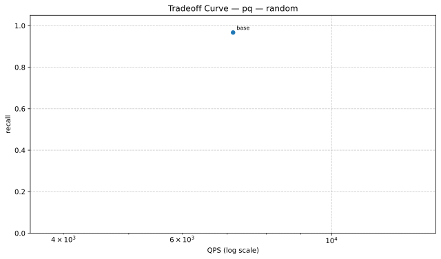

| Variant | QPS | Recall | Parameters |
|---|---:|---:|---|
| base | 7141.71 | 0.9672 | baseline |

##### Pareto Points (Non-dominated Frontier)

| Variant | QPS | Recall | Parameters |
|---|---:|---:|---|
| base | 7141.71 | 0.9672 | baseline |

Data: `./random/tradeoff_curves/tradeoff_random_pq.json`

| Algorithm | Recall | QPS | Mean Query Time (ms) | Build Time (s) | Status |
|---|---:|---:|---:|---:|---|
| ivf_flat__p10 | 1.0000 | 68715.08 | 0.015 | 0.08 | ok |
| exact | 1.0000 | 272.44 | 3.671 | 0.00 | ok |
| covertree_v2_2 | 1.0000 | 47.81 | 20.915 | 259.41 | ok |
| hnsw__p10 | 0.9754 | 88651.08 | 0.011 | 0.25 | ok |
| pq | 0.9672 | 7141.71 | 0.140 | 11.67 | ok |
| hnsw__p09 | 0.9613 | 107042.35 | 0.009 | 0.25 | ok |
| ivf_flat__p09 | 0.9566 | 47042.36 | 0.021 | 0.09 | ok |
| hnsw__p08 | 0.9477 | 126516.06 | 0.008 | 0.24 | ok |
| ivf_sq8__p10 | 0.9242 | 73173.08 | 0.014 | 0.25 | ok |
| hnsw__p07 | 0.9184 | 159427.15 | 0.006 | 0.24 | ok |
| ivf_pq__p10 | 0.9137 | 8078.53 | 0.124 | 11.51 | ok |
| ivf_flat__p08 | 0.8879 | 106638.38 | 0.009 | 0.08 | ok |
| hnsw__p06 | 0.8793 | 183388.87 | 0.005 | 0.24 | ok |
| ivf_sq8__p09 | 0.8680 | 88731.66 | 0.011 | 0.24 | ok |
| ivf_pq__p09 | 0.8613 | 16741.90 | 0.060 | 11.50 | ok |
| hnsw__p05 | 0.8395 | 215957.73 | 0.005 | 0.24 | ok |
| hnsw__p04 | 0.7805 | 261952.14 | 0.004 | 0.25 | ok |
| ivf_sq8__p08 | 0.7691 | 112610.57 | 0.009 | 0.25 | ok |
| ivf_pq__p08 | 0.7684 | 20220.75 | 0.049 | 12.79 | ok |
| ivf_flat__p07 | 0.7547 | 68217.40 | 0.015 | 0.10 | ok |
| ivf_sq8__p07 | 0.6848 | 128653.47 | 0.008 | 0.25 | ok |
| ivf_pq__p07 | 0.6844 | 27552.33 | 0.036 | 12.72 | ok |
| hnsw__p03 | 0.6809 | 344479.25 | 0.003 | 0.23 | ok |
| ivf_flat__p06 | 0.6621 | 61980.02 | 0.016 | 0.09 | ok |
| lsh__p10 | 0.6328 | 183.93 | 5.437 | 0.24 | ok |
| hnsw__p02 | 0.6035 | 404727.41 | 0.002 | 0.24 | ok |
| ivf_sq8__p06 | 0.5742 | 155479.56 | 0.006 | 0.25 | ok |
| ivf_pq__p06 | 0.5734 | 34968.47 | 0.029 | 12.72 | ok |
| lsh__p09 | 0.5512 | 192.32 | 5.200 | 0.24 | ok |
| ivf_flat__p05 | 0.5422 | 164105.43 | 0.006 | 0.08 | ok |
| hnsw__p01 | 0.5141 | 7187.89 | 0.139 | 0.54 | ok |
| lsh__p08 | 0.5102 | 197.01 | 5.076 | 0.24 | ok |
| ivf_sq8__p05 | 0.5090 | 166626.60 | 0.006 | 0.25 | ok |
| ivf_pq__p05 | 0.5090 | 38375.33 | 0.026 | 12.71 | ok |
| lsh__p07 | 0.4590 | 201.65 | 4.959 | 0.24 | ok |
| ivf_flat__p04 | 0.4559 | 81585.12 | 0.012 | 0.10 | ok |
| ivf_sq8__p04 | 0.4070 | 181528.63 | 0.006 | 0.25 | ok |
| ivf_pq__p04 | 0.4070 | 41190.03 | 0.024 | 12.76 | ok |
| lsh__p06 | 0.3961 | 206.50 | 4.843 | 0.24 | ok |
| ivf_flat__p03 | 0.3547 | 63542.54 | 0.016 | 0.10 | ok |
| ivf_sq8__p03 | 0.3516 | 185032.19 | 0.005 | 0.25 | ok |
| ivf_pq__p03 | 0.3516 | 27213.65 | 0.037 | 11.55 | ok |
| lsh__p05 | 0.3191 | 211.58 | 4.726 | 0.24 | ok |
| lsh__p04 | 0.2652 | 213.31 | 4.688 | 0.24 | ok |
| ivf_sq8__p02 | 0.2641 | 183294.95 | 0.005 | 0.25 | ok |
| ivf_pq__p02 | 0.2641 | 31936.64 | 0.031 | 12.36 | ok |
| ivf_flat__p02 | 0.2203 | 69714.44 | 0.014 | 0.10 | ok |
| lsh__p03 | 0.2086 | 215.23 | 4.646 | 0.24 | ok |
| lsh__p02 | 0.1770 | 217.01 | 4.608 | 0.24 | ok |
| ivf_sq8__p01 | 0.1719 | 20198.68 | 0.050 | 0.32 | ok |
| ivf_pq__p01 | 0.1719 | 4301.63 | 0.232 | 11.89 | ok |
| lsh__p01 | 0.1387 | 208.98 | 4.785 | 0.35 | ok |
| ivf_flat__p01 | 0.1277 | 61709.30 | 0.016 | 0.44 | ok |

### Algorithm Implementation Details

| Algorithm | Type | Metric | Indexer | Searcher |
|---|---|---|---|---|
| covertree_v2_2 | CoverTreeV2_2 | l2 | N/A | N/A |
| exact | Composite | l2 | BruteForceIndexer (metric=l2) | LinearSearcher (metric=l2) |
| hnsw__p01 | Composite | l2 | HNSWIndexer (M=16, efConstruction=200, efSearch=16, metric=l2) | FaissSearcher (metric=l2, nprobe=10) |
| hnsw__p02 | Composite | l2 | HNSWIndexer (M=16, efConstruction=200, efSearch=24, metric=l2) | FaissSearcher (metric=l2, nprobe=10) |
| hnsw__p03 | Composite | l2 | HNSWIndexer (M=16, efConstruction=200, efSearch=32, metric=l2) | FaissSearcher (metric=l2, nprobe=10) |
| hnsw__p04 | Composite | l2 | HNSWIndexer (M=16, efConstruction=200, efSearch=48, metric=l2) | FaissSearcher (metric=l2, nprobe=10) |
| hnsw__p05 | Composite | l2 | HNSWIndexer (M=16, efConstruction=200, efSearch=64, metric=l2) | FaissSearcher (metric=l2, nprobe=10) |
| hnsw__p06 | Composite | l2 | HNSWIndexer (M=16, efConstruction=200, efSearch=80, metric=l2) | FaissSearcher (metric=l2, nprobe=10) |
| hnsw__p07 | Composite | l2 | HNSWIndexer (M=16, efConstruction=200, efSearch=100, metric=l2) | FaissSearcher (metric=l2, nprobe=10) |
| hnsw__p08 | Composite | l2 | HNSWIndexer (M=16, efConstruction=200, efSearch=128, metric=l2) | FaissSearcher (metric=l2, nprobe=10) |
| hnsw__p09 | Composite | l2 | HNSWIndexer (M=16, efConstruction=200, efSearch=160, metric=l2) | FaissSearcher (metric=l2, nprobe=10) |
| hnsw__p10 | Composite | l2 | HNSWIndexer (M=16, efConstruction=200, efSearch=200, metric=l2) | FaissSearcher (metric=l2, nprobe=10) |
| ivf_flat__p01 | Composite | l2 | FaissIVFIndexer (index_type=IVF100,Flat, metric=l2, nprobe=10) | FaissSearcher (metric=l2, nprobe=2) |
| ivf_flat__p02 | Composite | l2 | FaissIVFIndexer (index_type=IVF100,Flat, metric=l2, nprobe=10) | FaissSearcher (metric=l2, nprobe=4) |
| ivf_flat__p03 | Composite | l2 | FaissIVFIndexer (index_type=IVF100,Flat, metric=l2, nprobe=10) | FaissSearcher (metric=l2, nprobe=8) |
| ivf_flat__p04 | Composite | l2 | FaissIVFIndexer (index_type=IVF100,Flat, metric=l2, nprobe=10) | FaissSearcher (metric=l2, nprobe=12) |
| ivf_flat__p05 | Composite | l2 | FaissIVFIndexer (index_type=IVF100,Flat, metric=l2, nprobe=10) | FaissSearcher (metric=l2, nprobe=16) |
| ivf_flat__p06 | Composite | l2 | FaissIVFIndexer (index_type=IVF100,Flat, metric=l2, nprobe=10) | FaissSearcher (metric=l2, nprobe=24) |
| ivf_flat__p07 | Composite | l2 | FaissIVFIndexer (index_type=IVF100,Flat, metric=l2, nprobe=10) | FaissSearcher (metric=l2, nprobe=32) |
| ivf_flat__p08 | Composite | l2 | FaissIVFIndexer (index_type=IVF100,Flat, metric=l2, nprobe=10) | FaissSearcher (metric=l2, nprobe=48) |
| ivf_flat__p09 | Composite | l2 | FaissIVFIndexer (index_type=IVF100,Flat, metric=l2, nprobe=10) | FaissSearcher (metric=l2, nprobe=64) |
| ivf_flat__p10 | Composite | l2 | FaissIVFIndexer (index_type=IVF100,Flat, metric=l2, nprobe=10) | FaissSearcher (metric=l2, nprobe=96) |
| ivf_pq__p01 | Composite | l2 | FaissFactoryIndexer (index_key=IVF256,PQ64, metric=l2, nprobe=24) | FaissSearcher (metric=l2, nprobe=4) |
| ivf_pq__p02 | Composite | l2 | FaissFactoryIndexer (index_key=IVF256,PQ64, metric=l2, nprobe=24) | FaissSearcher (metric=l2, nprobe=8) |
| ivf_pq__p03 | Composite | l2 | FaissFactoryIndexer (index_key=IVF256,PQ64, metric=l2, nprobe=24) | FaissSearcher (metric=l2, nprobe=12) |
| ivf_pq__p04 | Composite | l2 | FaissFactoryIndexer (index_key=IVF256,PQ64, metric=l2, nprobe=24) | FaissSearcher (metric=l2, nprobe=16) |
| ivf_pq__p05 | Composite | l2 | FaissFactoryIndexer (index_key=IVF256,PQ64, metric=l2, nprobe=24) | FaissSearcher (metric=l2, nprobe=24) |
| ivf_pq__p06 | Composite | l2 | FaissFactoryIndexer (index_key=IVF256,PQ64, metric=l2, nprobe=24) | FaissSearcher (metric=l2, nprobe=32) |
| ivf_pq__p07 | Composite | l2 | FaissFactoryIndexer (index_key=IVF256,PQ64, metric=l2, nprobe=24) | FaissSearcher (metric=l2, nprobe=48) |
| ivf_pq__p08 | Composite | l2 | FaissFactoryIndexer (index_key=IVF256,PQ64, metric=l2, nprobe=24) | FaissSearcher (metric=l2, nprobe=64) |
| ivf_pq__p09 | Composite | l2 | FaissFactoryIndexer (index_key=IVF256,PQ64, metric=l2, nprobe=24) | FaissSearcher (metric=l2, nprobe=96) |
| ivf_pq__p10 | Composite | l2 | FaissFactoryIndexer (index_key=IVF256,PQ64, metric=l2, nprobe=24) | FaissSearcher (metric=l2, nprobe=128) |
| ivf_sq8__p01 | Composite | l2 | FaissFactoryIndexer (index_key=IVF256,SQ8, metric=l2, nprobe=24) | FaissSearcher (metric=l2, nprobe=4) |
| ivf_sq8__p02 | Composite | l2 | FaissFactoryIndexer (index_key=IVF256,SQ8, metric=l2, nprobe=24) | FaissSearcher (metric=l2, nprobe=8) |
| ivf_sq8__p03 | Composite | l2 | FaissFactoryIndexer (index_key=IVF256,SQ8, metric=l2, nprobe=24) | FaissSearcher (metric=l2, nprobe=12) |
| ivf_sq8__p04 | Composite | l2 | FaissFactoryIndexer (index_key=IVF256,SQ8, metric=l2, nprobe=24) | FaissSearcher (metric=l2, nprobe=16) |
| ivf_sq8__p05 | Composite | l2 | FaissFactoryIndexer (index_key=IVF256,SQ8, metric=l2, nprobe=24) | FaissSearcher (metric=l2, nprobe=24) |
| ivf_sq8__p06 | Composite | l2 | FaissFactoryIndexer (index_key=IVF256,SQ8, metric=l2, nprobe=24) | FaissSearcher (metric=l2, nprobe=32) |
| ivf_sq8__p07 | Composite | l2 | FaissFactoryIndexer (index_key=IVF256,SQ8, metric=l2, nprobe=24) | FaissSearcher (metric=l2, nprobe=48) |
| ivf_sq8__p08 | Composite | l2 | FaissFactoryIndexer (index_key=IVF256,SQ8, metric=l2, nprobe=24) | FaissSearcher (metric=l2, nprobe=64) |
| ivf_sq8__p09 | Composite | l2 | FaissFactoryIndexer (index_key=IVF256,SQ8, metric=l2, nprobe=24) | FaissSearcher (metric=l2, nprobe=96) |
| ivf_sq8__p10 | Composite | l2 | FaissFactoryIndexer (index_key=IVF256,SQ8, metric=l2, nprobe=24) | FaissSearcher (metric=l2, nprobe=128) |
| lsh__p01 | Composite | l2 | LSHIndexer (bucket_width=20, hash_size=4, metric=l2, num_tables=12, ...) | LSHSearcher (candidate_multiplier=16, fallback_to_bruteforce=False, metric=l2) |
| lsh__p02 | Composite | l2 | LSHIndexer (bucket_width=20, hash_size=4, metric=l2, num_tables=12, ...) | LSHSearcher (candidate_multiplier=24, fallback_to_bruteforce=False, metric=l2) |
| lsh__p03 | Composite | l2 | LSHIndexer (bucket_width=20, hash_size=4, metric=l2, num_tables=12, ...) | LSHSearcher (candidate_multiplier=32, fallback_to_bruteforce=False, metric=l2) |
| lsh__p04 | Composite | l2 | LSHIndexer (bucket_width=20, hash_size=4, metric=l2, num_tables=12, ...) | LSHSearcher (candidate_multiplier=48, fallback_to_bruteforce=False, metric=l2) |
| lsh__p05 | Composite | l2 | LSHIndexer (bucket_width=20, hash_size=4, metric=l2, num_tables=12, ...) | LSHSearcher (candidate_multiplier=64, fallback_to_bruteforce=False, metric=l2) |
| lsh__p06 | Composite | l2 | LSHIndexer (bucket_width=20, hash_size=4, metric=l2, num_tables=12, ...) | LSHSearcher (candidate_multiplier=96, fallback_to_bruteforce=False, metric=l2) |
| lsh__p07 | Composite | l2 | LSHIndexer (bucket_width=20, hash_size=4, metric=l2, num_tables=12, ...) | LSHSearcher (candidate_multiplier=128, fallback_to_bruteforce=False, metric=l2) |
| lsh__p08 | Composite | l2 | LSHIndexer (bucket_width=20, hash_size=4, metric=l2, num_tables=12, ...) | LSHSearcher (candidate_multiplier=160, fallback_to_bruteforce=False, metric=l2) |
| lsh__p09 | Composite | l2 | LSHIndexer (bucket_width=20, hash_size=4, metric=l2, num_tables=12, ...) | LSHSearcher (candidate_multiplier=192, fallback_to_bruteforce=False, metric=l2) |
| lsh__p10 | Composite | l2 | LSHIndexer (bucket_width=20, hash_size=4, metric=l2, num_tables=12, ...) | LSHSearcher (candidate_multiplier=256, fallback_to_bruteforce=False, metric=l2) |
| pq | Composite | l2 | FaissFactoryIndexer (index_key=PQ64, metric=l2) | FaissSearcher (metric=l2, nprobe=24) |

### Dataset Details

- Config: `benchmark_results/benchmark_20260319_102154/random/random_config.yaml`
- metric: `l2`
- topk: `20`
- n_queries: `256`
- repeat: `2`
- seed: `42`
- dataset_options.dimensions: `64`
- dataset_options.ground_truth_k: `200`
- dataset_options.seed: `7`
- dataset_options.test_size: `512`
- dataset_options.train_size: `20000`

## Dataset: glove50

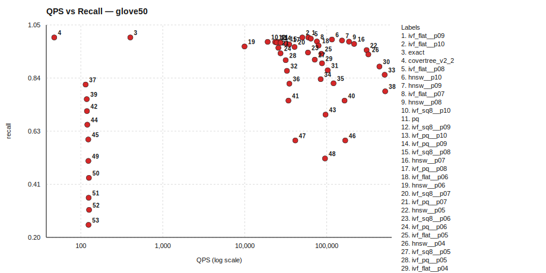

### Tradeoff Curves by Algorithm

_Pareto points are listed under `Pareto Points (Non-dominated Frontier)` for each algorithm._

#### covertree_v2_2 (1 points)

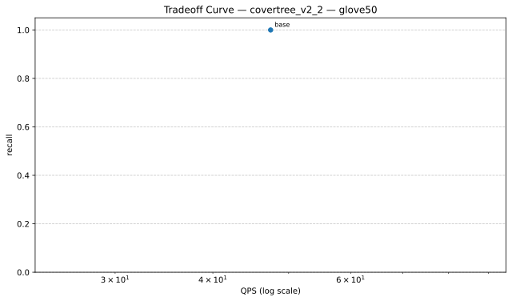

| Variant | QPS | Recall | Parameters |
|---|---:|---:|---|
| base | 47.41 | 1.0000 | baseline |

##### Pareto Points (Non-dominated Frontier)

| Variant | QPS | Recall | Parameters |
|---|---:|---:|---|
| base | 47.41 | 1.0000 | baseline |

Data: `./glove50/tradeoff_curves/tradeoff_glove50_covertree_v2_2.json`

#### exact (1 points)

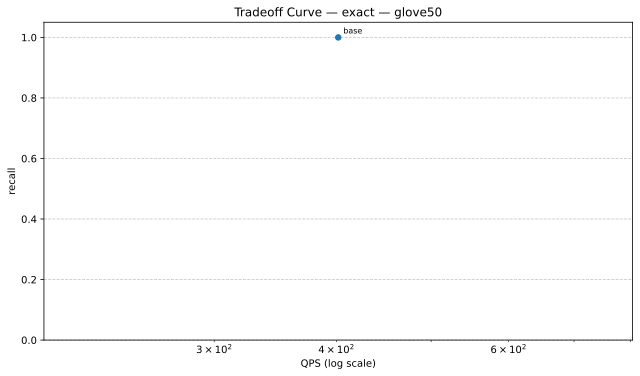

| Variant | QPS | Recall | Parameters |
|---|---:|---:|---|
| base | 401.80 | 1.0000 | baseline |

##### Pareto Points (Non-dominated Frontier)

| Variant | QPS | Recall | Parameters |
|---|---:|---:|---|
| base | 401.80 | 1.0000 | baseline |

Data: `./glove50/tradeoff_curves/tradeoff_glove50_exact.json`

#### hnsw (10 points)

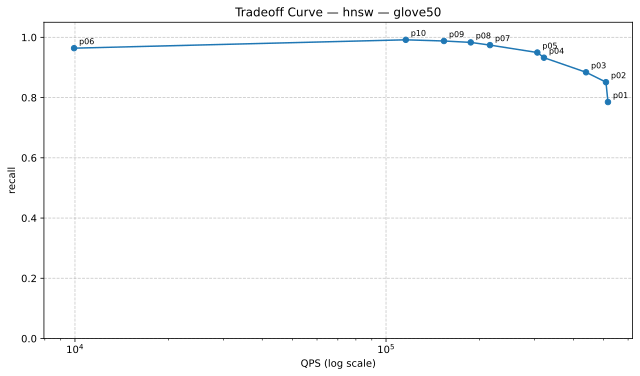

| Variant | QPS | Recall | Parameters |
|---|---:|---:|---|
| p01 | 516967.66 | 0.7852 | indexer.efSearch=16 |
| p02 | 509365.19 | 0.8512 | indexer.efSearch=24 |
| p03 | 439517.73 | 0.8840 | indexer.efSearch=32 |
| p04 | 321865.06 | 0.9324 | indexer.efSearch=48 |
| p05 | 306433.17 | 0.9496 | indexer.efSearch=64 |
| p06 | 9935.43 | 0.9641 | indexer.efSearch=80 |
| p07 | 215870.89 | 0.9742 | indexer.efSearch=100 |
| p08 | 187226.12 | 0.9832 | indexer.efSearch=128 |
| p09 | 153545.23 | 0.9879 | indexer.efSearch=160 |
| p10 | 115754.83 | 0.9918 | indexer.efSearch=200 |

##### Pareto Points (Non-dominated Frontier)

| Variant | QPS | Recall | Parameters |
|---|---:|---:|---|
| p10 | 115754.83 | 0.9918 | indexer.efSearch=200 |
| p09 | 153545.23 | 0.9879 | indexer.efSearch=160 |
| p08 | 187226.12 | 0.9832 | indexer.efSearch=128 |
| p07 | 215870.89 | 0.9742 | indexer.efSearch=100 |
| p05 | 306433.17 | 0.9496 | indexer.efSearch=64 |
| p04 | 321865.06 | 0.9324 | indexer.efSearch=48 |
| p03 | 439517.73 | 0.8840 | indexer.efSearch=32 |
| p02 | 509365.19 | 0.8512 | indexer.efSearch=24 |
| p01 | 516967.66 | 0.7852 | indexer.efSearch=16 |

Data: `./glove50/tradeoff_curves/tradeoff_glove50_hnsw.json`

#### ivf_flat (10 points)

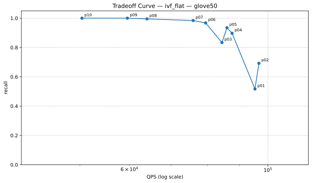

| Variant | QPS | Recall | Parameters |
|---|---:|---:|---|
| p01 | 95333.55 | 0.5172 | searcher.nprobe=2 |
| p02 | 96742.21 | 0.6922 | searcher.nprobe=4 |
| p03 | 84413.67 | 0.8336 | searcher.nprobe=8 |
| p04 | 87623.78 | 0.8969 | searcher.nprobe=12 |
| p05 | 85981.89 | 0.9352 | searcher.nprobe=16 |
| p06 | 79483.44 | 0.9676 | searcher.nprobe=24 |
| p07 | 75909.64 | 0.9840 | searcher.nprobe=32 |
| p08 | 64023.72 | 0.9953 | searcher.nprobe=48 |
| p09 | 59559.68 | 1.0000 | searcher.nprobe=64 |
| p10 | 50372.58 | 1.0000 | searcher.nprobe=96 |

##### Pareto Points (Non-dominated Frontier)

| Variant | QPS | Recall | Parameters |
|---|---:|---:|---|
| p09 | 59559.68 | 1.0000 | searcher.nprobe=64 |
| p08 | 64023.72 | 0.9953 | searcher.nprobe=48 |
| p07 | 75909.64 | 0.9840 | searcher.nprobe=32 |
| p06 | 79483.44 | 0.9676 | searcher.nprobe=24 |
| p05 | 85981.89 | 0.9352 | searcher.nprobe=16 |
| p04 | 87623.78 | 0.8969 | searcher.nprobe=12 |
| p02 | 96742.21 | 0.6922 | searcher.nprobe=4 |

Data: `./glove50/tradeoff_curves/tradeoff_glove50_ivf_flat.json`

#### ivf_pq (10 points)

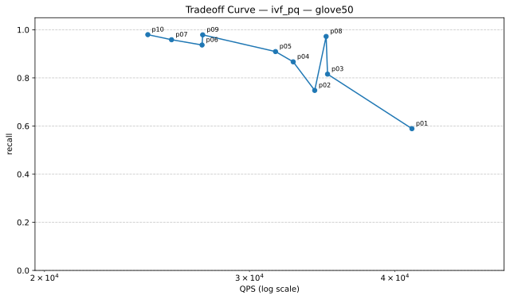

| Variant | QPS | Recall | Parameters |
|---|---:|---:|---|
| p01 | 41366.18 | 0.5891 | searcher.nprobe=4 |
| p02 | 34130.38 | 0.7480 | searcher.nprobe=8 |
| p03 | 35007.23 | 0.8156 | searcher.nprobe=12 |
| p04 | 32708.11 | 0.8668 | searcher.nprobe=16 |
| p05 | 31583.43 | 0.9094 | searcher.nprobe=24 |
| p06 | 27313.33 | 0.9367 | searcher.nprobe=32 |
| p07 | 25713.44 | 0.9586 | searcher.nprobe=48 |
| p08 | 34910.49 | 0.9723 | searcher.nprobe=64 |
| p09 | 27346.73 | 0.9789 | searcher.nprobe=96 |
| p10 | 24534.82 | 0.9797 | searcher.nprobe=128 |

##### Pareto Points (Non-dominated Frontier)

| Variant | QPS | Recall | Parameters |
|---|---:|---:|---|
| p10 | 24534.82 | 0.9797 | searcher.nprobe=128 |
| p09 | 27346.73 | 0.9789 | searcher.nprobe=96 |
| p08 | 34910.49 | 0.9723 | searcher.nprobe=64 |
| p03 | 35007.23 | 0.8156 | searcher.nprobe=12 |
| p01 | 41366.18 | 0.5891 | searcher.nprobe=4 |

Data: `./glove50/tradeoff_curves/tradeoff_glove50_ivf_pq.json`

#### ivf_sq8 (10 points)

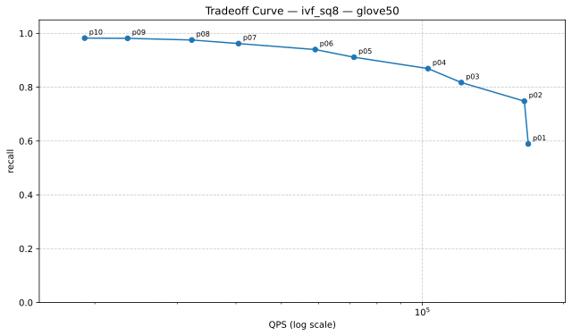

| Variant | QPS | Recall | Parameters |
|---|---:|---:|---|
| p01 | 168192.64 | 0.5891 | searcher.nprobe=4 |
| p02 | 164987.99 | 0.7480 | searcher.nprobe=8 |
| p03 | 121080.49 | 0.8172 | searcher.nprobe=12 |
| p04 | 102789.76 | 0.8691 | searcher.nprobe=16 |
| p05 | 71449.42 | 0.9113 | searcher.nprobe=24 |
| p06 | 59064.96 | 0.9398 | searcher.nprobe=32 |
| p07 | 40520.09 | 0.9621 | searcher.nprobe=48 |
| p08 | 32206.78 | 0.9754 | searcher.nprobe=64 |
| p09 | 23493.90 | 0.9816 | searcher.nprobe=96 |
| p10 | 19027.52 | 0.9824 | searcher.nprobe=128 |

##### Pareto Points (Non-dominated Frontier)

| Variant | QPS | Recall | Parameters |
|---|---:|---:|---|
| p10 | 19027.52 | 0.9824 | searcher.nprobe=128 |
| p09 | 23493.90 | 0.9816 | searcher.nprobe=96 |
| p08 | 32206.78 | 0.9754 | searcher.nprobe=64 |
| p07 | 40520.09 | 0.9621 | searcher.nprobe=48 |
| p06 | 59064.96 | 0.9398 | searcher.nprobe=32 |
| p05 | 71449.42 | 0.9113 | searcher.nprobe=24 |
| p04 | 102789.76 | 0.8691 | searcher.nprobe=16 |
| p03 | 121080.49 | 0.8172 | searcher.nprobe=12 |
| p02 | 164987.99 | 0.7480 | searcher.nprobe=8 |
| p01 | 168192.64 | 0.5891 | searcher.nprobe=4 |

Data: `./glove50/tradeoff_curves/tradeoff_glove50_ivf_sq8.json`

#### lsh (10 points)

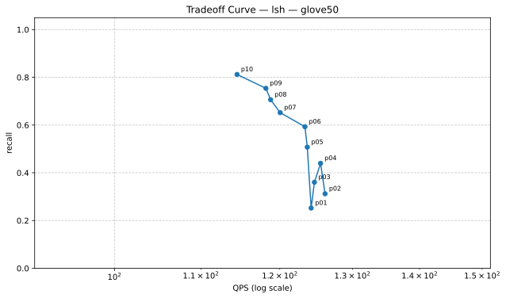

| Variant | QPS | Recall | Parameters |
|---|---:|---:|---|
| p01 | 124.22 | 0.2523 | searcher.candidate_multiplier=16 |
| p02 | 126.14 | 0.3121 | searcher.candidate_multiplier=24 |
| p03 | 124.67 | 0.3605 | searcher.candidate_multiplier=32 |
| p04 | 125.52 | 0.4398 | searcher.candidate_multiplier=48 |
| p05 | 123.69 | 0.5074 | searcher.candidate_multiplier=64 |
| p06 | 123.37 | 0.5930 | searcher.candidate_multiplier=96 |
| p07 | 120.05 | 0.6520 | searcher.candidate_multiplier=128 |
| p08 | 118.79 | 0.7063 | searcher.candidate_multiplier=160 |
| p09 | 118.17 | 0.7539 | searcher.candidate_multiplier=192 |
| p10 | 114.47 | 0.8121 | searcher.candidate_multiplier=256 |

##### Pareto Points (Non-dominated Frontier)

| Variant | QPS | Recall | Parameters |
|---|---:|---:|---|
| p10 | 114.47 | 0.8121 | searcher.candidate_multiplier=256 |
| p09 | 118.17 | 0.7539 | searcher.candidate_multiplier=192 |
| p08 | 118.79 | 0.7063 | searcher.candidate_multiplier=160 |
| p07 | 120.05 | 0.6520 | searcher.candidate_multiplier=128 |
| p06 | 123.37 | 0.5930 | searcher.candidate_multiplier=96 |
| p05 | 123.69 | 0.5074 | searcher.candidate_multiplier=64 |
| p04 | 125.52 | 0.4398 | searcher.candidate_multiplier=48 |
| p02 | 126.14 | 0.3121 | searcher.candidate_multiplier=24 |

Data: `./glove50/tradeoff_curves/tradeoff_glove50_lsh.json`

#### pq (1 points)

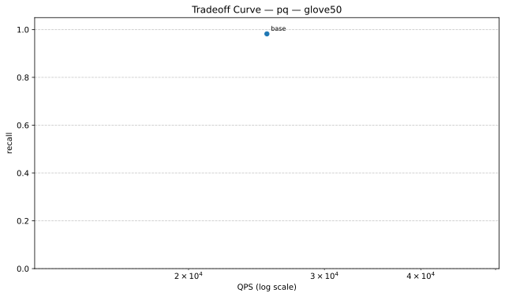

| Variant | QPS | Recall | Parameters |
|---|---:|---:|---|
| base | 25269.27 | 0.9820 | baseline |

##### Pareto Points (Non-dominated Frontier)

| Variant | QPS | Recall | Parameters |
|---|---:|---:|---|
| base | 25269.27 | 0.9820 | baseline |

Data: `./glove50/tradeoff_curves/tradeoff_glove50_pq.json`

| Algorithm | Recall | QPS | Mean Query Time (ms) | Build Time (s) | Status |
|---|---:|---:|---:|---:|---|
| ivf_flat__p09 | 1.0000 | 59559.68 | 0.017 | 0.09 | ok |
| ivf_flat__p10 | 1.0000 | 50372.58 | 0.020 | 0.09 | ok |
| exact | 1.0000 | 401.80 | 2.489 | 0.00 | ok |
| covertree_v2_2 | 1.0000 | 47.41 | 21.091 | 217.97 | ok |
| ivf_flat__p08 | 0.9953 | 64023.72 | 0.016 | 0.09 | ok |
| hnsw__p10 | 0.9918 | 115754.83 | 0.009 | 0.14 | ok |
| hnsw__p09 | 0.9879 | 153545.23 | 0.007 | 0.14 | ok |
| ivf_flat__p07 | 0.9840 | 75909.64 | 0.013 | 0.09 | ok |
| hnsw__p08 | 0.9832 | 187226.12 | 0.005 | 0.14 | ok |
| ivf_sq8__p10 | 0.9824 | 19027.52 | 0.053 | 0.38 | ok |
| pq | 0.9820 | 25269.27 | 0.040 | 10.72 | ok |
| ivf_sq8__p09 | 0.9816 | 23493.90 | 0.043 | 0.38 | ok |
| ivf_pq__p10 | 0.9797 | 24534.82 | 0.041 | 11.31 | ok |
| ivf_pq__p09 | 0.9789 | 27346.73 | 0.037 | 11.31 | ok |
| ivf_sq8__p08 | 0.9754 | 32206.78 | 0.031 | 0.38 | ok |
| hnsw__p07 | 0.9742 | 215870.89 | 0.005 | 0.14 | ok |
| ivf_pq__p08 | 0.9723 | 34910.49 | 0.029 | 11.08 | ok |
| ivf_flat__p06 | 0.9676 | 79483.44 | 0.013 | 0.09 | ok |
| hnsw__p06 | 0.9641 | 9935.43 | 0.101 | 0.15 | ok |
| ivf_sq8__p07 | 0.9621 | 40520.09 | 0.025 | 0.38 | ok |
| ivf_pq__p07 | 0.9586 | 25713.44 | 0.039 | 11.18 | ok |
| hnsw__p05 | 0.9496 | 306433.17 | 0.003 | 0.14 | ok |
| ivf_sq8__p06 | 0.9398 | 59064.96 | 0.017 | 0.36 | ok |
| ivf_pq__p06 | 0.9367 | 27313.33 | 0.037 | 11.16 | ok |
| ivf_flat__p05 | 0.9352 | 85981.89 | 0.012 | 0.09 | ok |
| hnsw__p04 | 0.9324 | 321865.06 | 0.003 | 0.14 | ok |
| ivf_sq8__p05 | 0.9113 | 71449.42 | 0.014 | 0.38 | ok |
| ivf_pq__p05 | 0.9094 | 31583.43 | 0.032 | 11.15 | ok |
| ivf_flat__p04 | 0.8969 | 87623.78 | 0.011 | 0.09 | ok |
| hnsw__p03 | 0.8840 | 439517.73 | 0.002 | 0.14 | ok |
| ivf_sq8__p04 | 0.8691 | 102789.76 | 0.010 | 0.38 | ok |
| ivf_pq__p04 | 0.8668 | 32708.11 | 0.031 | 11.13 | ok |
| hnsw__p02 | 0.8512 | 509365.19 | 0.002 | 0.14 | ok |
| ivf_flat__p03 | 0.8336 | 84413.67 | 0.012 | 0.09 | ok |
| ivf_sq8__p03 | 0.8172 | 121080.49 | 0.008 | 0.38 | ok |
| ivf_pq__p03 | 0.8156 | 35007.23 | 0.029 | 11.15 | ok |
| lsh__p10 | 0.8121 | 114.47 | 8.736 | 0.24 | ok |
| hnsw__p01 | 0.7852 | 516967.66 | 0.002 | 0.15 | ok |
| lsh__p09 | 0.7539 | 118.17 | 8.462 | 0.23 | ok |
| ivf_sq8__p02 | 0.7480 | 164987.99 | 0.006 | 0.38 | ok |
| ivf_pq__p02 | 0.7480 | 34130.38 | 0.029 | 11.17 | ok |
| lsh__p08 | 0.7063 | 118.79 | 8.418 | 0.24 | ok |
| ivf_flat__p02 | 0.6922 | 96742.21 | 0.010 | 0.09 | ok |
| lsh__p07 | 0.6520 | 120.05 | 8.330 | 0.24 | ok |
| lsh__p06 | 0.5930 | 123.37 | 8.106 | 0.23 | ok |
| ivf_sq8__p01 | 0.5891 | 168192.64 | 0.006 | 0.34 | ok |
| ivf_pq__p01 | 0.5891 | 41366.18 | 0.024 | 11.16 | ok |
| ivf_flat__p01 | 0.5172 | 95333.55 | 0.010 | 0.09 | ok |
| lsh__p05 | 0.5074 | 123.69 | 8.085 | 0.24 | ok |
| lsh__p04 | 0.4398 | 125.52 | 7.967 | 0.24 | ok |
| lsh__p03 | 0.3605 | 124.67 | 8.021 | 0.24 | ok |
| lsh__p02 | 0.3121 | 126.14 | 7.928 | 0.23 | ok |
| lsh__p01 | 0.2523 | 124.22 | 8.050 | 0.45 | ok |

### Algorithm Implementation Details

| Algorithm | Type | Metric | Indexer | Searcher |
|---|---|---|---|---|
| covertree_v2_2 | CoverTreeV2_2 | l2 | N/A | N/A |
| exact | Composite | l2 | BruteForceIndexer (metric=l2) | LinearSearcher (metric=l2) |
| hnsw__p01 | Composite | l2 | HNSWIndexer (M=16, efConstruction=200, efSearch=16, metric=l2) | FaissSearcher (metric=l2, nprobe=10) |
| hnsw__p02 | Composite | l2 | HNSWIndexer (M=16, efConstruction=200, efSearch=24, metric=l2) | FaissSearcher (metric=l2, nprobe=10) |
| hnsw__p03 | Composite | l2 | HNSWIndexer (M=16, efConstruction=200, efSearch=32, metric=l2) | FaissSearcher (metric=l2, nprobe=10) |
| hnsw__p04 | Composite | l2 | HNSWIndexer (M=16, efConstruction=200, efSearch=48, metric=l2) | FaissSearcher (metric=l2, nprobe=10) |
| hnsw__p05 | Composite | l2 | HNSWIndexer (M=16, efConstruction=200, efSearch=64, metric=l2) | FaissSearcher (metric=l2, nprobe=10) |
| hnsw__p06 | Composite | l2 | HNSWIndexer (M=16, efConstruction=200, efSearch=80, metric=l2) | FaissSearcher (metric=l2, nprobe=10) |
| hnsw__p07 | Composite | l2 | HNSWIndexer (M=16, efConstruction=200, efSearch=100, metric=l2) | FaissSearcher (metric=l2, nprobe=10) |
| hnsw__p08 | Composite | l2 | HNSWIndexer (M=16, efConstruction=200, efSearch=128, metric=l2) | FaissSearcher (metric=l2, nprobe=10) |
| hnsw__p09 | Composite | l2 | HNSWIndexer (M=16, efConstruction=200, efSearch=160, metric=l2) | FaissSearcher (metric=l2, nprobe=10) |
| hnsw__p10 | Composite | l2 | HNSWIndexer (M=16, efConstruction=200, efSearch=200, metric=l2) | FaissSearcher (metric=l2, nprobe=10) |
| ivf_flat__p01 | Composite | l2 | FaissIVFIndexer (index_type=IVF100,Flat, metric=l2, nprobe=10) | FaissSearcher (metric=l2, nprobe=2) |
| ivf_flat__p02 | Composite | l2 | FaissIVFIndexer (index_type=IVF100,Flat, metric=l2, nprobe=10) | FaissSearcher (metric=l2, nprobe=4) |
| ivf_flat__p03 | Composite | l2 | FaissIVFIndexer (index_type=IVF100,Flat, metric=l2, nprobe=10) | FaissSearcher (metric=l2, nprobe=8) |
| ivf_flat__p04 | Composite | l2 | FaissIVFIndexer (index_type=IVF100,Flat, metric=l2, nprobe=10) | FaissSearcher (metric=l2, nprobe=12) |
| ivf_flat__p05 | Composite | l2 | FaissIVFIndexer (index_type=IVF100,Flat, metric=l2, nprobe=10) | FaissSearcher (metric=l2, nprobe=16) |
| ivf_flat__p06 | Composite | l2 | FaissIVFIndexer (index_type=IVF100,Flat, metric=l2, nprobe=10) | FaissSearcher (metric=l2, nprobe=24) |
| ivf_flat__p07 | Composite | l2 | FaissIVFIndexer (index_type=IVF100,Flat, metric=l2, nprobe=10) | FaissSearcher (metric=l2, nprobe=32) |
| ivf_flat__p08 | Composite | l2 | FaissIVFIndexer (index_type=IVF100,Flat, metric=l2, nprobe=10) | FaissSearcher (metric=l2, nprobe=48) |
| ivf_flat__p09 | Composite | l2 | FaissIVFIndexer (index_type=IVF100,Flat, metric=l2, nprobe=10) | FaissSearcher (metric=l2, nprobe=64) |
| ivf_flat__p10 | Composite | l2 | FaissIVFIndexer (index_type=IVF100,Flat, metric=l2, nprobe=10) | FaissSearcher (metric=l2, nprobe=96) |
| ivf_pq__p01 | Composite | l2 | FaissFactoryIndexer (index_key=IVF256,PQ50, metric=l2, nprobe=24) | FaissSearcher (metric=l2, nprobe=4) |
| ivf_pq__p02 | Composite | l2 | FaissFactoryIndexer (index_key=IVF256,PQ50, metric=l2, nprobe=24) | FaissSearcher (metric=l2, nprobe=8) |
| ivf_pq__p03 | Composite | l2 | FaissFactoryIndexer (index_key=IVF256,PQ50, metric=l2, nprobe=24) | FaissSearcher (metric=l2, nprobe=12) |
| ivf_pq__p04 | Composite | l2 | FaissFactoryIndexer (index_key=IVF256,PQ50, metric=l2, nprobe=24) | FaissSearcher (metric=l2, nprobe=16) |
| ivf_pq__p05 | Composite | l2 | FaissFactoryIndexer (index_key=IVF256,PQ50, metric=l2, nprobe=24) | FaissSearcher (metric=l2, nprobe=24) |
| ivf_pq__p06 | Composite | l2 | FaissFactoryIndexer (index_key=IVF256,PQ50, metric=l2, nprobe=24) | FaissSearcher (metric=l2, nprobe=32) |
| ivf_pq__p07 | Composite | l2 | FaissFactoryIndexer (index_key=IVF256,PQ50, metric=l2, nprobe=24) | FaissSearcher (metric=l2, nprobe=48) |
| ivf_pq__p08 | Composite | l2 | FaissFactoryIndexer (index_key=IVF256,PQ50, metric=l2, nprobe=24) | FaissSearcher (metric=l2, nprobe=64) |
| ivf_pq__p09 | Composite | l2 | FaissFactoryIndexer (index_key=IVF256,PQ50, metric=l2, nprobe=24) | FaissSearcher (metric=l2, nprobe=96) |
| ivf_pq__p10 | Composite | l2 | FaissFactoryIndexer (index_key=IVF256,PQ50, metric=l2, nprobe=24) | FaissSearcher (metric=l2, nprobe=128) |
| ivf_sq8__p01 | Composite | l2 | FaissFactoryIndexer (index_key=IVF256,SQ8, metric=l2, nprobe=24) | FaissSearcher (metric=l2, nprobe=4) |
| ivf_sq8__p02 | Composite | l2 | FaissFactoryIndexer (index_key=IVF256,SQ8, metric=l2, nprobe=24) | FaissSearcher (metric=l2, nprobe=8) |
| ivf_sq8__p03 | Composite | l2 | FaissFactoryIndexer (index_key=IVF256,SQ8, metric=l2, nprobe=24) | FaissSearcher (metric=l2, nprobe=12) |
| ivf_sq8__p04 | Composite | l2 | FaissFactoryIndexer (index_key=IVF256,SQ8, metric=l2, nprobe=24) | FaissSearcher (metric=l2, nprobe=16) |
| ivf_sq8__p05 | Composite | l2 | FaissFactoryIndexer (index_key=IVF256,SQ8, metric=l2, nprobe=24) | FaissSearcher (metric=l2, nprobe=24) |
| ivf_sq8__p06 | Composite | l2 | FaissFactoryIndexer (index_key=IVF256,SQ8, metric=l2, nprobe=24) | FaissSearcher (metric=l2, nprobe=32) |
| ivf_sq8__p07 | Composite | l2 | FaissFactoryIndexer (index_key=IVF256,SQ8, metric=l2, nprobe=24) | FaissSearcher (metric=l2, nprobe=48) |
| ivf_sq8__p08 | Composite | l2 | FaissFactoryIndexer (index_key=IVF256,SQ8, metric=l2, nprobe=24) | FaissSearcher (metric=l2, nprobe=64) |
| ivf_sq8__p09 | Composite | l2 | FaissFactoryIndexer (index_key=IVF256,SQ8, metric=l2, nprobe=24) | FaissSearcher (metric=l2, nprobe=96) |
| ivf_sq8__p10 | Composite | l2 | FaissFactoryIndexer (index_key=IVF256,SQ8, metric=l2, nprobe=24) | FaissSearcher (metric=l2, nprobe=128) |
| lsh__p01 | Composite | l2 | LSHIndexer (bucket_width=20, hash_size=4, metric=l2, num_tables=12, ...) | LSHSearcher (candidate_multiplier=16, fallback_to_bruteforce=False, metric=l2) |
| lsh__p02 | Composite | l2 | LSHIndexer (bucket_width=20, hash_size=4, metric=l2, num_tables=12, ...) | LSHSearcher (candidate_multiplier=24, fallback_to_bruteforce=False, metric=l2) |
| lsh__p03 | Composite | l2 | LSHIndexer (bucket_width=20, hash_size=4, metric=l2, num_tables=12, ...) | LSHSearcher (candidate_multiplier=32, fallback_to_bruteforce=False, metric=l2) |
| lsh__p04 | Composite | l2 | LSHIndexer (bucket_width=20, hash_size=4, metric=l2, num_tables=12, ...) | LSHSearcher (candidate_multiplier=48, fallback_to_bruteforce=False, metric=l2) |
| lsh__p05 | Composite | l2 | LSHIndexer (bucket_width=20, hash_size=4, metric=l2, num_tables=12, ...) | LSHSearcher (candidate_multiplier=64, fallback_to_bruteforce=False, metric=l2) |
| lsh__p06 | Composite | l2 | LSHIndexer (bucket_width=20, hash_size=4, metric=l2, num_tables=12, ...) | LSHSearcher (candidate_multiplier=96, fallback_to_bruteforce=False, metric=l2) |
| lsh__p07 | Composite | l2 | LSHIndexer (bucket_width=20, hash_size=4, metric=l2, num_tables=12, ...) | LSHSearcher (candidate_multiplier=128, fallback_to_bruteforce=False, metric=l2) |
| lsh__p08 | Composite | l2 | LSHIndexer (bucket_width=20, hash_size=4, metric=l2, num_tables=12, ...) | LSHSearcher (candidate_multiplier=160, fallback_to_bruteforce=False, metric=l2) |
| lsh__p09 | Composite | l2 | LSHIndexer (bucket_width=20, hash_size=4, metric=l2, num_tables=12, ...) | LSHSearcher (candidate_multiplier=192, fallback_to_bruteforce=False, metric=l2) |
| lsh__p10 | Composite | l2 | LSHIndexer (bucket_width=20, hash_size=4, metric=l2, num_tables=12, ...) | LSHSearcher (candidate_multiplier=256, fallback_to_bruteforce=False, metric=l2) |
| pq | Composite | l2 | FaissFactoryIndexer (index_key=PQ50, metric=l2) | FaissSearcher (metric=l2, nprobe=24) |

### Dataset Details

- Config: `benchmark_results/benchmark_20260319_102154/glove50/glove50_config.yaml`
- metric: `l2`
- topk: `20`
- n_queries: `256`
- repeat: `2`
- seed: `42`
- dataset_options.ground_truth_k: `200`
- dataset_options.seed: `11`
- dataset_options.test_size: `256`
- dataset_options.train_limit: `20000`

## Dataset: msmarco

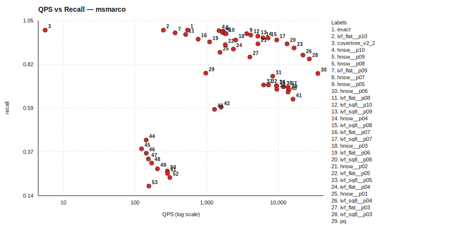

### Tradeoff Curves by Algorithm

_Pareto points are listed under `Pareto Points (Non-dominated Frontier)` for each algorithm._

#### covertree_v2_2 (1 points)

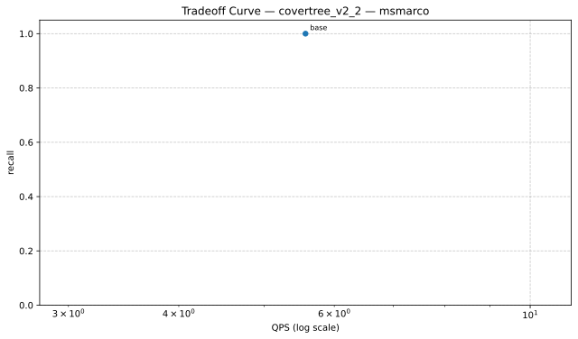

| Variant | QPS | Recall | Parameters |
|---|---:|---:|---|
| base | 5.57 | 1.0000 | baseline |

##### Pareto Points (Non-dominated Frontier)

| Variant | QPS | Recall | Parameters |
|---|---:|---:|---|
| base | 5.57 | 1.0000 | baseline |

Data: `./msmarco/tradeoff_curves/tradeoff_msmarco_covertree_v2_2.json`

#### exact (1 points)

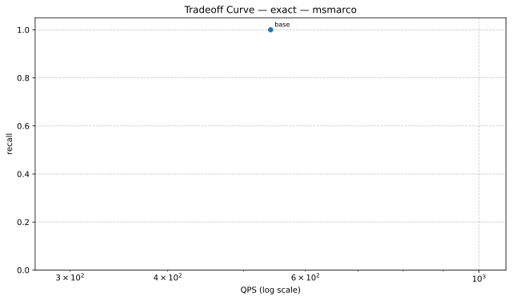

| Variant | QPS | Recall | Parameters |
|---|---:|---:|---|
| base | 541.42 | 1.0000 | baseline |

##### Pareto Points (Non-dominated Frontier)

| Variant | QPS | Recall | Parameters |
|---|---:|---:|---|
| base | 541.42 | 1.0000 | baseline |

Data: `./msmarco/tradeoff_curves/tradeoff_msmarco_exact.json`

#### hnsw (10 points)

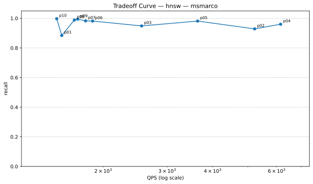

| Variant | QPS | Recall | Parameters |
|---|---:|---:|---|
| p01 | 1538.19 | 0.8843 | indexer.efSearch=16 |
| p02 | 5217.72 | 0.9286 | indexer.efSearch=24 |
| p03 | 2550.64 | 0.9486 | indexer.efSearch=32 |
| p04 | 6150.52 | 0.9600 | indexer.efSearch=48 |
| p05 | 3636.29 | 0.9814 | indexer.efSearch=64 |
| p06 | 1870.35 | 0.9814 | indexer.efSearch=80 |
| p07 | 1788.70 | 0.9829 | indexer.efSearch=100 |
| p08 | 1665.85 | 0.9886 | indexer.efSearch=128 |
| p09 | 1701.53 | 0.9943 | indexer.efSearch=160 |
| p10 | 1489.83 | 0.9971 | indexer.efSearch=200 |

##### Pareto Points (Non-dominated Frontier)

| Variant | QPS | Recall | Parameters |
|---|---:|---:|---|
| p10 | 1489.83 | 0.9971 | indexer.efSearch=200 |
| p09 | 1701.53 | 0.9943 | indexer.efSearch=160 |
| p07 | 1788.70 | 0.9829 | indexer.efSearch=100 |
| p05 | 3636.29 | 0.9814 | indexer.efSearch=64 |
| p04 | 6150.52 | 0.9600 | indexer.efSearch=48 |

Data: `./msmarco/tradeoff_curves/tradeoff_msmarco_hnsw.json`

#### ivf_flat (10 points)

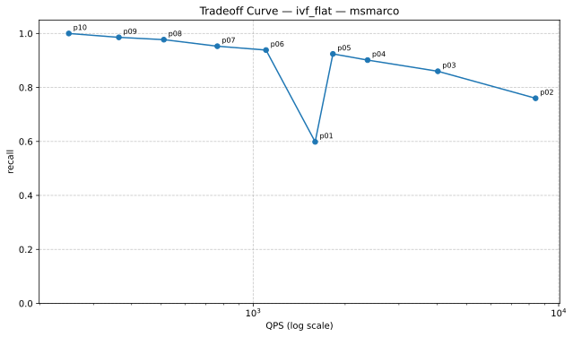

| Variant | QPS | Recall | Parameters |
|---|---:|---:|---|
| p01 | 1595.40 | 0.5986 | searcher.nprobe=2 |
| p02 | 8402.53 | 0.7600 | searcher.nprobe=4 |
| p03 | 4022.32 | 0.8600 | searcher.nprobe=8 |
| p04 | 2368.65 | 0.9014 | searcher.nprobe=12 |
| p05 | 1823.83 | 0.9243 | searcher.nprobe=16 |
| p06 | 1101.52 | 0.9386 | searcher.nprobe=24 |
| p07 | 763.14 | 0.9529 | searcher.nprobe=32 |
| p08 | 509.95 | 0.9771 | searcher.nprobe=48 |
| p09 | 363.35 | 0.9857 | searcher.nprobe=64 |
| p10 | 249.14 | 1.0000 | searcher.nprobe=96 |

##### Pareto Points (Non-dominated Frontier)

| Variant | QPS | Recall | Parameters |
|---|---:|---:|---|
| p10 | 249.14 | 1.0000 | searcher.nprobe=96 |
| p09 | 363.35 | 0.9857 | searcher.nprobe=64 |
| p08 | 509.95 | 0.9771 | searcher.nprobe=48 |
| p07 | 763.14 | 0.9529 | searcher.nprobe=32 |
| p06 | 1101.52 | 0.9386 | searcher.nprobe=24 |
| p05 | 1823.83 | 0.9243 | searcher.nprobe=16 |
| p04 | 2368.65 | 0.9014 | searcher.nprobe=12 |
| p03 | 4022.32 | 0.8600 | searcher.nprobe=8 |
| p02 | 8402.53 | 0.7600 | searcher.nprobe=4 |

Data: `./msmarco/tradeoff_curves/tradeoff_msmarco_ivf_flat.json`

#### ivf_pq (10 points)

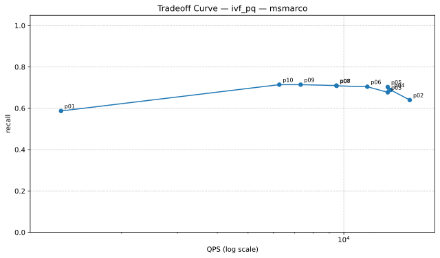

| Variant | QPS | Recall | Parameters |
|---|---:|---:|---|
| p01 | 1290.57 | 0.5871 | searcher.nprobe=4 |
| p02 | 16116.88 | 0.6400 | searcher.nprobe=8 |
| p03 | 13745.38 | 0.6771 | searcher.nprobe=12 |
| p04 | 14039.85 | 0.6886 | searcher.nprobe=16 |
| p05 | 13745.38 | 0.7029 | searcher.nprobe=24 |
| p06 | 11855.49 | 0.7043 | searcher.nprobe=32 |
| p07 | 9495.82 | 0.7086 | searcher.nprobe=48 |
| p08 | 9472.54 | 0.7100 | searcher.nprobe=64 |
| p09 | 7318.44 | 0.7143 | searcher.nprobe=96 |
| p10 | 6268.98 | 0.7143 | searcher.nprobe=128 |

##### Pareto Points (Non-dominated Frontier)

| Variant | QPS | Recall | Parameters |
|---|---:|---:|---|
| p09 | 7318.44 | 0.7143 | searcher.nprobe=96 |
| p08 | 9472.54 | 0.7100 | searcher.nprobe=64 |
| p07 | 9495.82 | 0.7086 | searcher.nprobe=48 |
| p06 | 11855.49 | 0.7043 | searcher.nprobe=32 |
| p05 | 13745.38 | 0.7029 | searcher.nprobe=24 |
| p04 | 14039.85 | 0.6886 | searcher.nprobe=16 |
| p02 | 16116.88 | 0.6400 | searcher.nprobe=8 |

Data: `./msmarco/tradeoff_curves/tradeoff_msmarco_ivf_pq.json`

#### ivf_sq8 (10 points)

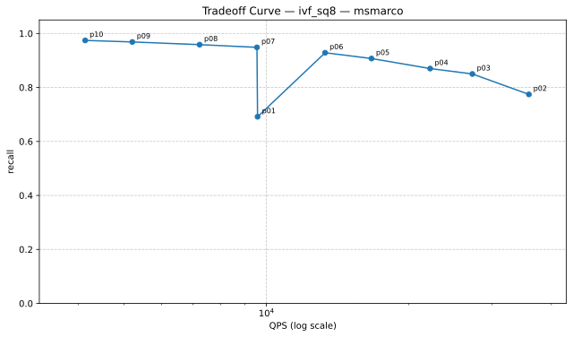

| Variant | QPS | Recall | Parameters |
|---|---:|---:|---|
| p01 | 9576.66 | 0.6914 | searcher.nprobe=4 |
| p02 | 35853.13 | 0.7743 | searcher.nprobe=8 |
| p03 | 27230.69 | 0.8500 | searcher.nprobe=12 |
| p04 | 22175.32 | 0.8700 | searcher.nprobe=16 |
| p05 | 16670.52 | 0.9071 | searcher.nprobe=24 |
| p06 | 13303.79 | 0.9286 | searcher.nprobe=32 |
| p07 | 9548.94 | 0.9486 | searcher.nprobe=48 |
| p08 | 7225.15 | 0.9586 | searcher.nprobe=64 |
| p09 | 5206.43 | 0.9686 | searcher.nprobe=96 |
| p10 | 4140.30 | 0.9743 | searcher.nprobe=128 |

##### Pareto Points (Non-dominated Frontier)

| Variant | QPS | Recall | Parameters |
|---|---:|---:|---|
| p10 | 4140.30 | 0.9743 | searcher.nprobe=128 |
| p09 | 5206.43 | 0.9686 | searcher.nprobe=96 |
| p08 | 7225.15 | 0.9586 | searcher.nprobe=64 |
| p07 | 9548.94 | 0.9486 | searcher.nprobe=48 |
| p06 | 13303.79 | 0.9286 | searcher.nprobe=32 |
| p05 | 16670.52 | 0.9071 | searcher.nprobe=24 |
| p04 | 22175.32 | 0.8700 | searcher.nprobe=16 |
| p03 | 27230.69 | 0.8500 | searcher.nprobe=12 |
| p02 | 35853.13 | 0.7743 | searcher.nprobe=8 |

Data: `./msmarco/tradeoff_curves/tradeoff_msmarco_ivf_sq8.json`

#### lsh (10 points)

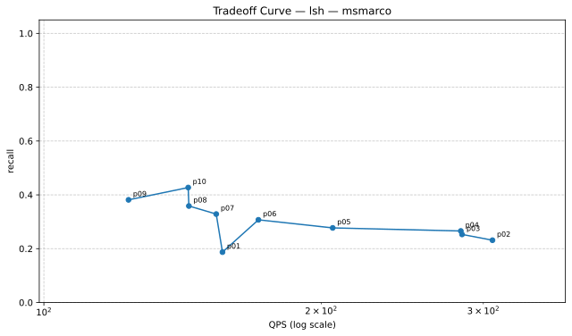

| Variant | QPS | Recall | Parameters |
|---|---:|---:|---|
| p01 | 156.28 | 0.1871 | searcher.candidate_multiplier=16 |
| p02 | 306.92 | 0.2314 | searcher.candidate_multiplier=24 |
| p03 | 284.45 | 0.2529 | searcher.candidate_multiplier=32 |
| p04 | 283.58 | 0.2657 | searcher.candidate_multiplier=48 |
| p05 | 205.86 | 0.2771 | searcher.candidate_multiplier=64 |
| p06 | 170.97 | 0.3071 | searcher.candidate_multiplier=96 |
| p07 | 153.86 | 0.3286 | searcher.candidate_multiplier=128 |
| p08 | 143.70 | 0.3586 | searcher.candidate_multiplier=160 |
| p09 | 123.57 | 0.3814 | searcher.candidate_multiplier=192 |
| p10 | 143.45 | 0.4271 | searcher.candidate_multiplier=256 |

##### Pareto Points (Non-dominated Frontier)

| Variant | QPS | Recall | Parameters |
|---|---:|---:|---|
| p10 | 143.45 | 0.4271 | searcher.candidate_multiplier=256 |
| p08 | 143.70 | 0.3586 | searcher.candidate_multiplier=160 |
| p07 | 153.86 | 0.3286 | searcher.candidate_multiplier=128 |
| p06 | 170.97 | 0.3071 | searcher.candidate_multiplier=96 |
| p05 | 205.86 | 0.2771 | searcher.candidate_multiplier=64 |
| p04 | 283.58 | 0.2657 | searcher.candidate_multiplier=48 |
| p03 | 284.45 | 0.2529 | searcher.candidate_multiplier=32 |
| p02 | 306.92 | 0.2314 | searcher.candidate_multiplier=24 |

Data: `./msmarco/tradeoff_curves/tradeoff_msmarco_lsh.json`

#### pq (1 points)

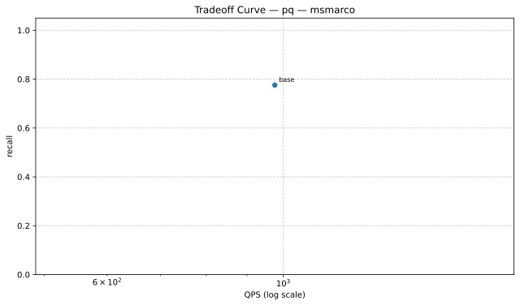

| Variant | QPS | Recall | Parameters |
|---|---:|---:|---|
| base | 975.70 | 0.7757 | baseline |

##### Pareto Points (Non-dominated Frontier)

| Variant | QPS | Recall | Parameters |
|---|---:|---:|---|
| base | 975.70 | 0.7757 | baseline |

Data: `./msmarco/tradeoff_curves/tradeoff_msmarco_pq.json`

| Algorithm | Recall | QPS | Mean Query Time (ms) | Build Time (s) | Status |
|---|---:|---:|---:|---:|---|
| exact | 1.0000 | 541.42 | 1.847 | 0.87 | ok |
| ivf_flat__p10 | 1.0000 | 249.14 | 4.014 | 0.74 | ok |
| covertree_v2_2 | 1.0000 | 5.57 | 179.659 | 4387.85 | ok |
| hnsw__p10 | 0.9971 | 1489.83 | 0.671 | 25.72 | ok |
| hnsw__p09 | 0.9943 | 1701.53 | 0.588 | 25.64 | ok |
| hnsw__p08 | 0.9886 | 1665.85 | 0.600 | 23.77 | ok |
| ivf_flat__p09 | 0.9857 | 363.35 | 2.752 | 0.73 | ok |
| hnsw__p07 | 0.9829 | 1788.70 | 0.559 | 23.29 | ok |
| hnsw__p05 | 0.9814 | 3636.29 | 0.275 | 23.84 | ok |
| hnsw__p06 | 0.9814 | 1870.35 | 0.535 | 25.04 | ok |
| ivf_flat__p08 | 0.9771 | 509.95 | 1.961 | 0.73 | ok |
| ivf_sq8__p10 | 0.9743 | 4140.30 | 0.242 | 3.30 | ok |
| ivf_sq8__p09 | 0.9686 | 5206.43 | 0.192 | 3.32 | ok |
| hnsw__p04 | 0.9600 | 6150.52 | 0.163 | 24.21 | ok |
| ivf_sq8__p08 | 0.9586 | 7225.15 | 0.138 | 3.32 | ok |
| ivf_flat__p07 | 0.9529 | 763.14 | 1.310 | 0.73 | ok |
| ivf_sq8__p07 | 0.9486 | 9548.94 | 0.105 | 3.29 | ok |
| hnsw__p03 | 0.9486 | 2550.64 | 0.392 | 23.93 | ok |
| ivf_flat__p06 | 0.9386 | 1101.52 | 0.908 | 0.76 | ok |
| ivf_sq8__p06 | 0.9286 | 13303.79 | 0.075 | 3.30 | ok |
| hnsw__p02 | 0.9286 | 5217.72 | 0.192 | 25.93 | ok |
| ivf_flat__p05 | 0.9243 | 1823.83 | 0.548 | 0.76 | ok |
| ivf_sq8__p05 | 0.9071 | 16670.52 | 0.060 | 3.29 | ok |
| ivf_flat__p04 | 0.9014 | 2368.65 | 0.422 | 0.76 | ok |
| hnsw__p01 | 0.8843 | 1538.19 | 0.650 | 26.69 | ok |
| ivf_sq8__p04 | 0.8700 | 22175.32 | 0.045 | 3.30 | ok |
| ivf_flat__p03 | 0.8600 | 4022.32 | 0.249 | 0.76 | ok |
| ivf_sq8__p03 | 0.8500 | 27230.69 | 0.037 | 3.30 | ok |
| pq | 0.7757 | 975.70 | 1.025 | 14.08 | ok |
| ivf_sq8__p02 | 0.7743 | 35853.13 | 0.028 | 3.30 | ok |
| ivf_flat__p02 | 0.7600 | 8402.53 | 0.119 | 0.74 | ok |
| ivf_pq__p09 | 0.7143 | 7318.44 | 0.137 | 16.87 | ok |
| ivf_pq__p10 | 0.7143 | 6268.98 | 0.160 | 16.33 | ok |
| ivf_pq__p08 | 0.7100 | 9472.54 | 0.106 | 17.07 | ok |
| ivf_pq__p07 | 0.7086 | 9495.82 | 0.105 | 16.80 | ok |
| ivf_pq__p06 | 0.7043 | 11855.49 | 0.084 | 16.55 | ok |
| ivf_pq__p05 | 0.7029 | 13745.38 | 0.073 | 17.16 | ok |
| ivf_sq8__p01 | 0.6914 | 9576.66 | 0.104 | 3.37 | ok |
| ivf_pq__p04 | 0.6886 | 14039.85 | 0.071 | 17.02 | ok |
| ivf_pq__p03 | 0.6771 | 13745.38 | 0.073 | 16.42 | ok |
| ivf_pq__p02 | 0.6400 | 16116.88 | 0.062 | 17.49 | ok |
| ivf_flat__p01 | 0.5986 | 1595.40 | 0.627 | 1.23 | ok |
| ivf_pq__p01 | 0.5871 | 1290.57 | 0.775 | 16.48 | ok |
| lsh__p10 | 0.4271 | 143.45 | 6.971 | 2.91 | ok |
| lsh__p09 | 0.3814 | 123.57 | 8.093 | 3.01 | ok |
| lsh__p08 | 0.3586 | 143.70 | 6.959 | 3.05 | ok |
| lsh__p07 | 0.3286 | 153.86 | 6.500 | 3.02 | ok |
| lsh__p06 | 0.3071 | 170.97 | 5.849 | 3.04 | ok |
| lsh__p05 | 0.2771 | 205.86 | 4.858 | 3.06 | ok |
| lsh__p04 | 0.2657 | 283.58 | 3.526 | 2.94 | ok |
| lsh__p03 | 0.2529 | 284.45 | 3.516 | 3.03 | ok |
| lsh__p02 | 0.2314 | 306.92 | 3.258 | 2.97 | ok |
| lsh__p01 | 0.1871 | 156.28 | 6.399 | 3.01 | ok |

### Algorithm Implementation Details

| Algorithm | Type | Metric | Indexer | Searcher |
|---|---|---|---|---|
| covertree_v2_2 | CoverTreeV2_2 | cosine | N/A | N/A |
| exact | Composite | cosine | BruteForceIndexer (metric=cosine) | LinearSearcher (metric=cosine) |
| hnsw__p01 | Composite | cosine | HNSWIndexer (M=16, efConstruction=200, efSearch=16, metric=cosine) | FaissSearcher (metric=cosine, nprobe=32) |
| hnsw__p02 | Composite | cosine | HNSWIndexer (M=16, efConstruction=200, efSearch=24, metric=cosine) | FaissSearcher (metric=cosine, nprobe=32) |
| hnsw__p03 | Composite | cosine | HNSWIndexer (M=16, efConstruction=200, efSearch=32, metric=cosine) | FaissSearcher (metric=cosine, nprobe=32) |
| hnsw__p04 | Composite | cosine | HNSWIndexer (M=16, efConstruction=200, efSearch=48, metric=cosine) | FaissSearcher (metric=cosine, nprobe=32) |
| hnsw__p05 | Composite | cosine | HNSWIndexer (M=16, efConstruction=200, efSearch=64, metric=cosine) | FaissSearcher (metric=cosine, nprobe=32) |
| hnsw__p06 | Composite | cosine | HNSWIndexer (M=16, efConstruction=200, efSearch=80, metric=cosine) | FaissSearcher (metric=cosine, nprobe=32) |
| hnsw__p07 | Composite | cosine | HNSWIndexer (M=16, efConstruction=200, efSearch=100, metric=cosine) | FaissSearcher (metric=cosine, nprobe=32) |
| hnsw__p08 | Composite | cosine | HNSWIndexer (M=16, efConstruction=200, efSearch=128, metric=cosine) | FaissSearcher (metric=cosine, nprobe=32) |
| hnsw__p09 | Composite | cosine | HNSWIndexer (M=16, efConstruction=200, efSearch=160, metric=cosine) | FaissSearcher (metric=cosine, nprobe=32) |
| hnsw__p10 | Composite | cosine | HNSWIndexer (M=16, efConstruction=200, efSearch=200, metric=cosine) | FaissSearcher (metric=cosine, nprobe=32) |
| ivf_flat__p01 | Composite | cosine | FaissIVFIndexer (index_type=IVF100,Flat, metric=cosine, nprobe=10) | FaissSearcher (metric=cosine, nprobe=2) |
| ivf_flat__p02 | Composite | cosine | FaissIVFIndexer (index_type=IVF100,Flat, metric=cosine, nprobe=10) | FaissSearcher (metric=cosine, nprobe=4) |
| ivf_flat__p03 | Composite | cosine | FaissIVFIndexer (index_type=IVF100,Flat, metric=cosine, nprobe=10) | FaissSearcher (metric=cosine, nprobe=8) |
| ivf_flat__p04 | Composite | cosine | FaissIVFIndexer (index_type=IVF100,Flat, metric=cosine, nprobe=10) | FaissSearcher (metric=cosine, nprobe=12) |
| ivf_flat__p05 | Composite | cosine | FaissIVFIndexer (index_type=IVF100,Flat, metric=cosine, nprobe=10) | FaissSearcher (metric=cosine, nprobe=16) |
| ivf_flat__p06 | Composite | cosine | FaissIVFIndexer (index_type=IVF100,Flat, metric=cosine, nprobe=10) | FaissSearcher (metric=cosine, nprobe=24) |
| ivf_flat__p07 | Composite | cosine | FaissIVFIndexer (index_type=IVF100,Flat, metric=cosine, nprobe=10) | FaissSearcher (metric=cosine, nprobe=32) |
| ivf_flat__p08 | Composite | cosine | FaissIVFIndexer (index_type=IVF100,Flat, metric=cosine, nprobe=10) | FaissSearcher (metric=cosine, nprobe=48) |
| ivf_flat__p09 | Composite | cosine | FaissIVFIndexer (index_type=IVF100,Flat, metric=cosine, nprobe=10) | FaissSearcher (metric=cosine, nprobe=64) |
| ivf_flat__p10 | Composite | cosine | FaissIVFIndexer (index_type=IVF100,Flat, metric=cosine, nprobe=10) | FaissSearcher (metric=cosine, nprobe=96) |
| ivf_pq__p01 | Composite | cosine | FaissFactoryIndexer (index_key=IVF256,PQ64, metric=cosine, nprobe=48) | FaissSearcher (metric=cosine, nprobe=4) |
| ivf_pq__p02 | Composite | cosine | FaissFactoryIndexer (index_key=IVF256,PQ64, metric=cosine, nprobe=48) | FaissSearcher (metric=cosine, nprobe=8) |
| ivf_pq__p03 | Composite | cosine | FaissFactoryIndexer (index_key=IVF256,PQ64, metric=cosine, nprobe=48) | FaissSearcher (metric=cosine, nprobe=12) |
| ivf_pq__p04 | Composite | cosine | FaissFactoryIndexer (index_key=IVF256,PQ64, metric=cosine, nprobe=48) | FaissSearcher (metric=cosine, nprobe=16) |
| ivf_pq__p05 | Composite | cosine | FaissFactoryIndexer (index_key=IVF256,PQ64, metric=cosine, nprobe=48) | FaissSearcher (metric=cosine, nprobe=24) |
| ivf_pq__p06 | Composite | cosine | FaissFactoryIndexer (index_key=IVF256,PQ64, metric=cosine, nprobe=48) | FaissSearcher (metric=cosine, nprobe=32) |
| ivf_pq__p07 | Composite | cosine | FaissFactoryIndexer (index_key=IVF256,PQ64, metric=cosine, nprobe=48) | FaissSearcher (metric=cosine, nprobe=48) |
| ivf_pq__p08 | Composite | cosine | FaissFactoryIndexer (index_key=IVF256,PQ64, metric=cosine, nprobe=48) | FaissSearcher (metric=cosine, nprobe=64) |
| ivf_pq__p09 | Composite | cosine | FaissFactoryIndexer (index_key=IVF256,PQ64, metric=cosine, nprobe=48) | FaissSearcher (metric=cosine, nprobe=96) |
| ivf_pq__p10 | Composite | cosine | FaissFactoryIndexer (index_key=IVF256,PQ64, metric=cosine, nprobe=48) | FaissSearcher (metric=cosine, nprobe=128) |
| ivf_sq8__p01 | Composite | cosine | FaissFactoryIndexer (index_key=IVF256,SQ8, metric=cosine, nprobe=48) | FaissSearcher (metric=cosine, nprobe=4) |
| ivf_sq8__p02 | Composite | cosine | FaissFactoryIndexer (index_key=IVF256,SQ8, metric=cosine, nprobe=48) | FaissSearcher (metric=cosine, nprobe=8) |
| ivf_sq8__p03 | Composite | cosine | FaissFactoryIndexer (index_key=IVF256,SQ8, metric=cosine, nprobe=48) | FaissSearcher (metric=cosine, nprobe=12) |
| ivf_sq8__p04 | Composite | cosine | FaissFactoryIndexer (index_key=IVF256,SQ8, metric=cosine, nprobe=48) | FaissSearcher (metric=cosine, nprobe=16) |
| ivf_sq8__p05 | Composite | cosine | FaissFactoryIndexer (index_key=IVF256,SQ8, metric=cosine, nprobe=48) | FaissSearcher (metric=cosine, nprobe=24) |
| ivf_sq8__p06 | Composite | cosine | FaissFactoryIndexer (index_key=IVF256,SQ8, metric=cosine, nprobe=48) | FaissSearcher (metric=cosine, nprobe=32) |
| ivf_sq8__p07 | Composite | cosine | FaissFactoryIndexer (index_key=IVF256,SQ8, metric=cosine, nprobe=48) | FaissSearcher (metric=cosine, nprobe=48) |
| ivf_sq8__p08 | Composite | cosine | FaissFactoryIndexer (index_key=IVF256,SQ8, metric=cosine, nprobe=48) | FaissSearcher (metric=cosine, nprobe=64) |
| ivf_sq8__p09 | Composite | cosine | FaissFactoryIndexer (index_key=IVF256,SQ8, metric=cosine, nprobe=48) | FaissSearcher (metric=cosine, nprobe=96) |
| ivf_sq8__p10 | Composite | cosine | FaissFactoryIndexer (index_key=IVF256,SQ8, metric=cosine, nprobe=48) | FaissSearcher (metric=cosine, nprobe=128) |
| lsh__p01 | Composite | cosine | LSHIndexer (hash_size=8, metric=cosine, num_tables=24, seed=42) | LSHSearcher (candidate_multiplier=16, fallback_to_bruteforce=False, metric=cosine) |
| lsh__p02 | Composite | cosine | LSHIndexer (hash_size=8, metric=cosine, num_tables=24, seed=42) | LSHSearcher (candidate_multiplier=24, fallback_to_bruteforce=False, metric=cosine) |
| lsh__p03 | Composite | cosine | LSHIndexer (hash_size=8, metric=cosine, num_tables=24, seed=42) | LSHSearcher (candidate_multiplier=32, fallback_to_bruteforce=False, metric=cosine) |
| lsh__p04 | Composite | cosine | LSHIndexer (hash_size=8, metric=cosine, num_tables=24, seed=42) | LSHSearcher (candidate_multiplier=48, fallback_to_bruteforce=False, metric=cosine) |
| lsh__p05 | Composite | cosine | LSHIndexer (hash_size=8, metric=cosine, num_tables=24, seed=42) | LSHSearcher (candidate_multiplier=64, fallback_to_bruteforce=False, metric=cosine) |
| lsh__p06 | Composite | cosine | LSHIndexer (hash_size=8, metric=cosine, num_tables=24, seed=42) | LSHSearcher (candidate_multiplier=96, fallback_to_bruteforce=False, metric=cosine) |
| lsh__p07 | Composite | cosine | LSHIndexer (hash_size=8, metric=cosine, num_tables=24, seed=42) | LSHSearcher (candidate_multiplier=128, fallback_to_bruteforce=False, metric=cosine) |
| lsh__p08 | Composite | cosine | LSHIndexer (hash_size=8, metric=cosine, num_tables=24, seed=42) | LSHSearcher (candidate_multiplier=160, fallback_to_bruteforce=False, metric=cosine) |
| lsh__p09 | Composite | cosine | LSHIndexer (hash_size=8, metric=cosine, num_tables=24, seed=42) | LSHSearcher (candidate_multiplier=192, fallback_to_bruteforce=False, metric=cosine) |
| lsh__p10 | Composite | cosine | LSHIndexer (hash_size=8, metric=cosine, num_tables=24, seed=42) | LSHSearcher (candidate_multiplier=256, fallback_to_bruteforce=False, metric=cosine) |
| pq | Composite | cosine | FaissFactoryIndexer (index_key=PQ64, metric=cosine) | FaissSearcher (metric=cosine, nprobe=48) |

### Dataset Details

- Config: `benchmark_results/benchmark_20260319_102154/msmarco/msmarco_config.yaml`
- metric: `cosine`
- topk: `20`
- n_queries: `200`
- repeat: `2`
- seed: `42`
- dataset_options.base_limit: `100000`
- dataset_options.cache_dir: `/storage/ice-shared/cs8903onl/vectordb-retrieval/results/cache`
- dataset_options.embedded_dataset_dir: `/storage/ice-shared/cs8903onl/vectordb-retrieval/datasets/msmarco_v1_embeddings`
- dataset_options.ground_truth_k: `200`
- dataset_options.query_limit: `200`
- dataset_options.use_memmap_cache: `True`
- dataset_options.use_preembedded: `True`

## Brief Takeaways

- `random`: best recall `ivf_flat__p10` (1.0000), best QPS `hnsw__p02` (404727.41)
- `glove50`: best recall `ivf_flat__p09` (1.0000), best QPS `hnsw__p01` (516967.66)
- `msmarco`: best recall `exact` (1.0000), best QPS `ivf_sq8__p02` (35853.13)
