# One-Page Benchmark Summary (QPS vs Recall)

*Generated on: 2026-03-20 12:10:32*
*Run directory: `benchmark_results/benchmark_20260320_115137`*

## Table of Contents

- [Dataset: random](#dataset-random)
- [random / Tradeoff Curves by Algorithm](#tradeoff-random)
- [random / Algorithm Implementation Details](#algo-details-random)
- [random / Dataset Details](#dataset-details-random)
- [Dataset: glove50](#dataset-glove50)
- [glove50 / Tradeoff Curves by Algorithm](#tradeoff-glove50)
- [glove50 / Algorithm Implementation Details](#algo-details-glove50)
- [glove50 / Dataset Details](#dataset-details-glove50)
- [Dataset: msmarco](#dataset-msmarco)
- [msmarco / Tradeoff Curves by Algorithm](#tradeoff-msmarco)
- [msmarco / Algorithm Implementation Details](#algo-details-msmarco)
- [msmarco / Dataset Details](#dataset-details-msmarco)
- [Brief Takeaways](#brief-takeaways)

## Dataset: random

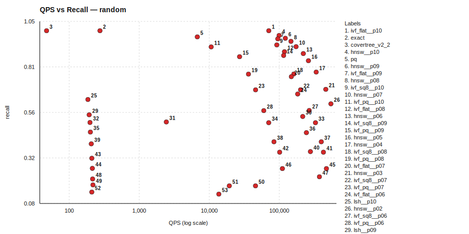

### Tradeoff Curves by Algorithm

_Pareto points are listed under `Pareto Points (Non-dominated Frontier)` for each algorithm._

#### covertree_v2_2 (1 points)

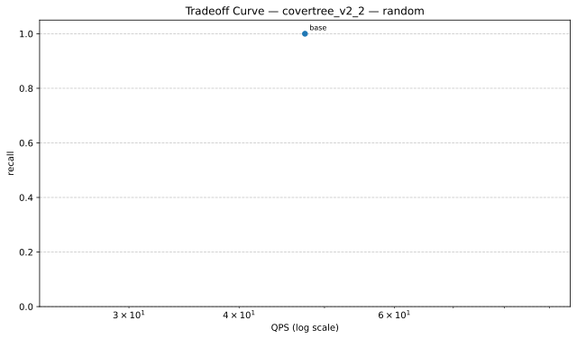

| Variant | QPS | Recall | Parameters |
|---|---:|---:|---|
| base | 47.51 | 1.0000 | baseline |

##### Pareto Points (Non-dominated Frontier)

| Variant | QPS | Recall | Parameters |
|---|---:|---:|---|
| base | 47.51 | 1.0000 | baseline |

##### Mermaid Quadrant Chart

_Point IDs ending with `_pareto` mark Pareto points._

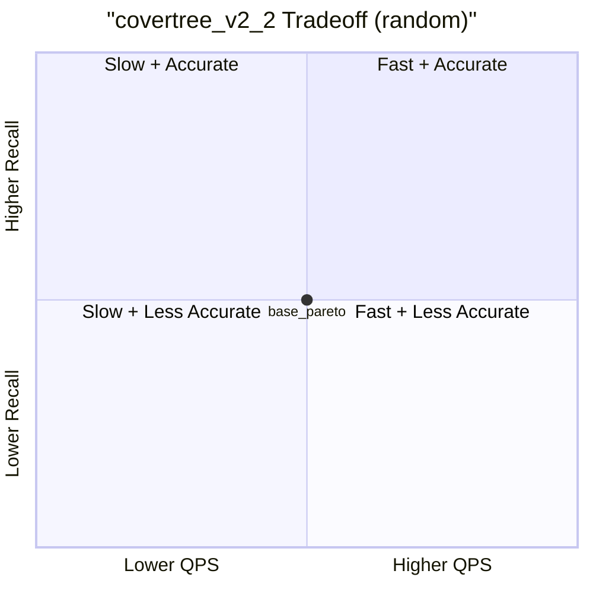
```mermaid
quadrantChart
    title "covertree_v2_2 Tradeoff (random)"
    x-axis "Lower QPS" --> "Higher QPS"
    y-axis "Lower Recall" --> "Higher Recall"
    quadrant-1 "Fast + Accurate"
    quadrant-2 "Slow + Accurate"
    quadrant-3 "Slow + Less Accurate"
    quadrant-4 "Fast + Less Accurate"
    %% Point key uses variant IDs from the tables below; '_pareto' marks Pareto points.
    base_pareto: [0.500, 0.500]
```

Mermaid source: `./random/tradeoff_curves/tradeoff_random_covertree_v2_2_quadrant.mmd`

Data: `./random/tradeoff_curves/tradeoff_random_covertree_v2_2.json`

#### exact (1 points)

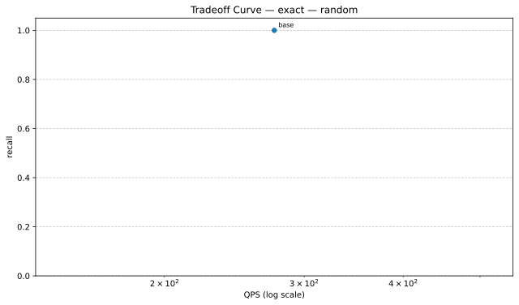

| Variant | QPS | Recall | Parameters |
|---|---:|---:|---|
| base | 275.12 | 1.0000 | baseline |

##### Pareto Points (Non-dominated Frontier)

| Variant | QPS | Recall | Parameters |
|---|---:|---:|---|
| base | 275.12 | 1.0000 | baseline |

##### Mermaid Quadrant Chart

_Point IDs ending with `_pareto` mark Pareto points._

```mermaid
quadrantChart
    title "exact Tradeoff (random)"
    x-axis "Lower QPS" --> "Higher QPS"
    y-axis "Lower Recall" --> "Higher Recall"
    quadrant-1 "Fast + Accurate"
    quadrant-2 "Slow + Accurate"
    quadrant-3 "Slow + Less Accurate"
    quadrant-4 "Fast + Less Accurate"
    %% Point key uses variant IDs from the tables below; '_pareto' marks Pareto points.
    base_pareto: [0.500, 0.500]
```

Mermaid source: `./random/tradeoff_curves/tradeoff_random_exact_quadrant.mmd`

Data: `./random/tradeoff_curves/tradeoff_random_exact.json`

#### hnsw (10 points)

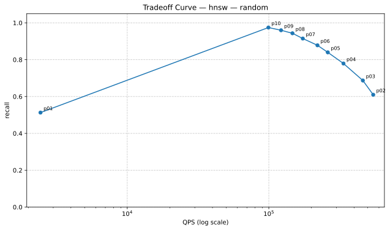

| Variant | QPS | Recall | Parameters |
|---|---:|---:|---|
| p01 | 2438.34 | 0.5129 | indexer.efSearch=16 |
| p02 | 546433.50 | 0.6098 | indexer.efSearch=24 |
| p03 | 461625.89 | 0.6871 | indexer.efSearch=32 |
| p04 | 336807.35 | 0.7793 | indexer.efSearch=48 |
| p05 | 260997.04 | 0.8398 | indexer.efSearch=64 |
| p06 | 220616.77 | 0.8781 | indexer.efSearch=80 |
| p07 | 173800.88 | 0.9148 | indexer.efSearch=100 |
| p08 | 146886.71 | 0.9434 | indexer.efSearch=128 |
| p09 | 122029.98 | 0.9598 | indexer.efSearch=160 |
| p10 | 99365.34 | 0.9746 | indexer.efSearch=200 |

##### Pareto Points (Non-dominated Frontier)

| Variant | QPS | Recall | Parameters |
|---|---:|---:|---|
| p10 | 99365.34 | 0.9746 | indexer.efSearch=200 |
| p09 | 122029.98 | 0.9598 | indexer.efSearch=160 |
| p08 | 146886.71 | 0.9434 | indexer.efSearch=128 |
| p07 | 173800.88 | 0.9148 | indexer.efSearch=100 |
| p06 | 220616.77 | 0.8781 | indexer.efSearch=80 |
| p05 | 260997.04 | 0.8398 | indexer.efSearch=64 |
| p04 | 336807.35 | 0.7793 | indexer.efSearch=48 |
| p03 | 461625.89 | 0.6871 | indexer.efSearch=32 |
| p02 | 546433.50 | 0.6098 | indexer.efSearch=24 |

##### Mermaid Quadrant Chart

_Point IDs ending with `_pareto` mark Pareto points._

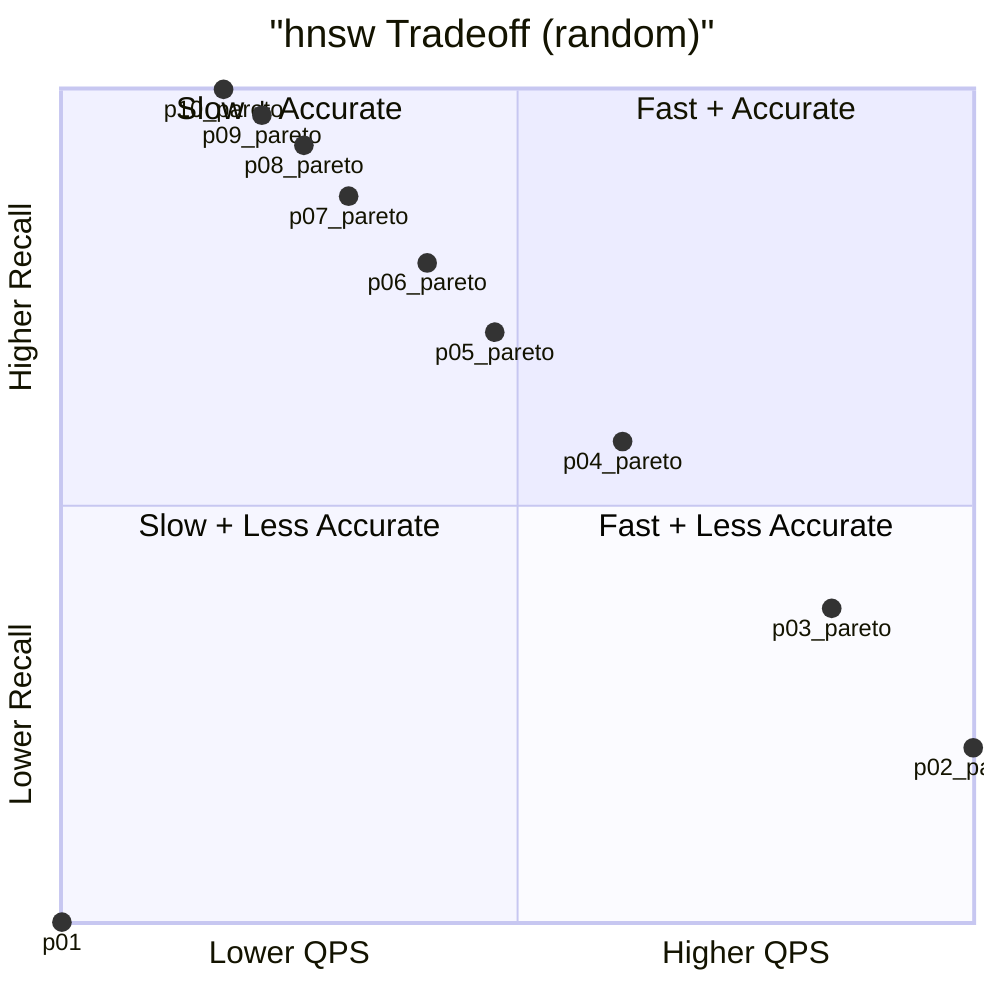
```mermaid
quadrantChart
    title "hnsw Tradeoff (random)"
    x-axis "Lower QPS" --> "Higher QPS"
    y-axis "Lower Recall" --> "Higher Recall"
    quadrant-1 "Fast + Accurate"
    quadrant-2 "Slow + Accurate"
    quadrant-3 "Slow + Less Accurate"
    quadrant-4 "Fast + Less Accurate"
    %% Point key uses variant IDs from the tables below; '_pareto' marks Pareto points.
    p01: [0.001, 0.001]
    p02_pareto: [0.999, 0.210]
    p03_pareto: [0.844, 0.377]
    p04_pareto: [0.615, 0.577]
    p05_pareto: [0.475, 0.708]
    p06_pareto: [0.401, 0.791]
    p07_pareto: [0.315, 0.871]
    p08_pareto: [0.266, 0.932]
    p09_pareto: [0.220, 0.968]
    p10_pareto: [0.178, 0.999]
```

Mermaid source: `./random/tradeoff_curves/tradeoff_random_hnsw_quadrant.mmd`

Data: `./random/tradeoff_curves/tradeoff_random_hnsw.json`

#### ivf_flat (10 points)

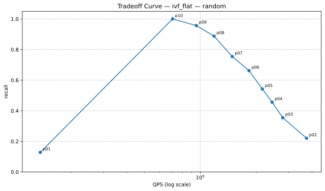

| Variant | QPS | Recall | Parameters |
|---|---:|---:|---|
| p01 | 13707.93 | 0.1277 | searcher.nprobe=2 |
| p02 | 374386.97 | 0.2203 | searcher.nprobe=4 |
| p03 | 278460.02 | 0.3547 | searcher.nprobe=8 |
| p04 | 244087.71 | 0.4559 | searcher.nprobe=12 |
| p05 | 216175.12 | 0.5422 | searcher.nprobe=16 |
| p06 | 183263.67 | 0.6621 | searcher.nprobe=24 |
| p07 | 148697.11 | 0.7547 | searcher.nprobe=32 |
| p08 | 118658.62 | 0.8879 | searcher.nprobe=48 |
| p09 | 95282.80 | 0.9566 | searcher.nprobe=64 |
| p10 | 70864.69 | 1.0000 | searcher.nprobe=96 |

##### Pareto Points (Non-dominated Frontier)

| Variant | QPS | Recall | Parameters |
|---|---:|---:|---|
| p10 | 70864.69 | 1.0000 | searcher.nprobe=96 |
| p09 | 95282.80 | 0.9566 | searcher.nprobe=64 |
| p08 | 118658.62 | 0.8879 | searcher.nprobe=48 |
| p07 | 148697.11 | 0.7547 | searcher.nprobe=32 |
| p06 | 183263.67 | 0.6621 | searcher.nprobe=24 |
| p05 | 216175.12 | 0.5422 | searcher.nprobe=16 |
| p04 | 244087.71 | 0.4559 | searcher.nprobe=12 |
| p03 | 278460.02 | 0.3547 | searcher.nprobe=8 |
| p02 | 374386.97 | 0.2203 | searcher.nprobe=4 |

##### Mermaid Quadrant Chart

_Point IDs ending with `_pareto` mark Pareto points._

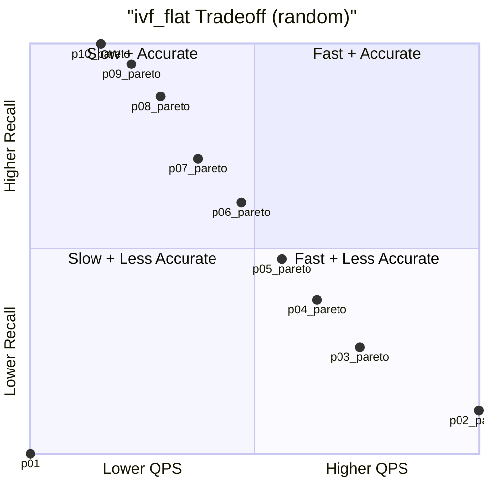
```mermaid
quadrantChart
    title "ivf_flat Tradeoff (random)"
    x-axis "Lower QPS" --> "Higher QPS"
    y-axis "Lower Recall" --> "Higher Recall"
    quadrant-1 "Fast + Accurate"
    quadrant-2 "Slow + Accurate"
    quadrant-3 "Slow + Less Accurate"
    quadrant-4 "Fast + Less Accurate"
    %% Point key uses variant IDs from the tables below; '_pareto' marks Pareto points.
    p01: [0.001, 0.001]
    p02_pareto: [0.999, 0.106]
    p03_pareto: [0.734, 0.260]
    p04_pareto: [0.639, 0.376]
    p05_pareto: [0.561, 0.475]
    p06_pareto: [0.470, 0.613]
    p07_pareto: [0.374, 0.719]
    p08_pareto: [0.291, 0.871]
    p09_pareto: [0.226, 0.950]
    p10_pareto: [0.158, 0.999]
```

Mermaid source: `./random/tradeoff_curves/tradeoff_random_ivf_flat_quadrant.mmd`

Data: `./random/tradeoff_curves/tradeoff_random_ivf_flat.json`

#### ivf_pq (10 points)

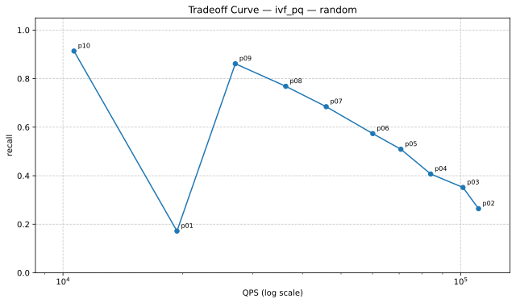

| Variant | QPS | Recall | Parameters |
|---|---:|---:|---|
| p01 | 19344.26 | 0.1719 | searcher.nprobe=4 |
| p02 | 110832.15 | 0.2641 | searcher.nprobe=8 |
| p03 | 101296.40 | 0.3516 | searcher.nprobe=12 |
| p04 | 84010.78 | 0.4070 | searcher.nprobe=16 |
| p05 | 70706.03 | 0.5090 | searcher.nprobe=24 |
| p06 | 60082.92 | 0.5734 | searcher.nprobe=32 |
| p07 | 45888.36 | 0.6844 | searcher.nprobe=48 |
| p08 | 36313.09 | 0.7684 | searcher.nprobe=64 |
| p09 | 27114.01 | 0.8613 | searcher.nprobe=96 |
| p10 | 10656.54 | 0.9137 | searcher.nprobe=128 |

##### Pareto Points (Non-dominated Frontier)

| Variant | QPS | Recall | Parameters |
|---|---:|---:|---|
| p10 | 10656.54 | 0.9137 | searcher.nprobe=128 |
| p09 | 27114.01 | 0.8613 | searcher.nprobe=96 |
| p08 | 36313.09 | 0.7684 | searcher.nprobe=64 |
| p07 | 45888.36 | 0.6844 | searcher.nprobe=48 |
| p06 | 60082.92 | 0.5734 | searcher.nprobe=32 |
| p05 | 70706.03 | 0.5090 | searcher.nprobe=24 |
| p04 | 84010.78 | 0.4070 | searcher.nprobe=16 |
| p03 | 101296.40 | 0.3516 | searcher.nprobe=12 |
| p02 | 110832.15 | 0.2641 | searcher.nprobe=8 |

##### Mermaid Quadrant Chart

_Point IDs ending with `_pareto` mark Pareto points._

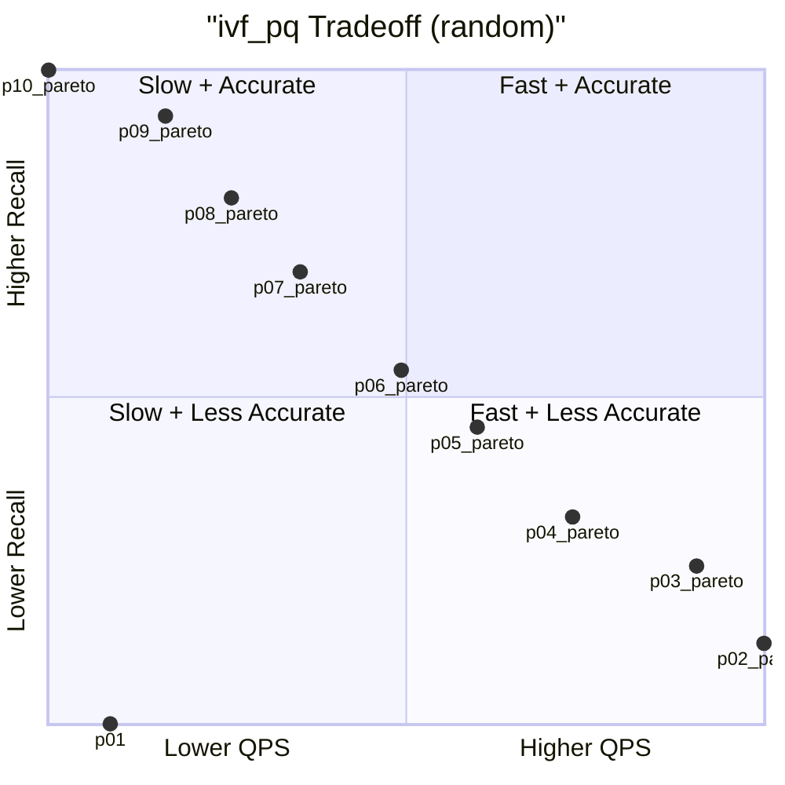
```mermaid
quadrantChart
    title "ivf_pq Tradeoff (random)"
    x-axis "Lower QPS" --> "Higher QPS"
    y-axis "Lower Recall" --> "Higher Recall"
    quadrant-1 "Fast + Accurate"
    quadrant-2 "Slow + Accurate"
    quadrant-3 "Slow + Less Accurate"
    quadrant-4 "Fast + Less Accurate"
    %% Point key uses variant IDs from the tables below; '_pareto' marks Pareto points.
    p01: [0.087, 0.001]
    p02_pareto: [0.999, 0.124]
    p03_pareto: [0.905, 0.242]
    p04_pareto: [0.732, 0.317]
    p05_pareto: [0.599, 0.454]
    p06_pareto: [0.493, 0.541]
    p07_pareto: [0.352, 0.691]
    p08_pareto: [0.256, 0.804]
    p09_pareto: [0.164, 0.929]
    p10_pareto: [0.001, 0.999]
```

Mermaid source: `./random/tradeoff_curves/tradeoff_random_ivf_pq_quadrant.mmd`

Data: `./random/tradeoff_curves/tradeoff_random_ivf_pq.json`

#### ivf_sq8 (10 points)

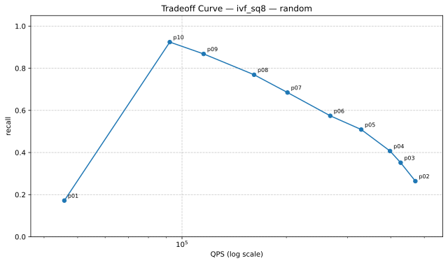

| Variant | QPS | Recall | Parameters |
|---|---:|---:|---|
| p01 | 45769.05 | 0.1719 | searcher.nprobe=4 |
| p02 | 471146.04 | 0.2641 | searcher.nprobe=8 |
| p03 | 427274.90 | 0.3516 | searcher.nprobe=12 |
| p04 | 398124.52 | 0.4070 | searcher.nprobe=16 |
| p05 | 328864.26 | 0.5090 | searcher.nprobe=24 |
| p06 | 267699.28 | 0.5742 | searcher.nprobe=32 |
| p07 | 201490.30 | 0.6848 | searcher.nprobe=48 |
| p08 | 161416.39 | 0.7691 | searcher.nprobe=64 |
| p09 | 115443.70 | 0.8680 | searcher.nprobe=96 |
| p10 | 92190.42 | 0.9242 | searcher.nprobe=128 |

##### Pareto Points (Non-dominated Frontier)

| Variant | QPS | Recall | Parameters |
|---|---:|---:|---|
| p10 | 92190.42 | 0.9242 | searcher.nprobe=128 |
| p09 | 115443.70 | 0.8680 | searcher.nprobe=96 |
| p08 | 161416.39 | 0.7691 | searcher.nprobe=64 |
| p07 | 201490.30 | 0.6848 | searcher.nprobe=48 |
| p06 | 267699.28 | 0.5742 | searcher.nprobe=32 |
| p05 | 328864.26 | 0.5090 | searcher.nprobe=24 |
| p04 | 398124.52 | 0.4070 | searcher.nprobe=16 |
| p03 | 427274.90 | 0.3516 | searcher.nprobe=12 |
| p02 | 471146.04 | 0.2641 | searcher.nprobe=8 |

##### Mermaid Quadrant Chart

_Point IDs ending with `_pareto` mark Pareto points._

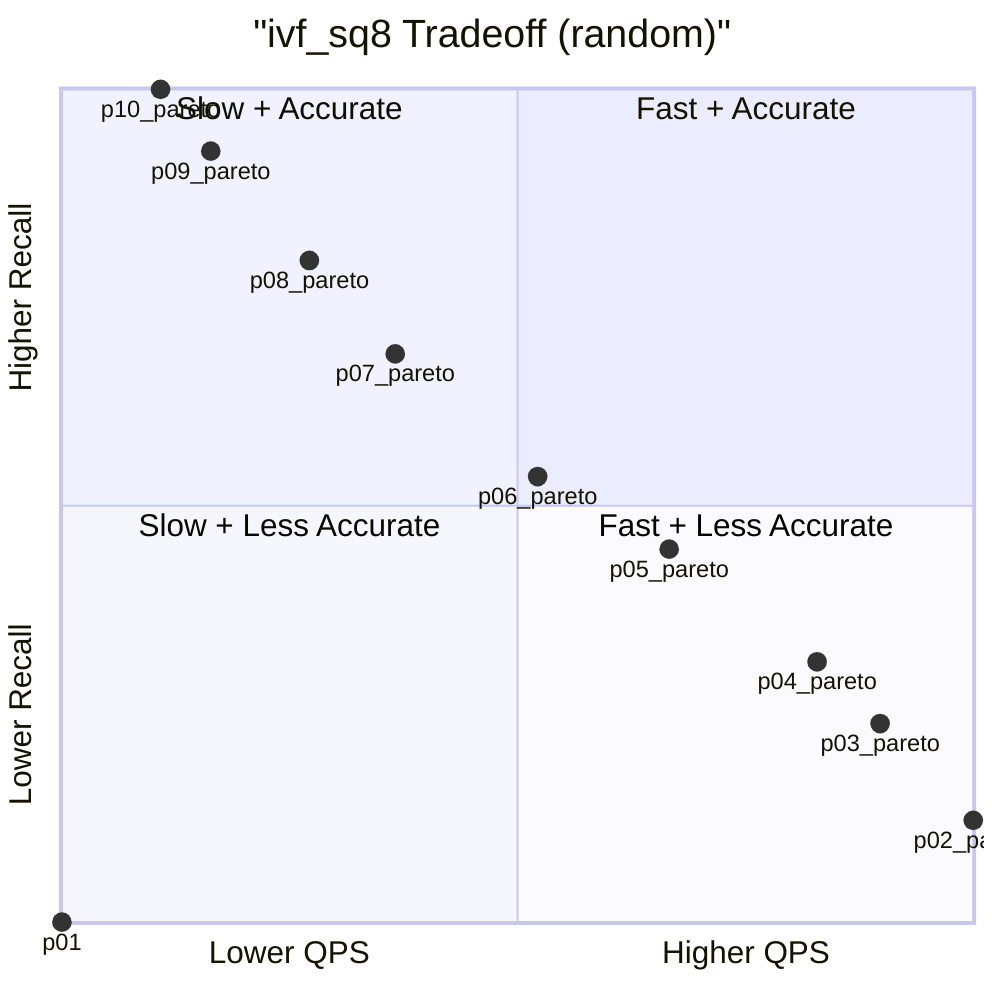
```mermaid
quadrantChart
    title "ivf_sq8 Tradeoff (random)"
    x-axis "Lower QPS" --> "Higher QPS"
    y-axis "Lower Recall" --> "Higher Recall"
    quadrant-1 "Fast + Accurate"
    quadrant-2 "Slow + Accurate"
    quadrant-3 "Slow + Less Accurate"
    quadrant-4 "Fast + Less Accurate"
    %% Point key uses variant IDs from the tables below; '_pareto' marks Pareto points.
    p01: [0.001, 0.001]
    p02_pareto: [0.999, 0.123]
    p03_pareto: [0.897, 0.239]
    p04_pareto: [0.828, 0.313]
    p05_pareto: [0.666, 0.448]
    p06_pareto: [0.522, 0.535]
    p07_pareto: [0.366, 0.682]
    p08_pareto: [0.272, 0.794]
    p09_pareto: [0.164, 0.925]
    p10_pareto: [0.109, 0.999]
```

Mermaid source: `./random/tradeoff_curves/tradeoff_random_ivf_sq8_quadrant.mmd`

Data: `./random/tradeoff_curves/tradeoff_random_ivf_sq8.json`

#### lsh (10 points)

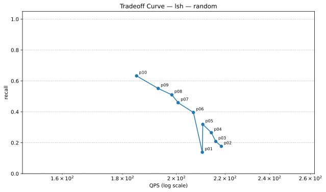

| Variant | QPS | Recall | Parameters |
|---|---:|---:|---|
| p01 | 210.41 | 0.1387 | searcher.candidate_multiplier=16 |
| p02 | 218.39 | 0.1770 | searcher.candidate_multiplier=24 |
| p03 | 216.01 | 0.2086 | searcher.candidate_multiplier=32 |
| p04 | 214.17 | 0.2652 | searcher.candidate_multiplier=48 |
| p05 | 210.61 | 0.3191 | searcher.candidate_multiplier=64 |
| p06 | 206.78 | 0.3961 | searcher.candidate_multiplier=96 |
| p07 | 200.69 | 0.4590 | searcher.candidate_multiplier=128 |
| p08 | 198.23 | 0.5102 | searcher.candidate_multiplier=160 |
| p09 | 193.02 | 0.5512 | searcher.candidate_multiplier=192 |
| p10 | 185.01 | 0.6328 | searcher.candidate_multiplier=256 |

##### Pareto Points (Non-dominated Frontier)

| Variant | QPS | Recall | Parameters |
|---|---:|---:|---|
| p10 | 185.01 | 0.6328 | searcher.candidate_multiplier=256 |
| p09 | 193.02 | 0.5512 | searcher.candidate_multiplier=192 |
| p08 | 198.23 | 0.5102 | searcher.candidate_multiplier=160 |
| p07 | 200.69 | 0.4590 | searcher.candidate_multiplier=128 |
| p06 | 206.78 | 0.3961 | searcher.candidate_multiplier=96 |
| p05 | 210.61 | 0.3191 | searcher.candidate_multiplier=64 |
| p04 | 214.17 | 0.2652 | searcher.candidate_multiplier=48 |
| p03 | 216.01 | 0.2086 | searcher.candidate_multiplier=32 |
| p02 | 218.39 | 0.1770 | searcher.candidate_multiplier=24 |

##### Mermaid Quadrant Chart

_Point IDs ending with `_pareto` mark Pareto points._

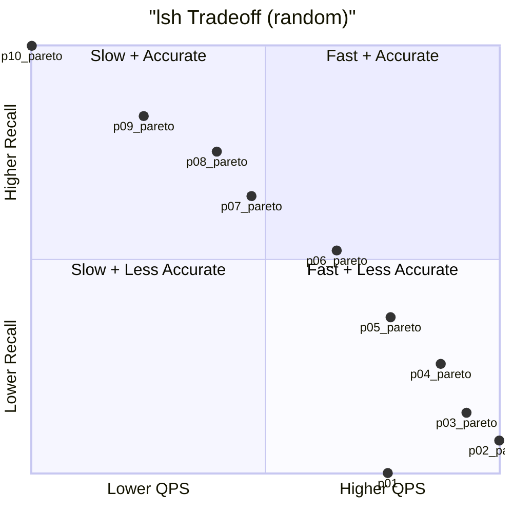
```mermaid
quadrantChart
    title "lsh Tradeoff (random)"
    x-axis "Lower QPS" --> "Higher QPS"
    y-axis "Lower Recall" --> "Higher Recall"
    quadrant-1 "Fast + Accurate"
    quadrant-2 "Slow + Accurate"
    quadrant-3 "Slow + Less Accurate"
    quadrant-4 "Fast + Less Accurate"
    %% Point key uses variant IDs from the tables below; '_pareto' marks Pareto points.
    p01: [0.761, 0.001]
    p02_pareto: [0.999, 0.077]
    p03_pareto: [0.929, 0.142]
    p04_pareto: [0.874, 0.256]
    p05_pareto: [0.767, 0.365]
    p06_pareto: [0.652, 0.521]
    p07_pareto: [0.470, 0.648]
    p08_pareto: [0.396, 0.752]
    p09_pareto: [0.240, 0.835]
    p10_pareto: [0.001, 0.999]
```

Mermaid source: `./random/tradeoff_curves/tradeoff_random_lsh_quadrant.mmd`

Data: `./random/tradeoff_curves/tradeoff_random_lsh.json`

#### pq (1 points)

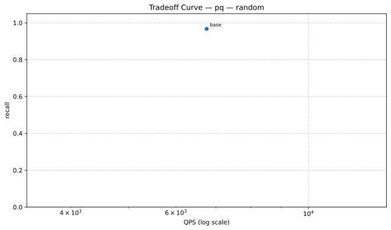

| Variant | QPS | Recall | Parameters |
|---|---:|---:|---|
| base | 6753.99 | 0.9672 | baseline |

##### Pareto Points (Non-dominated Frontier)

| Variant | QPS | Recall | Parameters |
|---|---:|---:|---|
| base | 6753.99 | 0.9672 | baseline |

##### Mermaid Quadrant Chart

_Point IDs ending with `_pareto` mark Pareto points._

```mermaid
quadrantChart
    title "pq Tradeoff (random)"
    x-axis "Lower QPS" --> "Higher QPS"
    y-axis "Lower Recall" --> "Higher Recall"
    quadrant-1 "Fast + Accurate"
    quadrant-2 "Slow + Accurate"
    quadrant-3 "Slow + Less Accurate"
    quadrant-4 "Fast + Less Accurate"
    %% Point key uses variant IDs from the tables below; '_pareto' marks Pareto points.
    base_pareto: [0.500, 0.500]
```

Mermaid source: `./random/tradeoff_curves/tradeoff_random_pq_quadrant.mmd`

Data: `./random/tradeoff_curves/tradeoff_random_pq.json`

| Algorithm | Recall | QPS | Mean Query Time (ms) | Build Time (s) | Status |
|---|---:|---:|---:|---:|---|
| ivf_flat__p10 | 1.0000 | 70864.69 | 0.014 | 0.07 | ok |
| exact | 1.0000 | 275.12 | 3.635 | 0.00 | ok |
| covertree_v2_2 | 1.0000 | 47.51 | 21.048 | 257.50 | ok |
| hnsw__p10 | 0.9746 | 99365.34 | 0.010 | 0.22 | ok |
| pq | 0.9672 | 6753.99 | 0.148 | 11.20 | ok |
| hnsw__p09 | 0.9598 | 122029.98 | 0.008 | 0.22 | ok |
| ivf_flat__p09 | 0.9566 | 95282.80 | 0.010 | 0.07 | ok |
| hnsw__p08 | 0.9434 | 146886.71 | 0.007 | 0.22 | ok |
| ivf_sq8__p10 | 0.9242 | 92190.42 | 0.011 | 0.18 | ok |
| hnsw__p07 | 0.9148 | 173800.88 | 0.006 | 0.24 | ok |
| ivf_pq__p10 | 0.9137 | 10656.54 | 0.094 | 11.02 | ok |
| ivf_flat__p08 | 0.8879 | 118658.62 | 0.008 | 0.07 | ok |
| hnsw__p06 | 0.8781 | 220616.77 | 0.005 | 0.22 | ok |
| ivf_sq8__p09 | 0.8680 | 115443.70 | 0.009 | 0.18 | ok |
| ivf_pq__p09 | 0.8613 | 27114.01 | 0.037 | 11.19 | ok |
| hnsw__p05 | 0.8398 | 260997.04 | 0.004 | 0.22 | ok |
| hnsw__p04 | 0.7793 | 336807.35 | 0.003 | 0.21 | ok |
| ivf_sq8__p08 | 0.7691 | 161416.39 | 0.006 | 0.18 | ok |
| ivf_pq__p08 | 0.7684 | 36313.09 | 0.028 | 11.01 | ok |
| ivf_flat__p07 | 0.7547 | 148697.11 | 0.007 | 0.07 | ok |
| hnsw__p03 | 0.6871 | 461625.89 | 0.002 | 0.21 | ok |
| ivf_sq8__p07 | 0.6848 | 201490.30 | 0.005 | 0.18 | ok |
| ivf_pq__p07 | 0.6844 | 45888.36 | 0.022 | 11.03 | ok |
| ivf_flat__p06 | 0.6621 | 183263.67 | 0.005 | 0.07 | ok |
| lsh__p10 | 0.6328 | 185.01 | 5.405 | 0.24 | ok |
| hnsw__p02 | 0.6098 | 546433.50 | 0.002 | 0.21 | ok |
| ivf_sq8__p06 | 0.5742 | 267699.28 | 0.004 | 0.18 | ok |
| ivf_pq__p06 | 0.5734 | 60082.92 | 0.017 | 11.02 | ok |
| lsh__p09 | 0.5512 | 193.02 | 5.181 | 0.24 | ok |
| ivf_flat__p05 | 0.5422 | 216175.12 | 0.005 | 0.07 | ok |
| hnsw__p01 | 0.5129 | 2438.34 | 0.410 | 0.46 | ok |
| lsh__p08 | 0.5102 | 198.23 | 5.045 | 0.24 | ok |
| ivf_sq8__p05 | 0.5090 | 328864.26 | 0.003 | 0.18 | ok |
| ivf_pq__p05 | 0.5090 | 70706.03 | 0.014 | 11.00 | ok |
| lsh__p07 | 0.4590 | 200.69 | 4.983 | 0.24 | ok |
| ivf_flat__p04 | 0.4559 | 244087.71 | 0.004 | 0.07 | ok |
| ivf_sq8__p04 | 0.4070 | 398124.52 | 0.003 | 0.18 | ok |
| ivf_pq__p04 | 0.4070 | 84010.78 | 0.012 | 11.00 | ok |
| lsh__p06 | 0.3961 | 206.78 | 4.836 | 0.24 | ok |
| ivf_flat__p03 | 0.3547 | 278460.02 | 0.004 | 0.07 | ok |
| ivf_sq8__p03 | 0.3516 | 427274.90 | 0.002 | 0.18 | ok |
| ivf_pq__p03 | 0.3516 | 101296.40 | 0.010 | 11.02 | ok |
| lsh__p05 | 0.3191 | 210.61 | 4.748 | 0.24 | ok |
| lsh__p04 | 0.2652 | 214.17 | 4.669 | 0.24 | ok |
| ivf_sq8__p02 | 0.2641 | 471146.04 | 0.002 | 0.18 | ok |
| ivf_pq__p02 | 0.2641 | 110832.15 | 0.009 | 10.97 | ok |
| ivf_flat__p02 | 0.2203 | 374386.97 | 0.003 | 0.07 | ok |
| lsh__p03 | 0.2086 | 216.01 | 4.629 | 0.24 | ok |
| lsh__p02 | 0.1770 | 218.39 | 4.579 | 0.24 | ok |
| ivf_sq8__p01 | 0.1719 | 45769.05 | 0.022 | 0.26 | ok |
| ivf_pq__p01 | 0.1719 | 19344.26 | 0.052 | 11.41 | ok |
| lsh__p01 | 0.1387 | 210.41 | 4.753 | 0.34 | ok |
| ivf_flat__p01 | 0.1277 | 13707.93 | 0.073 | 0.62 | ok |

### Algorithm Implementation Details

| Algorithm | Type | Metric | Indexer | Searcher |
|---|---|---|---|---|
| covertree_v2_2 | CoverTreeV2_2 | l2 | N/A | N/A |
| exact | Composite | l2 | BruteForceIndexer (metric=l2) | LinearSearcher (metric=l2) |
| hnsw__p01 | Composite | l2 | HNSWIndexer (M=16, efConstruction=200, efSearch=16, metric=l2) | FaissSearcher (metric=l2, nprobe=10) |
| hnsw__p02 | Composite | l2 | HNSWIndexer (M=16, efConstruction=200, efSearch=24, metric=l2) | FaissSearcher (metric=l2, nprobe=10) |
| hnsw__p03 | Composite | l2 | HNSWIndexer (M=16, efConstruction=200, efSearch=32, metric=l2) | FaissSearcher (metric=l2, nprobe=10) |
| hnsw__p04 | Composite | l2 | HNSWIndexer (M=16, efConstruction=200, efSearch=48, metric=l2) | FaissSearcher (metric=l2, nprobe=10) |
| hnsw__p05 | Composite | l2 | HNSWIndexer (M=16, efConstruction=200, efSearch=64, metric=l2) | FaissSearcher (metric=l2, nprobe=10) |
| hnsw__p06 | Composite | l2 | HNSWIndexer (M=16, efConstruction=200, efSearch=80, metric=l2) | FaissSearcher (metric=l2, nprobe=10) |
| hnsw__p07 | Composite | l2 | HNSWIndexer (M=16, efConstruction=200, efSearch=100, metric=l2) | FaissSearcher (metric=l2, nprobe=10) |
| hnsw__p08 | Composite | l2 | HNSWIndexer (M=16, efConstruction=200, efSearch=128, metric=l2) | FaissSearcher (metric=l2, nprobe=10) |
| hnsw__p09 | Composite | l2 | HNSWIndexer (M=16, efConstruction=200, efSearch=160, metric=l2) | FaissSearcher (metric=l2, nprobe=10) |
| hnsw__p10 | Composite | l2 | HNSWIndexer (M=16, efConstruction=200, efSearch=200, metric=l2) | FaissSearcher (metric=l2, nprobe=10) |
| ivf_flat__p01 | Composite | l2 | FaissIVFIndexer (index_type=IVF100,Flat, metric=l2, nprobe=10) | FaissSearcher (metric=l2, nprobe=2) |
| ivf_flat__p02 | Composite | l2 | FaissIVFIndexer (index_type=IVF100,Flat, metric=l2, nprobe=10) | FaissSearcher (metric=l2, nprobe=4) |
| ivf_flat__p03 | Composite | l2 | FaissIVFIndexer (index_type=IVF100,Flat, metric=l2, nprobe=10) | FaissSearcher (metric=l2, nprobe=8) |
| ivf_flat__p04 | Composite | l2 | FaissIVFIndexer (index_type=IVF100,Flat, metric=l2, nprobe=10) | FaissSearcher (metric=l2, nprobe=12) |
| ivf_flat__p05 | Composite | l2 | FaissIVFIndexer (index_type=IVF100,Flat, metric=l2, nprobe=10) | FaissSearcher (metric=l2, nprobe=16) |
| ivf_flat__p06 | Composite | l2 | FaissIVFIndexer (index_type=IVF100,Flat, metric=l2, nprobe=10) | FaissSearcher (metric=l2, nprobe=24) |
| ivf_flat__p07 | Composite | l2 | FaissIVFIndexer (index_type=IVF100,Flat, metric=l2, nprobe=10) | FaissSearcher (metric=l2, nprobe=32) |
| ivf_flat__p08 | Composite | l2 | FaissIVFIndexer (index_type=IVF100,Flat, metric=l2, nprobe=10) | FaissSearcher (metric=l2, nprobe=48) |
| ivf_flat__p09 | Composite | l2 | FaissIVFIndexer (index_type=IVF100,Flat, metric=l2, nprobe=10) | FaissSearcher (metric=l2, nprobe=64) |
| ivf_flat__p10 | Composite | l2 | FaissIVFIndexer (index_type=IVF100,Flat, metric=l2, nprobe=10) | FaissSearcher (metric=l2, nprobe=96) |
| ivf_pq__p01 | Composite | l2 | FaissFactoryIndexer (index_key=IVF256,PQ64, metric=l2, nprobe=24) | FaissSearcher (metric=l2, nprobe=4) |
| ivf_pq__p02 | Composite | l2 | FaissFactoryIndexer (index_key=IVF256,PQ64, metric=l2, nprobe=24) | FaissSearcher (metric=l2, nprobe=8) |
| ivf_pq__p03 | Composite | l2 | FaissFactoryIndexer (index_key=IVF256,PQ64, metric=l2, nprobe=24) | FaissSearcher (metric=l2, nprobe=12) |
| ivf_pq__p04 | Composite | l2 | FaissFactoryIndexer (index_key=IVF256,PQ64, metric=l2, nprobe=24) | FaissSearcher (metric=l2, nprobe=16) |
| ivf_pq__p05 | Composite | l2 | FaissFactoryIndexer (index_key=IVF256,PQ64, metric=l2, nprobe=24) | FaissSearcher (metric=l2, nprobe=24) |
| ivf_pq__p06 | Composite | l2 | FaissFactoryIndexer (index_key=IVF256,PQ64, metric=l2, nprobe=24) | FaissSearcher (metric=l2, nprobe=32) |
| ivf_pq__p07 | Composite | l2 | FaissFactoryIndexer (index_key=IVF256,PQ64, metric=l2, nprobe=24) | FaissSearcher (metric=l2, nprobe=48) |
| ivf_pq__p08 | Composite | l2 | FaissFactoryIndexer (index_key=IVF256,PQ64, metric=l2, nprobe=24) | FaissSearcher (metric=l2, nprobe=64) |
| ivf_pq__p09 | Composite | l2 | FaissFactoryIndexer (index_key=IVF256,PQ64, metric=l2, nprobe=24) | FaissSearcher (metric=l2, nprobe=96) |
| ivf_pq__p10 | Composite | l2 | FaissFactoryIndexer (index_key=IVF256,PQ64, metric=l2, nprobe=24) | FaissSearcher (metric=l2, nprobe=128) |
| ivf_sq8__p01 | Composite | l2 | FaissFactoryIndexer (index_key=IVF256,SQ8, metric=l2, nprobe=24) | FaissSearcher (metric=l2, nprobe=4) |
| ivf_sq8__p02 | Composite | l2 | FaissFactoryIndexer (index_key=IVF256,SQ8, metric=l2, nprobe=24) | FaissSearcher (metric=l2, nprobe=8) |
| ivf_sq8__p03 | Composite | l2 | FaissFactoryIndexer (index_key=IVF256,SQ8, metric=l2, nprobe=24) | FaissSearcher (metric=l2, nprobe=12) |
| ivf_sq8__p04 | Composite | l2 | FaissFactoryIndexer (index_key=IVF256,SQ8, metric=l2, nprobe=24) | FaissSearcher (metric=l2, nprobe=16) |
| ivf_sq8__p05 | Composite | l2 | FaissFactoryIndexer (index_key=IVF256,SQ8, metric=l2, nprobe=24) | FaissSearcher (metric=l2, nprobe=24) |
| ivf_sq8__p06 | Composite | l2 | FaissFactoryIndexer (index_key=IVF256,SQ8, metric=l2, nprobe=24) | FaissSearcher (metric=l2, nprobe=32) |
| ivf_sq8__p07 | Composite | l2 | FaissFactoryIndexer (index_key=IVF256,SQ8, metric=l2, nprobe=24) | FaissSearcher (metric=l2, nprobe=48) |
| ivf_sq8__p08 | Composite | l2 | FaissFactoryIndexer (index_key=IVF256,SQ8, metric=l2, nprobe=24) | FaissSearcher (metric=l2, nprobe=64) |
| ivf_sq8__p09 | Composite | l2 | FaissFactoryIndexer (index_key=IVF256,SQ8, metric=l2, nprobe=24) | FaissSearcher (metric=l2, nprobe=96) |
| ivf_sq8__p10 | Composite | l2 | FaissFactoryIndexer (index_key=IVF256,SQ8, metric=l2, nprobe=24) | FaissSearcher (metric=l2, nprobe=128) |
| lsh__p01 | Composite | l2 | LSHIndexer (bucket_width=20, hash_size=4, metric=l2, num_tables=12, ...) | LSHSearcher (candidate_multiplier=16, fallback_to_bruteforce=False, metric=l2) |
| lsh__p02 | Composite | l2 | LSHIndexer (bucket_width=20, hash_size=4, metric=l2, num_tables=12, ...) | LSHSearcher (candidate_multiplier=24, fallback_to_bruteforce=False, metric=l2) |
| lsh__p03 | Composite | l2 | LSHIndexer (bucket_width=20, hash_size=4, metric=l2, num_tables=12, ...) | LSHSearcher (candidate_multiplier=32, fallback_to_bruteforce=False, metric=l2) |
| lsh__p04 | Composite | l2 | LSHIndexer (bucket_width=20, hash_size=4, metric=l2, num_tables=12, ...) | LSHSearcher (candidate_multiplier=48, fallback_to_bruteforce=False, metric=l2) |
| lsh__p05 | Composite | l2 | LSHIndexer (bucket_width=20, hash_size=4, metric=l2, num_tables=12, ...) | LSHSearcher (candidate_multiplier=64, fallback_to_bruteforce=False, metric=l2) |
| lsh__p06 | Composite | l2 | LSHIndexer (bucket_width=20, hash_size=4, metric=l2, num_tables=12, ...) | LSHSearcher (candidate_multiplier=96, fallback_to_bruteforce=False, metric=l2) |
| lsh__p07 | Composite | l2 | LSHIndexer (bucket_width=20, hash_size=4, metric=l2, num_tables=12, ...) | LSHSearcher (candidate_multiplier=128, fallback_to_bruteforce=False, metric=l2) |
| lsh__p08 | Composite | l2 | LSHIndexer (bucket_width=20, hash_size=4, metric=l2, num_tables=12, ...) | LSHSearcher (candidate_multiplier=160, fallback_to_bruteforce=False, metric=l2) |
| lsh__p09 | Composite | l2 | LSHIndexer (bucket_width=20, hash_size=4, metric=l2, num_tables=12, ...) | LSHSearcher (candidate_multiplier=192, fallback_to_bruteforce=False, metric=l2) |
| lsh__p10 | Composite | l2 | LSHIndexer (bucket_width=20, hash_size=4, metric=l2, num_tables=12, ...) | LSHSearcher (candidate_multiplier=256, fallback_to_bruteforce=False, metric=l2) |
| pq | Composite | l2 | FaissFactoryIndexer (index_key=PQ64, metric=l2) | FaissSearcher (metric=l2, nprobe=24) |

### Dataset Details

- Config: `benchmark_results/benchmark_20260320_115137/random/random_config.yaml`
- metric: `l2`
- topk: `20`
- n_queries: `256`
- repeat: `2`
- seed: `42`
- dataset_options.dimensions: `64`
- dataset_options.ground_truth_k: `200`
- dataset_options.seed: `7`
- dataset_options.test_size: `512`
- dataset_options.train_size: `20000`

## Dataset: glove50

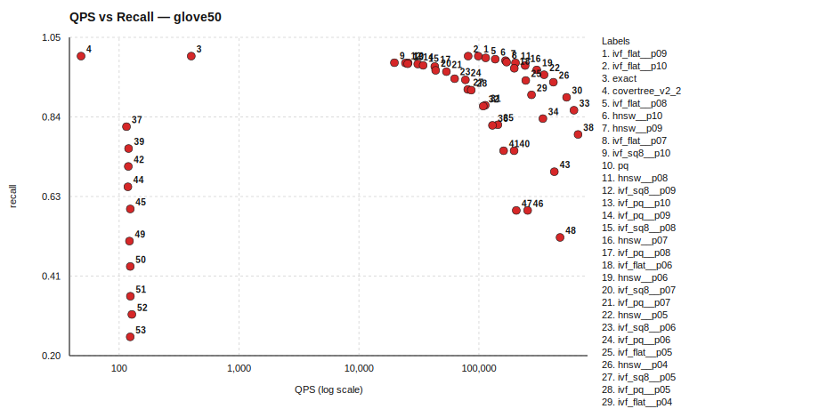

### Tradeoff Curves by Algorithm

_Pareto points are listed under `Pareto Points (Non-dominated Frontier)` for each algorithm._

#### covertree_v2_2 (1 points)

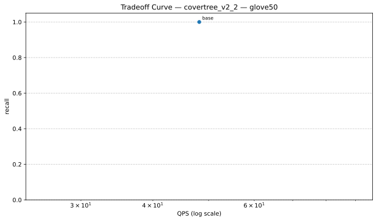

| Variant | QPS | Recall | Parameters |
|---|---:|---:|---|
| base | 48.17 | 1.0000 | baseline |

##### Pareto Points (Non-dominated Frontier)

| Variant | QPS | Recall | Parameters |
|---|---:|---:|---|
| base | 48.17 | 1.0000 | baseline |

##### Mermaid Quadrant Chart

_Point IDs ending with `_pareto` mark Pareto points._

```mermaid
quadrantChart
    title "covertree_v2_2 Tradeoff (glove50)"
    x-axis "Lower QPS" --> "Higher QPS"
    y-axis "Lower Recall" --> "Higher Recall"
    quadrant-1 "Fast + Accurate"
    quadrant-2 "Slow + Accurate"
    quadrant-3 "Slow + Less Accurate"
    quadrant-4 "Fast + Less Accurate"
    %% Point key uses variant IDs from the tables below; '_pareto' marks Pareto points.
    base_pareto: [0.500, 0.500]
```

Mermaid source: `./glove50/tradeoff_curves/tradeoff_glove50_covertree_v2_2_quadrant.mmd`

Data: `./glove50/tradeoff_curves/tradeoff_glove50_covertree_v2_2.json`

#### exact (1 points)

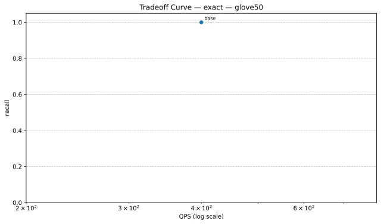

| Variant | QPS | Recall | Parameters |
|---|---:|---:|---|
| base | 399.74 | 1.0000 | baseline |

##### Pareto Points (Non-dominated Frontier)

| Variant | QPS | Recall | Parameters |
|---|---:|---:|---|
| base | 399.74 | 1.0000 | baseline |

##### Mermaid Quadrant Chart

_Point IDs ending with `_pareto` mark Pareto points._

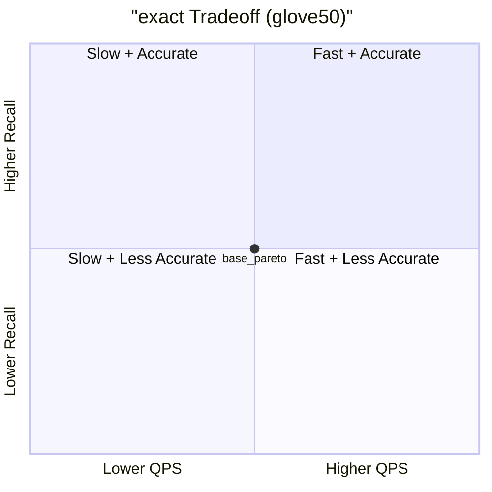
```mermaid
quadrantChart
    title "exact Tradeoff (glove50)"
    x-axis "Lower QPS" --> "Higher QPS"
    y-axis "Lower Recall" --> "Higher Recall"
    quadrant-1 "Fast + Accurate"
    quadrant-2 "Slow + Accurate"
    quadrant-3 "Slow + Less Accurate"
    quadrant-4 "Fast + Less Accurate"
    %% Point key uses variant IDs from the tables below; '_pareto' marks Pareto points.
    base_pareto: [0.500, 0.500]
```

Mermaid source: `./glove50/tradeoff_curves/tradeoff_glove50_exact_quadrant.mmd`

Data: `./glove50/tradeoff_curves/tradeoff_glove50_exact.json`

#### hnsw (10 points)

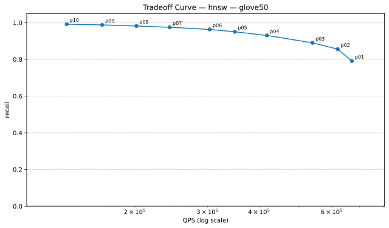

| Variant | QPS | Recall | Parameters |
|---|---:|---:|---|
| p01 | 671088.64 | 0.7914 | indexer.efSearch=16 |
| p02 | 620301.46 | 0.8559 | indexer.efSearch=24 |
| p03 | 538756.56 | 0.8902 | indexer.efSearch=32 |
| p04 | 417961.01 | 0.9305 | indexer.efSearch=48 |
| p05 | 349525.33 | 0.9504 | indexer.efSearch=64 |
| p06 | 303660.02 | 0.9633 | indexer.efSearch=80 |
| p07 | 242873.07 | 0.9750 | indexer.efSearch=100 |
| p08 | 201869.12 | 0.9820 | indexer.efSearch=128 |
| p09 | 166755.99 | 0.9879 | indexer.efSearch=160 |
| p10 | 136817.26 | 0.9918 | indexer.efSearch=200 |

##### Pareto Points (Non-dominated Frontier)

| Variant | QPS | Recall | Parameters |
|---|---:|---:|---|
| p10 | 136817.26 | 0.9918 | indexer.efSearch=200 |
| p09 | 166755.99 | 0.9879 | indexer.efSearch=160 |
| p08 | 201869.12 | 0.9820 | indexer.efSearch=128 |
| p07 | 242873.07 | 0.9750 | indexer.efSearch=100 |
| p06 | 303660.02 | 0.9633 | indexer.efSearch=80 |
| p05 | 349525.33 | 0.9504 | indexer.efSearch=64 |
| p04 | 417961.01 | 0.9305 | indexer.efSearch=48 |
| p03 | 538756.56 | 0.8902 | indexer.efSearch=32 |
| p02 | 620301.46 | 0.8559 | indexer.efSearch=24 |
| p01 | 671088.64 | 0.7914 | indexer.efSearch=16 |

##### Mermaid Quadrant Chart

_Point IDs ending with `_pareto` mark Pareto points._

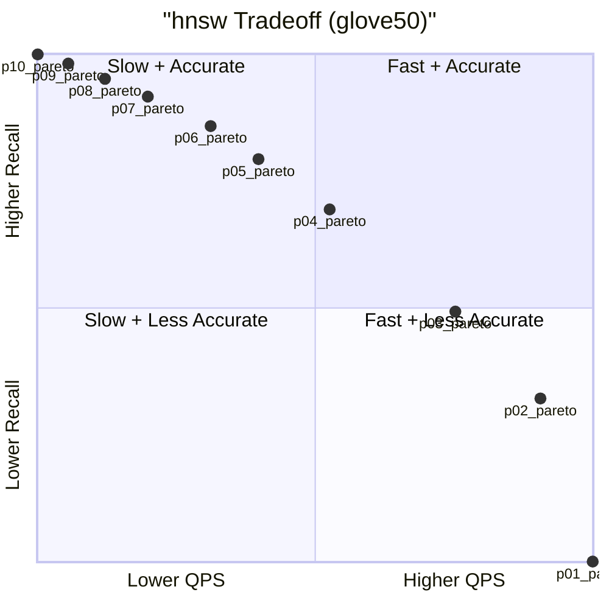
```mermaid
quadrantChart
    title "hnsw Tradeoff (glove50)"
    x-axis "Lower QPS" --> "Higher QPS"
    y-axis "Lower Recall" --> "Higher Recall"
    quadrant-1 "Fast + Accurate"
    quadrant-2 "Slow + Accurate"
    quadrant-3 "Slow + Less Accurate"
    quadrant-4 "Fast + Less Accurate"
    %% Point key uses variant IDs from the tables below; '_pareto' marks Pareto points.
    p01_pareto: [0.999, 0.001]
    p02_pareto: [0.905, 0.322]
    p03_pareto: [0.752, 0.493]
    p04_pareto: [0.526, 0.694]
    p05_pareto: [0.398, 0.793]
    p06_pareto: [0.312, 0.858]
    p07_pareto: [0.199, 0.916]
    p08_pareto: [0.122, 0.951]
    p09_pareto: [0.056, 0.981]
    p10_pareto: [0.001, 0.999]
```

Mermaid source: `./glove50/tradeoff_curves/tradeoff_glove50_hnsw_quadrant.mmd`

Data: `./glove50/tradeoff_curves/tradeoff_glove50_hnsw.json`

#### ivf_flat (10 points)

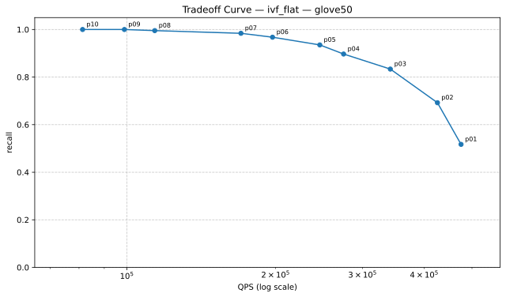

| Variant | QPS | Recall | Parameters |
|---|---:|---:|---|
| p01 | 475107.00 | 0.5172 | searcher.nprobe=2 |
| p02 | 425581.38 | 0.6922 | searcher.nprobe=4 |
| p03 | 341629.60 | 0.8336 | searcher.nprobe=8 |
| p04 | 274754.82 | 0.8969 | searcher.nprobe=12 |
| p05 | 245876.31 | 0.9352 | searcher.nprobe=16 |
| p06 | 197233.99 | 0.9676 | searcher.nprobe=24 |
| p07 | 170219.06 | 0.9840 | searcher.nprobe=32 |
| p08 | 113888.61 | 0.9953 | searcher.nprobe=48 |
| p09 | 98853.05 | 1.0000 | searcher.nprobe=64 |
| p10 | 81344.08 | 1.0000 | searcher.nprobe=96 |

##### Pareto Points (Non-dominated Frontier)

| Variant | QPS | Recall | Parameters |
|---|---:|---:|---|
| p09 | 98853.05 | 1.0000 | searcher.nprobe=64 |
| p08 | 113888.61 | 0.9953 | searcher.nprobe=48 |
| p07 | 170219.06 | 0.9840 | searcher.nprobe=32 |
| p06 | 197233.99 | 0.9676 | searcher.nprobe=24 |
| p05 | 245876.31 | 0.9352 | searcher.nprobe=16 |
| p04 | 274754.82 | 0.8969 | searcher.nprobe=12 |
| p03 | 341629.60 | 0.8336 | searcher.nprobe=8 |
| p02 | 425581.38 | 0.6922 | searcher.nprobe=4 |
| p01 | 475107.00 | 0.5172 | searcher.nprobe=2 |

##### Mermaid Quadrant Chart

_Point IDs ending with `_pareto` mark Pareto points._

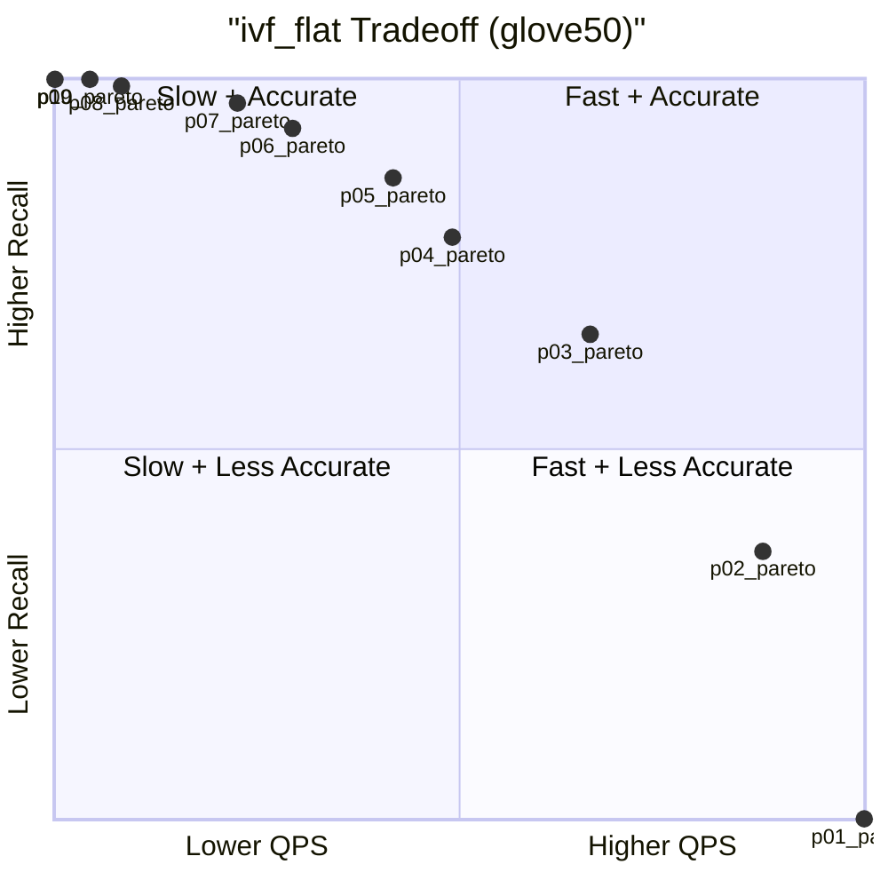
```mermaid
quadrantChart
    title "ivf_flat Tradeoff (glove50)"
    x-axis "Lower QPS" --> "Higher QPS"
    y-axis "Lower Recall" --> "Higher Recall"
    quadrant-1 "Fast + Accurate"
    quadrant-2 "Slow + Accurate"
    quadrant-3 "Slow + Less Accurate"
    quadrant-4 "Fast + Less Accurate"
    %% Point key uses variant IDs from the tables below; '_pareto' marks Pareto points.
    p01_pareto: [0.999, 0.001]
    p02_pareto: [0.874, 0.362]
    p03_pareto: [0.661, 0.655]
    p04_pareto: [0.491, 0.786]
    p05_pareto: [0.418, 0.866]
    p06_pareto: [0.294, 0.933]
    p07_pareto: [0.226, 0.967]
    p08_pareto: [0.083, 0.990]
    p09_pareto: [0.044, 0.999]
    p10: [0.001, 0.999]
```

Mermaid source: `./glove50/tradeoff_curves/tradeoff_glove50_ivf_flat_quadrant.mmd`

Data: `./glove50/tradeoff_curves/tradeoff_glove50_ivf_flat.json`

#### ivf_pq (10 points)

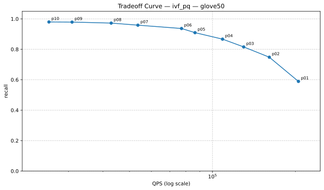

| Variant | QPS | Recall | Parameters |
|---|---:|---:|---|
| p01 | 205029.95 | 0.5891 | searcher.nprobe=4 |
| p02 | 160763.86 | 0.7480 | searcher.nprobe=8 |
| p03 | 129757.32 | 0.8156 | searcher.nprobe=12 |
| p04 | 108733.35 | 0.8668 | searcher.nprobe=16 |
| p05 | 86390.04 | 0.9094 | searcher.nprobe=24 |
| p06 | 77192.08 | 0.9367 | searcher.nprobe=32 |
| p07 | 53604.00 | 0.9586 | searcher.nprobe=48 |
| p08 | 42882.78 | 0.9723 | searcher.nprobe=64 |
| p09 | 30922.18 | 0.9789 | searcher.nprobe=96 |
| p10 | 25492.45 | 0.9797 | searcher.nprobe=128 |

##### Pareto Points (Non-dominated Frontier)

| Variant | QPS | Recall | Parameters |
|---|---:|---:|---|
| p10 | 25492.45 | 0.9797 | searcher.nprobe=128 |
| p09 | 30922.18 | 0.9789 | searcher.nprobe=96 |
| p08 | 42882.78 | 0.9723 | searcher.nprobe=64 |
| p07 | 53604.00 | 0.9586 | searcher.nprobe=48 |
| p06 | 77192.08 | 0.9367 | searcher.nprobe=32 |
| p05 | 86390.04 | 0.9094 | searcher.nprobe=24 |
| p04 | 108733.35 | 0.8668 | searcher.nprobe=16 |
| p03 | 129757.32 | 0.8156 | searcher.nprobe=12 |
| p02 | 160763.86 | 0.7480 | searcher.nprobe=8 |
| p01 | 205029.95 | 0.5891 | searcher.nprobe=4 |

##### Mermaid Quadrant Chart

_Point IDs ending with `_pareto` mark Pareto points._

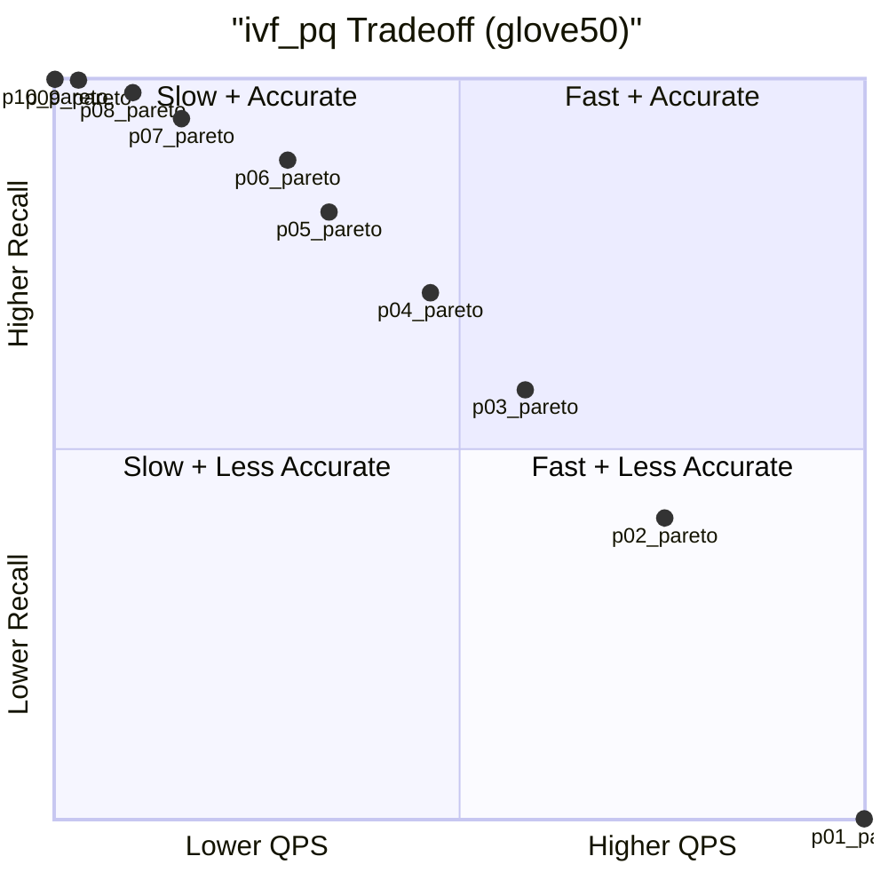
```mermaid
quadrantChart
    title "ivf_pq Tradeoff (glove50)"
    x-axis "Lower QPS" --> "Higher QPS"
    y-axis "Lower Recall" --> "Higher Recall"
    quadrant-1 "Fast + Accurate"
    quadrant-2 "Slow + Accurate"
    quadrant-3 "Slow + Less Accurate"
    quadrant-4 "Fast + Less Accurate"
    %% Point key uses variant IDs from the tables below; '_pareto' marks Pareto points.
    p01_pareto: [0.999, 0.001]
    p02_pareto: [0.753, 0.407]
    p03_pareto: [0.581, 0.580]
    p04_pareto: [0.464, 0.711]
    p05_pareto: [0.339, 0.820]
    p06_pareto: [0.288, 0.890]
    p07_pareto: [0.157, 0.946]
    p08_pareto: [0.097, 0.981]
    p09_pareto: [0.030, 0.998]
    p10_pareto: [0.001, 0.999]
```

Mermaid source: `./glove50/tradeoff_curves/tradeoff_glove50_ivf_pq_quadrant.mmd`

Data: `./glove50/tradeoff_curves/tradeoff_glove50_ivf_pq.json`

#### ivf_sq8 (10 points)

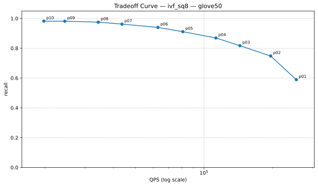

| Variant | QPS | Recall | Parameters |
|---|---:|---:|---|
| p01 | 254985.00 | 0.5891 | searcher.nprobe=4 |
| p02 | 196584.00 | 0.7480 | searcher.nprobe=8 |
| p03 | 143952.52 | 0.8172 | searcher.nprobe=12 |
| p04 | 112906.61 | 0.8691 | searcher.nprobe=16 |
| p05 | 80774.98 | 0.9113 | searcher.nprobe=24 |
| p06 | 62744.22 | 0.9398 | searcher.nprobe=32 |
| p07 | 43591.34 | 0.9621 | searcher.nprobe=48 |
| p08 | 34286.23 | 0.9754 | searcher.nprobe=64 |
| p09 | 24427.10 | 0.9816 | searcher.nprobe=96 |
| p10 | 19755.70 | 0.9824 | searcher.nprobe=128 |

##### Pareto Points (Non-dominated Frontier)

| Variant | QPS | Recall | Parameters |
|---|---:|---:|---|
| p10 | 19755.70 | 0.9824 | searcher.nprobe=128 |
| p09 | 24427.10 | 0.9816 | searcher.nprobe=96 |
| p08 | 34286.23 | 0.9754 | searcher.nprobe=64 |
| p07 | 43591.34 | 0.9621 | searcher.nprobe=48 |
| p06 | 62744.22 | 0.9398 | searcher.nprobe=32 |
| p05 | 80774.98 | 0.9113 | searcher.nprobe=24 |
| p04 | 112906.61 | 0.8691 | searcher.nprobe=16 |
| p03 | 143952.52 | 0.8172 | searcher.nprobe=12 |
| p02 | 196584.00 | 0.7480 | searcher.nprobe=8 |
| p01 | 254985.00 | 0.5891 | searcher.nprobe=4 |

##### Mermaid Quadrant Chart

_Point IDs ending with `_pareto` mark Pareto points._

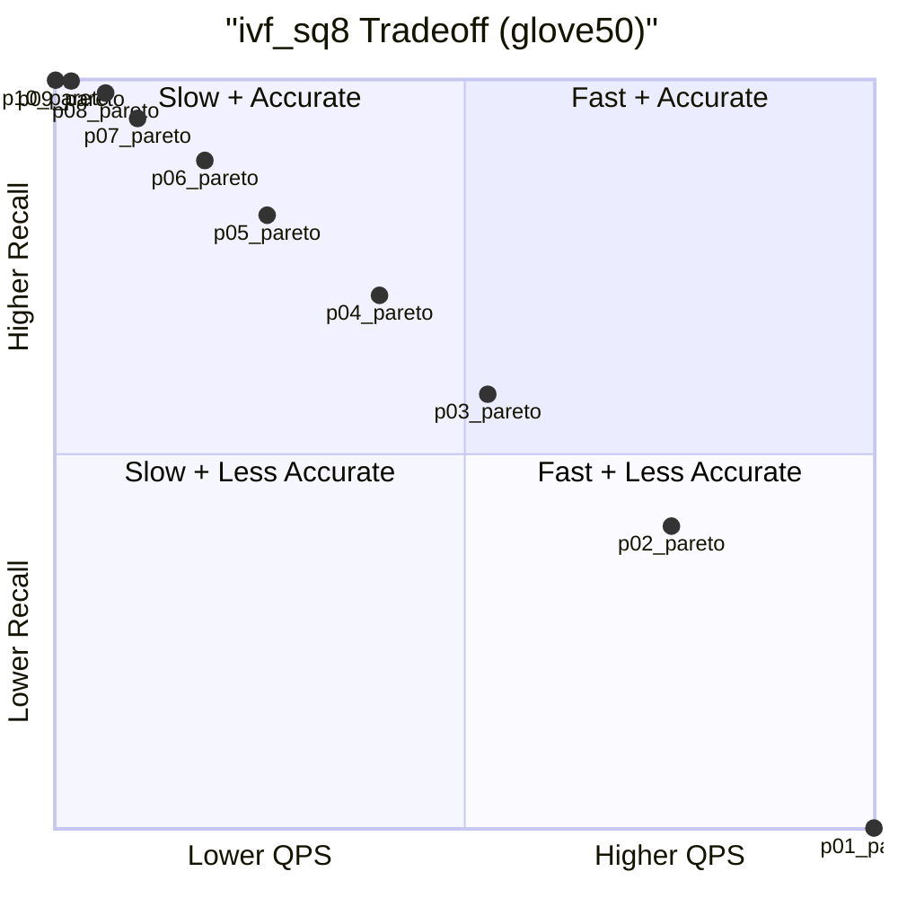
```mermaid
quadrantChart
    title "ivf_sq8 Tradeoff (glove50)"
    x-axis "Lower QPS" --> "Higher QPS"
    y-axis "Lower Recall" --> "Higher Recall"
    quadrant-1 "Fast + Accurate"
    quadrant-2 "Slow + Accurate"
    quadrant-3 "Slow + Less Accurate"
    quadrant-4 "Fast + Less Accurate"
    %% Point key uses variant IDs from the tables below; '_pareto' marks Pareto points.
    p01_pareto: [0.999, 0.001]
    p02_pareto: [0.752, 0.404]
    p03_pareto: [0.528, 0.580]
    p04_pareto: [0.396, 0.712]
    p05_pareto: [0.259, 0.819]
    p06_pareto: [0.183, 0.892]
    p07_pareto: [0.101, 0.948]
    p08_pareto: [0.062, 0.982]
    p09_pareto: [0.020, 0.998]
    p10_pareto: [0.001, 0.999]
```

Mermaid source: `./glove50/tradeoff_curves/tradeoff_glove50_ivf_sq8_quadrant.mmd`

Data: `./glove50/tradeoff_curves/tradeoff_glove50_ivf_sq8.json`

#### lsh (10 points)

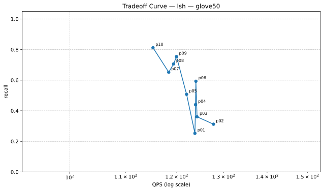

| Variant | QPS | Recall | Parameters |
|---|---:|---:|---|
| p01 | 123.78 | 0.2523 | searcher.candidate_multiplier=16 |
| p02 | 127.76 | 0.3121 | searcher.candidate_multiplier=24 |
| p03 | 124.23 | 0.3605 | searcher.candidate_multiplier=32 |
| p04 | 123.91 | 0.4398 | searcher.candidate_multiplier=48 |
| p05 | 122.03 | 0.5074 | searcher.candidate_multiplier=64 |
| p06 | 123.99 | 0.5930 | searcher.candidate_multiplier=96 |
| p07 | 118.37 | 0.6520 | searcher.candidate_multiplier=128 |
| p08 | 119.36 | 0.7063 | searcher.candidate_multiplier=160 |
| p09 | 119.95 | 0.7539 | searcher.candidate_multiplier=192 |
| p10 | 115.24 | 0.8121 | searcher.candidate_multiplier=256 |

##### Pareto Points (Non-dominated Frontier)

| Variant | QPS | Recall | Parameters |
|---|---:|---:|---|
| p10 | 115.24 | 0.8121 | searcher.candidate_multiplier=256 |
| p09 | 119.95 | 0.7539 | searcher.candidate_multiplier=192 |
| p06 | 123.99 | 0.5930 | searcher.candidate_multiplier=96 |
| p03 | 124.23 | 0.3605 | searcher.candidate_multiplier=32 |
| p02 | 127.76 | 0.3121 | searcher.candidate_multiplier=24 |

##### Mermaid Quadrant Chart

_Point IDs ending with `_pareto` mark Pareto points._

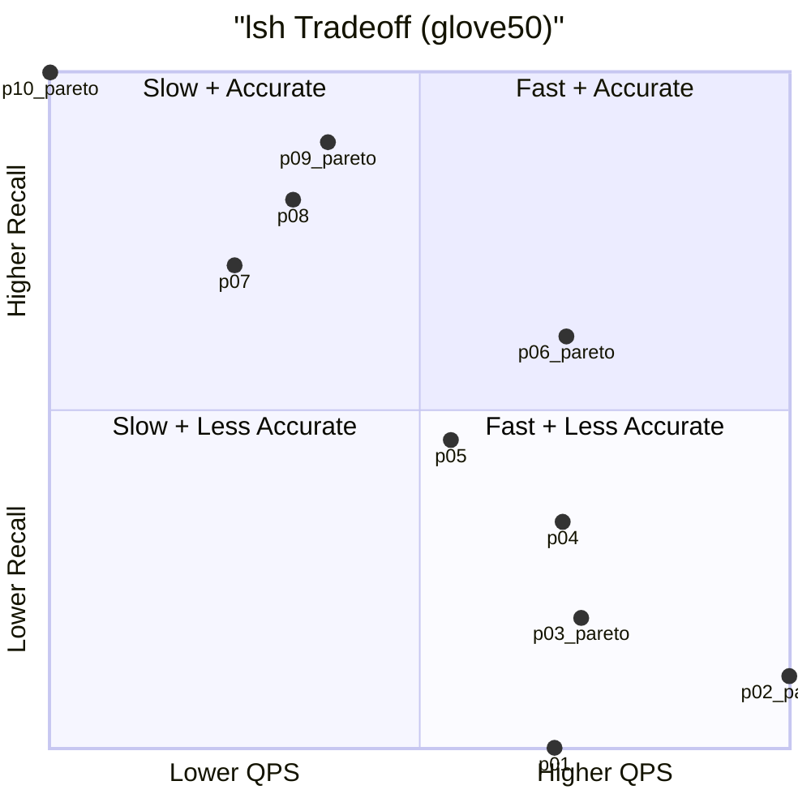
```mermaid
quadrantChart
    title "lsh Tradeoff (glove50)"
    x-axis "Lower QPS" --> "Higher QPS"
    y-axis "Lower Recall" --> "Higher Recall"
    quadrant-1 "Fast + Accurate"
    quadrant-2 "Slow + Accurate"
    quadrant-3 "Slow + Less Accurate"
    quadrant-4 "Fast + Less Accurate"
    %% Point key uses variant IDs from the tables below; '_pareto' marks Pareto points.
    p01: [0.682, 0.001]
    p02_pareto: [0.999, 0.107]
    p03_pareto: [0.718, 0.193]
    p04: [0.693, 0.335]
    p05: [0.542, 0.456]
    p06_pareto: [0.698, 0.609]
    p07: [0.250, 0.714]
    p08: [0.329, 0.811]
    p09_pareto: [0.376, 0.896]
    p10_pareto: [0.001, 0.999]
```

Mermaid source: `./glove50/tradeoff_curves/tradeoff_glove50_lsh_quadrant.mmd`

Data: `./glove50/tradeoff_curves/tradeoff_glove50_lsh.json`

#### pq (1 points)

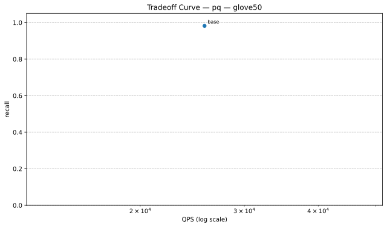

| Variant | QPS | Recall | Parameters |
|---|---:|---:|---|
| base | 25692.52 | 0.9820 | baseline |

##### Pareto Points (Non-dominated Frontier)

| Variant | QPS | Recall | Parameters |
|---|---:|---:|---|
| base | 25692.52 | 0.9820 | baseline |

##### Mermaid Quadrant Chart

_Point IDs ending with `_pareto` mark Pareto points._

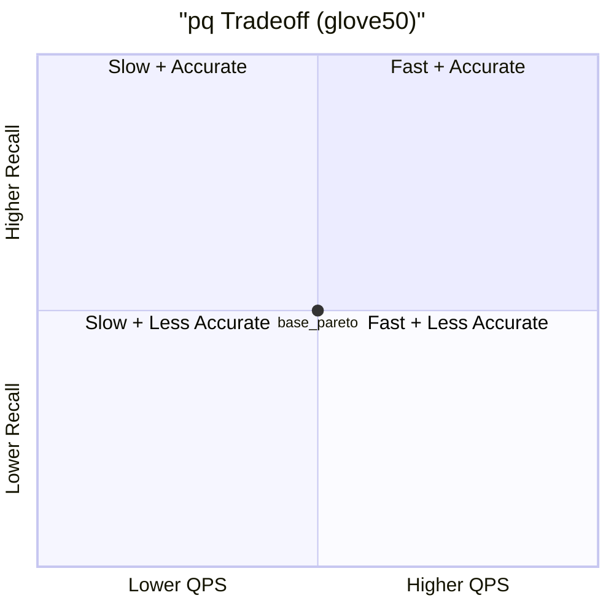
```mermaid
quadrantChart
    title "pq Tradeoff (glove50)"
    x-axis "Lower QPS" --> "Higher QPS"
    y-axis "Lower Recall" --> "Higher Recall"
    quadrant-1 "Fast + Accurate"
    quadrant-2 "Slow + Accurate"
    quadrant-3 "Slow + Less Accurate"
    quadrant-4 "Fast + Less Accurate"
    %% Point key uses variant IDs from the tables below; '_pareto' marks Pareto points.
    base_pareto: [0.500, 0.500]
```

Mermaid source: `./glove50/tradeoff_curves/tradeoff_glove50_pq_quadrant.mmd`

Data: `./glove50/tradeoff_curves/tradeoff_glove50_pq.json`

| Algorithm | Recall | QPS | Mean Query Time (ms) | Build Time (s) | Status |
|---|---:|---:|---:|---:|---|
| ivf_flat__p09 | 1.0000 | 98853.05 | 0.010 | 0.06 | ok |
| ivf_flat__p10 | 1.0000 | 81344.08 | 0.012 | 0.06 | ok |
| exact | 1.0000 | 399.74 | 2.502 | 0.00 | ok |
| covertree_v2_2 | 1.0000 | 48.17 | 20.759 | 203.57 | ok |
| ivf_flat__p08 | 0.9953 | 113888.61 | 0.009 | 0.06 | ok |
| hnsw__p10 | 0.9918 | 136817.26 | 0.007 | 0.13 | ok |
| hnsw__p09 | 0.9879 | 166755.99 | 0.006 | 0.13 | ok |
| ivf_flat__p07 | 0.9840 | 170219.06 | 0.006 | 0.06 | ok |
| ivf_sq8__p10 | 0.9824 | 19755.70 | 0.051 | 0.15 | ok |
| pq | 0.9820 | 25692.52 | 0.039 | 10.28 | ok |
| hnsw__p08 | 0.9820 | 201869.12 | 0.005 | 0.13 | ok |
| ivf_sq8__p09 | 0.9816 | 24427.10 | 0.041 | 0.15 | ok |
| ivf_pq__p10 | 0.9797 | 25492.45 | 0.039 | 10.80 | ok |
| ivf_pq__p09 | 0.9789 | 30922.18 | 0.032 | 10.82 | ok |
| ivf_sq8__p08 | 0.9754 | 34286.23 | 0.029 | 0.15 | ok |
| hnsw__p07 | 0.9750 | 242873.07 | 0.004 | 0.13 | ok |
| ivf_pq__p08 | 0.9723 | 42882.78 | 0.023 | 10.80 | ok |
| ivf_flat__p06 | 0.9676 | 197233.99 | 0.005 | 0.06 | ok |
| hnsw__p06 | 0.9633 | 303660.02 | 0.003 | 0.13 | ok |
| ivf_sq8__p07 | 0.9621 | 43591.34 | 0.023 | 0.15 | ok |
| ivf_pq__p07 | 0.9586 | 53604.00 | 0.019 | 10.81 | ok |
| hnsw__p05 | 0.9504 | 349525.33 | 0.003 | 0.13 | ok |
| ivf_sq8__p06 | 0.9398 | 62744.22 | 0.016 | 0.15 | ok |
| ivf_pq__p06 | 0.9367 | 77192.08 | 0.013 | 10.82 | ok |
| ivf_flat__p05 | 0.9352 | 245876.31 | 0.004 | 0.06 | ok |
| hnsw__p04 | 0.9305 | 417961.01 | 0.002 | 0.13 | ok |
| ivf_sq8__p05 | 0.9113 | 80774.98 | 0.012 | 0.15 | ok |
| ivf_pq__p05 | 0.9094 | 86390.04 | 0.012 | 10.82 | ok |
| ivf_flat__p04 | 0.8969 | 274754.82 | 0.004 | 0.06 | ok |
| hnsw__p03 | 0.8902 | 538756.56 | 0.002 | 0.13 | ok |
| ivf_sq8__p04 | 0.8691 | 112906.61 | 0.009 | 0.15 | ok |
| ivf_pq__p04 | 0.8668 | 108733.35 | 0.009 | 10.81 | ok |
| hnsw__p02 | 0.8559 | 620301.46 | 0.002 | 0.13 | ok |
| ivf_flat__p03 | 0.8336 | 341629.60 | 0.003 | 0.06 | ok |
| ivf_sq8__p03 | 0.8172 | 143952.52 | 0.007 | 0.15 | ok |
| ivf_pq__p03 | 0.8156 | 129757.32 | 0.008 | 10.79 | ok |
| lsh__p10 | 0.8121 | 115.24 | 8.678 | 0.23 | ok |
| hnsw__p01 | 0.7914 | 671088.64 | 0.001 | 0.13 | ok |
| lsh__p09 | 0.7539 | 119.95 | 8.337 | 0.23 | ok |
| ivf_sq8__p02 | 0.7480 | 196584.00 | 0.005 | 0.15 | ok |
| ivf_pq__p02 | 0.7480 | 160763.86 | 0.006 | 10.79 | ok |
| lsh__p08 | 0.7063 | 119.36 | 8.378 | 0.23 | ok |
| ivf_flat__p02 | 0.6922 | 425581.38 | 0.002 | 0.06 | ok |
| lsh__p07 | 0.6520 | 118.37 | 8.448 | 0.23 | ok |
| lsh__p06 | 0.5930 | 123.99 | 8.065 | 0.23 | ok |
| ivf_sq8__p01 | 0.5891 | 254985.00 | 0.004 | 0.16 | ok |
| ivf_pq__p01 | 0.5891 | 205029.95 | 0.005 | 10.81 | ok |
| ivf_flat__p01 | 0.5172 | 475107.00 | 0.002 | 0.06 | ok |
| lsh__p05 | 0.5074 | 122.03 | 8.195 | 0.23 | ok |
| lsh__p04 | 0.4398 | 123.91 | 8.070 | 0.23 | ok |
| lsh__p03 | 0.3605 | 124.23 | 8.049 | 0.23 | ok |
| lsh__p02 | 0.3121 | 127.76 | 7.827 | 0.23 | ok |
| lsh__p01 | 0.2523 | 123.78 | 8.079 | 0.38 | ok |

### Algorithm Implementation Details

| Algorithm | Type | Metric | Indexer | Searcher |
|---|---|---|---|---|
| covertree_v2_2 | CoverTreeV2_2 | l2 | N/A | N/A |
| exact | Composite | l2 | BruteForceIndexer (metric=l2) | LinearSearcher (metric=l2) |
| hnsw__p01 | Composite | l2 | HNSWIndexer (M=16, efConstruction=200, efSearch=16, metric=l2) | FaissSearcher (metric=l2, nprobe=10) |
| hnsw__p02 | Composite | l2 | HNSWIndexer (M=16, efConstruction=200, efSearch=24, metric=l2) | FaissSearcher (metric=l2, nprobe=10) |
| hnsw__p03 | Composite | l2 | HNSWIndexer (M=16, efConstruction=200, efSearch=32, metric=l2) | FaissSearcher (metric=l2, nprobe=10) |
| hnsw__p04 | Composite | l2 | HNSWIndexer (M=16, efConstruction=200, efSearch=48, metric=l2) | FaissSearcher (metric=l2, nprobe=10) |
| hnsw__p05 | Composite | l2 | HNSWIndexer (M=16, efConstruction=200, efSearch=64, metric=l2) | FaissSearcher (metric=l2, nprobe=10) |
| hnsw__p06 | Composite | l2 | HNSWIndexer (M=16, efConstruction=200, efSearch=80, metric=l2) | FaissSearcher (metric=l2, nprobe=10) |
| hnsw__p07 | Composite | l2 | HNSWIndexer (M=16, efConstruction=200, efSearch=100, metric=l2) | FaissSearcher (metric=l2, nprobe=10) |
| hnsw__p08 | Composite | l2 | HNSWIndexer (M=16, efConstruction=200, efSearch=128, metric=l2) | FaissSearcher (metric=l2, nprobe=10) |
| hnsw__p09 | Composite | l2 | HNSWIndexer (M=16, efConstruction=200, efSearch=160, metric=l2) | FaissSearcher (metric=l2, nprobe=10) |
| hnsw__p10 | Composite | l2 | HNSWIndexer (M=16, efConstruction=200, efSearch=200, metric=l2) | FaissSearcher (metric=l2, nprobe=10) |
| ivf_flat__p01 | Composite | l2 | FaissIVFIndexer (index_type=IVF100,Flat, metric=l2, nprobe=10) | FaissSearcher (metric=l2, nprobe=2) |
| ivf_flat__p02 | Composite | l2 | FaissIVFIndexer (index_type=IVF100,Flat, metric=l2, nprobe=10) | FaissSearcher (metric=l2, nprobe=4) |
| ivf_flat__p03 | Composite | l2 | FaissIVFIndexer (index_type=IVF100,Flat, metric=l2, nprobe=10) | FaissSearcher (metric=l2, nprobe=8) |
| ivf_flat__p04 | Composite | l2 | FaissIVFIndexer (index_type=IVF100,Flat, metric=l2, nprobe=10) | FaissSearcher (metric=l2, nprobe=12) |
| ivf_flat__p05 | Composite | l2 | FaissIVFIndexer (index_type=IVF100,Flat, metric=l2, nprobe=10) | FaissSearcher (metric=l2, nprobe=16) |
| ivf_flat__p06 | Composite | l2 | FaissIVFIndexer (index_type=IVF100,Flat, metric=l2, nprobe=10) | FaissSearcher (metric=l2, nprobe=24) |
| ivf_flat__p07 | Composite | l2 | FaissIVFIndexer (index_type=IVF100,Flat, metric=l2, nprobe=10) | FaissSearcher (metric=l2, nprobe=32) |
| ivf_flat__p08 | Composite | l2 | FaissIVFIndexer (index_type=IVF100,Flat, metric=l2, nprobe=10) | FaissSearcher (metric=l2, nprobe=48) |
| ivf_flat__p09 | Composite | l2 | FaissIVFIndexer (index_type=IVF100,Flat, metric=l2, nprobe=10) | FaissSearcher (metric=l2, nprobe=64) |
| ivf_flat__p10 | Composite | l2 | FaissIVFIndexer (index_type=IVF100,Flat, metric=l2, nprobe=10) | FaissSearcher (metric=l2, nprobe=96) |
| ivf_pq__p01 | Composite | l2 | FaissFactoryIndexer (index_key=IVF256,PQ50, metric=l2, nprobe=24) | FaissSearcher (metric=l2, nprobe=4) |
| ivf_pq__p02 | Composite | l2 | FaissFactoryIndexer (index_key=IVF256,PQ50, metric=l2, nprobe=24) | FaissSearcher (metric=l2, nprobe=8) |
| ivf_pq__p03 | Composite | l2 | FaissFactoryIndexer (index_key=IVF256,PQ50, metric=l2, nprobe=24) | FaissSearcher (metric=l2, nprobe=12) |
| ivf_pq__p04 | Composite | l2 | FaissFactoryIndexer (index_key=IVF256,PQ50, metric=l2, nprobe=24) | FaissSearcher (metric=l2, nprobe=16) |
| ivf_pq__p05 | Composite | l2 | FaissFactoryIndexer (index_key=IVF256,PQ50, metric=l2, nprobe=24) | FaissSearcher (metric=l2, nprobe=24) |
| ivf_pq__p06 | Composite | l2 | FaissFactoryIndexer (index_key=IVF256,PQ50, metric=l2, nprobe=24) | FaissSearcher (metric=l2, nprobe=32) |
| ivf_pq__p07 | Composite | l2 | FaissFactoryIndexer (index_key=IVF256,PQ50, metric=l2, nprobe=24) | FaissSearcher (metric=l2, nprobe=48) |
| ivf_pq__p08 | Composite | l2 | FaissFactoryIndexer (index_key=IVF256,PQ50, metric=l2, nprobe=24) | FaissSearcher (metric=l2, nprobe=64) |
| ivf_pq__p09 | Composite | l2 | FaissFactoryIndexer (index_key=IVF256,PQ50, metric=l2, nprobe=24) | FaissSearcher (metric=l2, nprobe=96) |
| ivf_pq__p10 | Composite | l2 | FaissFactoryIndexer (index_key=IVF256,PQ50, metric=l2, nprobe=24) | FaissSearcher (metric=l2, nprobe=128) |
| ivf_sq8__p01 | Composite | l2 | FaissFactoryIndexer (index_key=IVF256,SQ8, metric=l2, nprobe=24) | FaissSearcher (metric=l2, nprobe=4) |
| ivf_sq8__p02 | Composite | l2 | FaissFactoryIndexer (index_key=IVF256,SQ8, metric=l2, nprobe=24) | FaissSearcher (metric=l2, nprobe=8) |
| ivf_sq8__p03 | Composite | l2 | FaissFactoryIndexer (index_key=IVF256,SQ8, metric=l2, nprobe=24) | FaissSearcher (metric=l2, nprobe=12) |
| ivf_sq8__p04 | Composite | l2 | FaissFactoryIndexer (index_key=IVF256,SQ8, metric=l2, nprobe=24) | FaissSearcher (metric=l2, nprobe=16) |
| ivf_sq8__p05 | Composite | l2 | FaissFactoryIndexer (index_key=IVF256,SQ8, metric=l2, nprobe=24) | FaissSearcher (metric=l2, nprobe=24) |
| ivf_sq8__p06 | Composite | l2 | FaissFactoryIndexer (index_key=IVF256,SQ8, metric=l2, nprobe=24) | FaissSearcher (metric=l2, nprobe=32) |
| ivf_sq8__p07 | Composite | l2 | FaissFactoryIndexer (index_key=IVF256,SQ8, metric=l2, nprobe=24) | FaissSearcher (metric=l2, nprobe=48) |
| ivf_sq8__p08 | Composite | l2 | FaissFactoryIndexer (index_key=IVF256,SQ8, metric=l2, nprobe=24) | FaissSearcher (metric=l2, nprobe=64) |
| ivf_sq8__p09 | Composite | l2 | FaissFactoryIndexer (index_key=IVF256,SQ8, metric=l2, nprobe=24) | FaissSearcher (metric=l2, nprobe=96) |
| ivf_sq8__p10 | Composite | l2 | FaissFactoryIndexer (index_key=IVF256,SQ8, metric=l2, nprobe=24) | FaissSearcher (metric=l2, nprobe=128) |
| lsh__p01 | Composite | l2 | LSHIndexer (bucket_width=20, hash_size=4, metric=l2, num_tables=12, ...) | LSHSearcher (candidate_multiplier=16, fallback_to_bruteforce=False, metric=l2) |
| lsh__p02 | Composite | l2 | LSHIndexer (bucket_width=20, hash_size=4, metric=l2, num_tables=12, ...) | LSHSearcher (candidate_multiplier=24, fallback_to_bruteforce=False, metric=l2) |
| lsh__p03 | Composite | l2 | LSHIndexer (bucket_width=20, hash_size=4, metric=l2, num_tables=12, ...) | LSHSearcher (candidate_multiplier=32, fallback_to_bruteforce=False, metric=l2) |
| lsh__p04 | Composite | l2 | LSHIndexer (bucket_width=20, hash_size=4, metric=l2, num_tables=12, ...) | LSHSearcher (candidate_multiplier=48, fallback_to_bruteforce=False, metric=l2) |
| lsh__p05 | Composite | l2 | LSHIndexer (bucket_width=20, hash_size=4, metric=l2, num_tables=12, ...) | LSHSearcher (candidate_multiplier=64, fallback_to_bruteforce=False, metric=l2) |
| lsh__p06 | Composite | l2 | LSHIndexer (bucket_width=20, hash_size=4, metric=l2, num_tables=12, ...) | LSHSearcher (candidate_multiplier=96, fallback_to_bruteforce=False, metric=l2) |
| lsh__p07 | Composite | l2 | LSHIndexer (bucket_width=20, hash_size=4, metric=l2, num_tables=12, ...) | LSHSearcher (candidate_multiplier=128, fallback_to_bruteforce=False, metric=l2) |
| lsh__p08 | Composite | l2 | LSHIndexer (bucket_width=20, hash_size=4, metric=l2, num_tables=12, ...) | LSHSearcher (candidate_multiplier=160, fallback_to_bruteforce=False, metric=l2) |
| lsh__p09 | Composite | l2 | LSHIndexer (bucket_width=20, hash_size=4, metric=l2, num_tables=12, ...) | LSHSearcher (candidate_multiplier=192, fallback_to_bruteforce=False, metric=l2) |
| lsh__p10 | Composite | l2 | LSHIndexer (bucket_width=20, hash_size=4, metric=l2, num_tables=12, ...) | LSHSearcher (candidate_multiplier=256, fallback_to_bruteforce=False, metric=l2) |
| pq | Composite | l2 | FaissFactoryIndexer (index_key=PQ50, metric=l2) | FaissSearcher (metric=l2, nprobe=24) |

### Dataset Details

- Config: `benchmark_results/benchmark_20260320_115137/glove50/glove50_config.yaml`
- metric: `l2`
- topk: `20`
- n_queries: `256`
- repeat: `2`
- seed: `42`
- dataset_options.ground_truth_k: `200`
- dataset_options.seed: `11`
- dataset_options.test_size: `256`
- dataset_options.train_limit: `20000`

## Dataset: msmarco

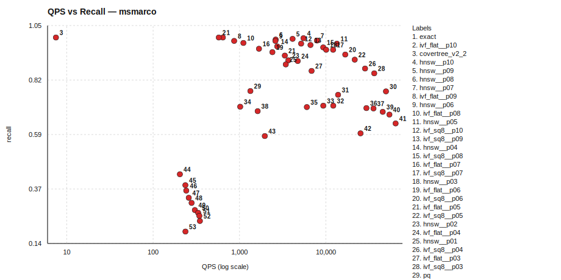

### Tradeoff Curves by Algorithm

_Pareto points are listed under `Pareto Points (Non-dominated Frontier)` for each algorithm._

#### covertree_v2_2 (1 points)

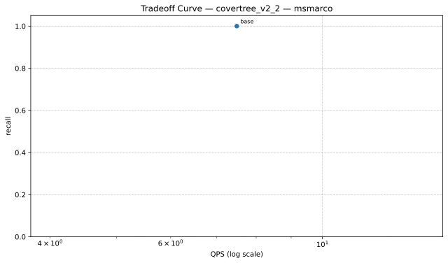

| Variant | QPS | Recall | Parameters |
|---|---:|---:|---|
| base | 7.50 | 1.0000 | baseline |

##### Pareto Points (Non-dominated Frontier)

| Variant | QPS | Recall | Parameters |
|---|---:|---:|---|
| base | 7.50 | 1.0000 | baseline |

##### Mermaid Quadrant Chart

_Point IDs ending with `_pareto` mark Pareto points._

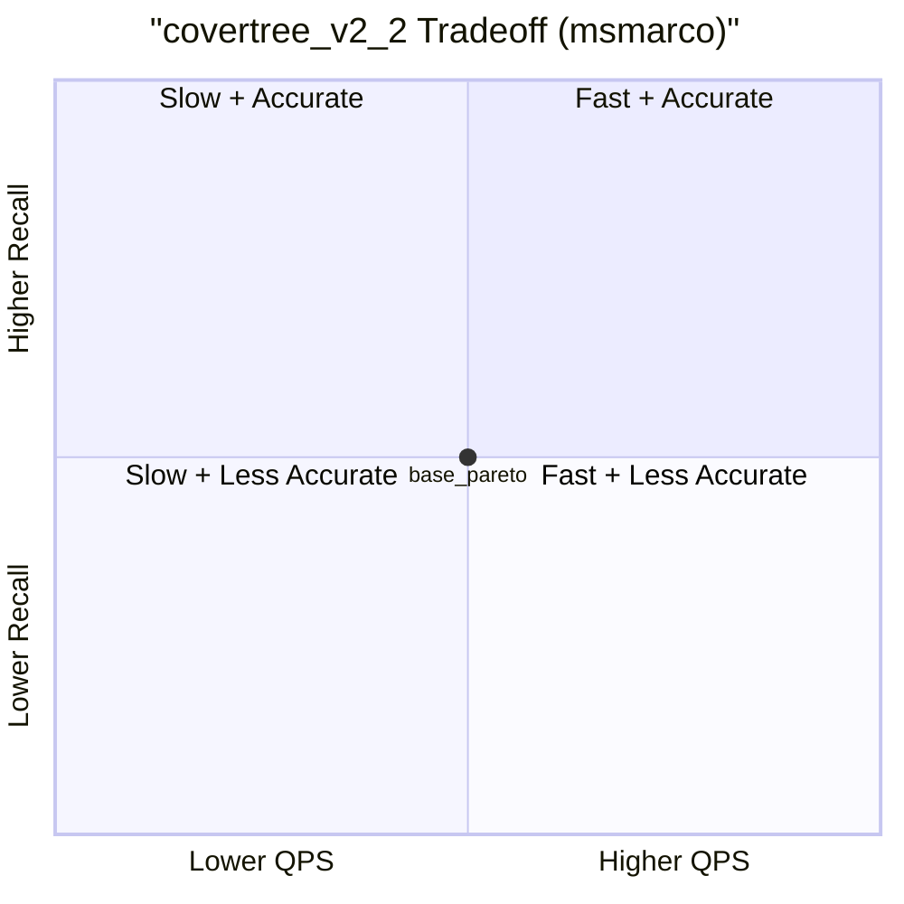
```mermaid
quadrantChart
    title "covertree_v2_2 Tradeoff (msmarco)"
    x-axis "Lower QPS" --> "Higher QPS"
    y-axis "Lower Recall" --> "Higher Recall"
    quadrant-1 "Fast + Accurate"
    quadrant-2 "Slow + Accurate"
    quadrant-3 "Slow + Less Accurate"
    quadrant-4 "Fast + Less Accurate"
    %% Point key uses variant IDs from the tables below; '_pareto' marks Pareto points.
    base_pareto: [0.500, 0.500]
```

Mermaid source: `./msmarco/tradeoff_curves/tradeoff_msmarco_covertree_v2_2_quadrant.mmd`

Data: `./msmarco/tradeoff_curves/tradeoff_msmarco_covertree_v2_2.json`

#### exact (1 points)

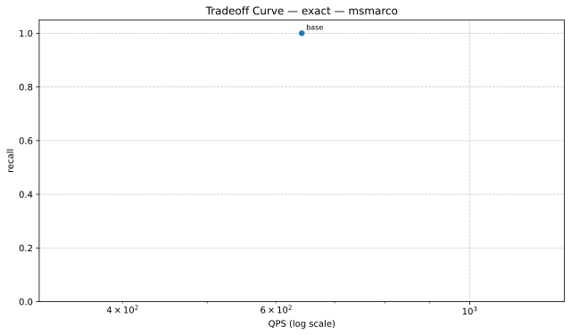

| Variant | QPS | Recall | Parameters |
|---|---:|---:|---|
| base | 641.88 | 1.0000 | baseline |

##### Pareto Points (Non-dominated Frontier)

| Variant | QPS | Recall | Parameters |
|---|---:|---:|---|
| base | 641.88 | 1.0000 | baseline |

##### Mermaid Quadrant Chart

_Point IDs ending with `_pareto` mark Pareto points._

```mermaid
quadrantChart
    title "exact Tradeoff (msmarco)"
    x-axis "Lower QPS" --> "Higher QPS"
    y-axis "Lower Recall" --> "Higher Recall"
    quadrant-1 "Fast + Accurate"
    quadrant-2 "Slow + Accurate"
    quadrant-3 "Slow + Less Accurate"
    quadrant-4 "Fast + Less Accurate"
    %% Point key uses variant IDs from the tables below; '_pareto' marks Pareto points.
    base_pareto: [0.500, 0.500]
```

Mermaid source: `./msmarco/tradeoff_curves/tradeoff_msmarco_exact_quadrant.mmd`

Data: `./msmarco/tradeoff_curves/tradeoff_msmarco_exact.json`

#### hnsw (10 points)

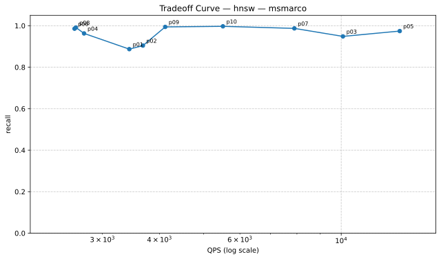

| Variant | QPS | Recall | Parameters |
|---|---:|---:|---|
| p01 | 3435.82 | 0.8871 | indexer.efSearch=16 |
| p02 | 3679.58 | 0.9043 | indexer.efSearch=24 |
| p03 | 10087.66 | 0.9486 | indexer.efSearch=32 |
| p04 | 2734.99 | 0.9629 | indexer.efSearch=48 |
| p05 | 13432.83 | 0.9743 | indexer.efSearch=64 |
| p06 | 2606.78 | 0.9857 | indexer.efSearch=80 |
| p07 | 7897.18 | 0.9871 | indexer.efSearch=100 |
| p08 | 2625.03 | 0.9914 | indexer.efSearch=128 |
| p09 | 4117.83 | 0.9943 | indexer.efSearch=160 |
| p10 | 5508.47 | 0.9971 | indexer.efSearch=200 |

##### Pareto Points (Non-dominated Frontier)

| Variant | QPS | Recall | Parameters |
|---|---:|---:|---|
| p10 | 5508.47 | 0.9971 | indexer.efSearch=200 |
| p07 | 7897.18 | 0.9871 | indexer.efSearch=100 |
| p05 | 13432.83 | 0.9743 | indexer.efSearch=64 |

##### Mermaid Quadrant Chart

_Point IDs ending with `_pareto` mark Pareto points._

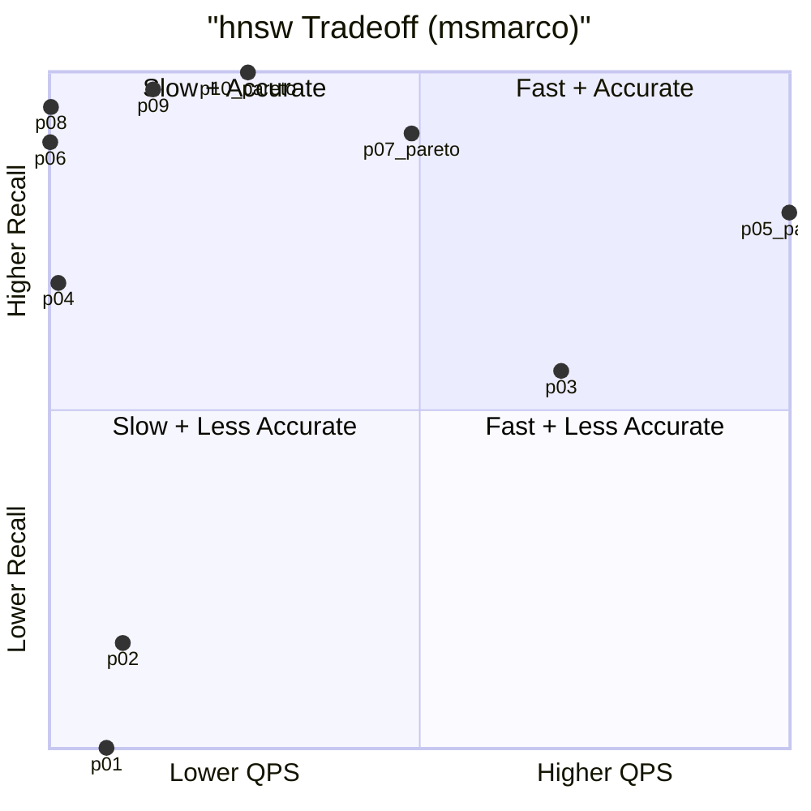
```mermaid
quadrantChart
    title "hnsw Tradeoff (msmarco)"
    x-axis "Lower QPS" --> "Higher QPS"
    y-axis "Lower Recall" --> "Higher Recall"
    quadrant-1 "Fast + Accurate"
    quadrant-2 "Slow + Accurate"
    quadrant-3 "Slow + Less Accurate"
    quadrant-4 "Fast + Less Accurate"
    %% Point key uses variant IDs from the tables below; '_pareto' marks Pareto points.
    p01: [0.077, 0.001]
    p02: [0.099, 0.156]
    p03: [0.691, 0.558]
    p04: [0.012, 0.688]
    p05_pareto: [0.999, 0.792]
    p06: [0.001, 0.896]
    p07_pareto: [0.489, 0.909]
    p08: [0.002, 0.948]
    p09: [0.140, 0.974]
    p10_pareto: [0.268, 0.999]
```

Mermaid source: `./msmarco/tradeoff_curves/tradeoff_msmarco_hnsw_quadrant.mmd`

Data: `./msmarco/tradeoff_curves/tradeoff_msmarco_hnsw.json`

#### ivf_flat (10 points)

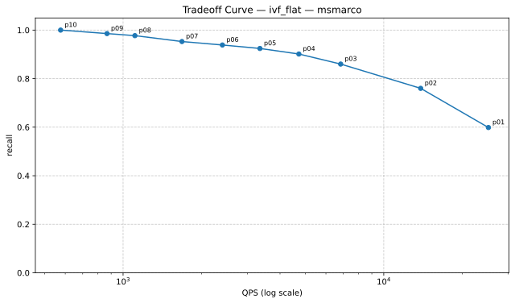

| Variant | QPS | Recall | Parameters |
|---|---:|---:|---|
| p01 | 25203.99 | 0.5986 | searcher.nprobe=2 |
| p02 | 13853.69 | 0.7600 | searcher.nprobe=4 |
| p03 | 6833.66 | 0.8600 | searcher.nprobe=8 |
| p04 | 4724.23 | 0.9014 | searcher.nprobe=12 |
| p05 | 3349.05 | 0.9243 | searcher.nprobe=16 |
| p06 | 2404.38 | 0.9386 | searcher.nprobe=24 |
| p07 | 1681.63 | 0.9529 | searcher.nprobe=32 |
| p08 | 1109.94 | 0.9771 | searcher.nprobe=48 |
| p09 | 867.55 | 0.9857 | searcher.nprobe=64 |
| p10 | 575.88 | 1.0000 | searcher.nprobe=96 |

##### Pareto Points (Non-dominated Frontier)

| Variant | QPS | Recall | Parameters |
|---|---:|---:|---|
| p10 | 575.88 | 1.0000 | searcher.nprobe=96 |
| p09 | 867.55 | 0.9857 | searcher.nprobe=64 |
| p08 | 1109.94 | 0.9771 | searcher.nprobe=48 |
| p07 | 1681.63 | 0.9529 | searcher.nprobe=32 |
| p06 | 2404.38 | 0.9386 | searcher.nprobe=24 |
| p05 | 3349.05 | 0.9243 | searcher.nprobe=16 |
| p04 | 4724.23 | 0.9014 | searcher.nprobe=12 |
| p03 | 6833.66 | 0.8600 | searcher.nprobe=8 |
| p02 | 13853.69 | 0.7600 | searcher.nprobe=4 |
| p01 | 25203.99 | 0.5986 | searcher.nprobe=2 |

##### Mermaid Quadrant Chart

_Point IDs ending with `_pareto` mark Pareto points._

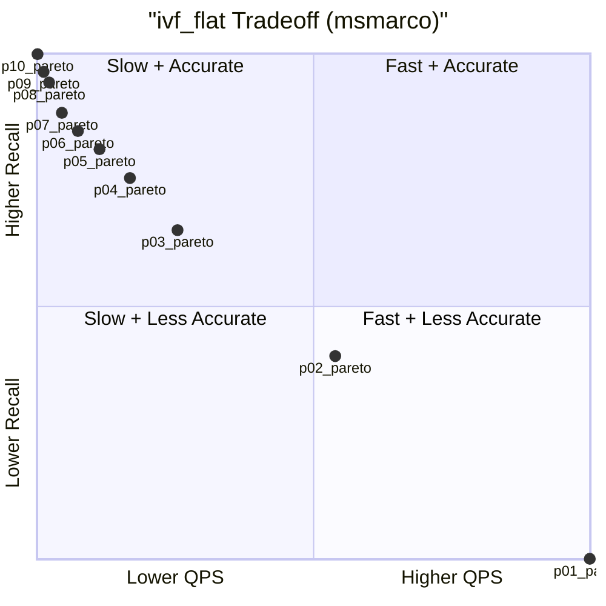
```mermaid
quadrantChart
    title "ivf_flat Tradeoff (msmarco)"
    x-axis "Lower QPS" --> "Higher QPS"
    y-axis "Lower Recall" --> "Higher Recall"
    quadrant-1 "Fast + Accurate"
    quadrant-2 "Slow + Accurate"
    quadrant-3 "Slow + Less Accurate"
    quadrant-4 "Fast + Less Accurate"
    %% Point key uses variant IDs from the tables below; '_pareto' marks Pareto points.
    p01_pareto: [0.999, 0.001]
    p02_pareto: [0.539, 0.402]
    p03_pareto: [0.254, 0.651]
    p04_pareto: [0.168, 0.754]
    p05_pareto: [0.113, 0.811]
    p06_pareto: [0.074, 0.847]
    p07_pareto: [0.045, 0.883]
    p08_pareto: [0.022, 0.943]
    p09_pareto: [0.012, 0.964]
    p10_pareto: [0.001, 0.999]
```

Mermaid source: `./msmarco/tradeoff_curves/tradeoff_msmarco_ivf_flat_quadrant.mmd`

Data: `./msmarco/tradeoff_curves/tradeoff_msmarco_ivf_flat.json`

#### ivf_pq (10 points)

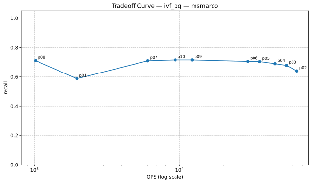

| Variant | QPS | Recall | Parameters |
|---|---:|---:|---|
| p01 | 1962.81 | 0.5871 | searcher.nprobe=4 |
| p02 | 64231.30 | 0.6400 | searcher.nprobe=8 |
| p03 | 54441.18 | 0.6771 | searcher.nprobe=12 |
| p04 | 45540.76 | 0.6886 | searcher.nprobe=16 |
| p05 | 35622.58 | 0.7029 | searcher.nprobe=24 |
| p06 | 29483.96 | 0.7043 | searcher.nprobe=32 |
| p07 | 6024.07 | 0.7086 | searcher.nprobe=48 |
| p08 | 1019.14 | 0.7100 | searcher.nprobe=64 |
| p09 | 12180.60 | 0.7143 | searcher.nprobe=96 |
| p10 | 9334.60 | 0.7143 | searcher.nprobe=128 |

##### Pareto Points (Non-dominated Frontier)

| Variant | QPS | Recall | Parameters |
|---|---:|---:|---|
| p09 | 12180.60 | 0.7143 | searcher.nprobe=96 |
| p06 | 29483.96 | 0.7043 | searcher.nprobe=32 |
| p05 | 35622.58 | 0.7029 | searcher.nprobe=24 |
| p04 | 45540.76 | 0.6886 | searcher.nprobe=16 |
| p03 | 54441.18 | 0.6771 | searcher.nprobe=12 |
| p02 | 64231.30 | 0.6400 | searcher.nprobe=8 |

##### Mermaid Quadrant Chart

_Point IDs ending with `_pareto` mark Pareto points._

```mermaid
quadrantChart
    title "ivf_pq Tradeoff (msmarco)"
    x-axis "Lower QPS" --> "Higher QPS"
    y-axis "Lower Recall" --> "Higher Recall"
    quadrant-1 "Fast + Accurate"
    quadrant-2 "Slow + Accurate"
    quadrant-3 "Slow + Less Accurate"
    quadrant-4 "Fast + Less Accurate"
    %% Point key uses variant IDs from the tables below; '_pareto' marks Pareto points.
    p01: [0.015, 0.001]
    p02_pareto: [0.999, 0.416]
    p03_pareto: [0.845, 0.708]
    p04_pareto: [0.704, 0.798]
    p05_pareto: [0.547, 0.910]
    p06_pareto: [0.450, 0.921]
    p07: [0.079, 0.955]
    p08: [0.001, 0.966]
    p09_pareto: [0.177, 0.999]
    p10: [0.132, 0.999]
```

Mermaid source: `./msmarco/tradeoff_curves/tradeoff_msmarco_ivf_pq_quadrant.mmd`

Data: `./msmarco/tradeoff_curves/tradeoff_msmarco_ivf_pq.json`

#### ivf_sq8 (10 points)

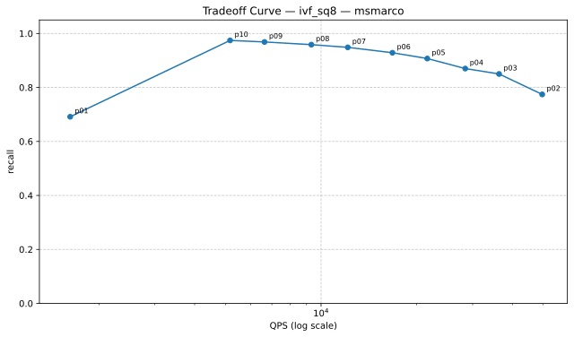

| Variant | QPS | Recall | Parameters |
|---|---:|---:|---|
| p01 | 1623.63 | 0.6914 | searcher.nprobe=4 |
| p02 | 49661.92 | 0.7743 | searcher.nprobe=8 |
| p03 | 36323.31 | 0.8500 | searcher.nprobe=12 |
| p04 | 28433.21 | 0.8700 | searcher.nprobe=16 |
| p05 | 21588.33 | 0.9071 | searcher.nprobe=24 |
| p06 | 16773.38 | 0.9286 | searcher.nprobe=32 |
| p07 | 12137.80 | 0.9486 | searcher.nprobe=48 |
| p08 | 9320.08 | 0.9586 | searcher.nprobe=64 |
| p09 | 6637.91 | 0.9686 | searcher.nprobe=96 |
| p10 | 5172.68 | 0.9743 | searcher.nprobe=128 |

##### Pareto Points (Non-dominated Frontier)

| Variant | QPS | Recall | Parameters |
|---|---:|---:|---|
| p10 | 5172.68 | 0.9743 | searcher.nprobe=128 |
| p09 | 6637.91 | 0.9686 | searcher.nprobe=96 |
| p08 | 9320.08 | 0.9586 | searcher.nprobe=64 |
| p07 | 12137.80 | 0.9486 | searcher.nprobe=48 |
| p06 | 16773.38 | 0.9286 | searcher.nprobe=32 |
| p05 | 21588.33 | 0.9071 | searcher.nprobe=24 |
| p04 | 28433.21 | 0.8700 | searcher.nprobe=16 |
| p03 | 36323.31 | 0.8500 | searcher.nprobe=12 |
| p02 | 49661.92 | 0.7743 | searcher.nprobe=8 |

##### Mermaid Quadrant Chart

_Point IDs ending with `_pareto` mark Pareto points._

```mermaid
quadrantChart
    title "ivf_sq8 Tradeoff (msmarco)"
    x-axis "Lower QPS" --> "Higher QPS"
    y-axis "Lower Recall" --> "Higher Recall"
    quadrant-1 "Fast + Accurate"
    quadrant-2 "Slow + Accurate"
    quadrant-3 "Slow + Less Accurate"
    quadrant-4 "Fast + Less Accurate"
    %% Point key uses variant IDs from the tables below; '_pareto' marks Pareto points.
    p01: [0.001, 0.001]
    p02_pareto: [0.999, 0.293]
    p03_pareto: [0.722, 0.561]
    p04_pareto: [0.558, 0.631]
    p05_pareto: [0.416, 0.763]
    p06_pareto: [0.315, 0.838]
    p07_pareto: [0.219, 0.909]
    p08_pareto: [0.160, 0.944]
    p09_pareto: [0.104, 0.980]
    p10_pareto: [0.074, 0.999]
```

Mermaid source: `./msmarco/tradeoff_curves/tradeoff_msmarco_ivf_sq8_quadrant.mmd`

Data: `./msmarco/tradeoff_curves/tradeoff_msmarco_ivf_sq8.json`

#### lsh (10 points)

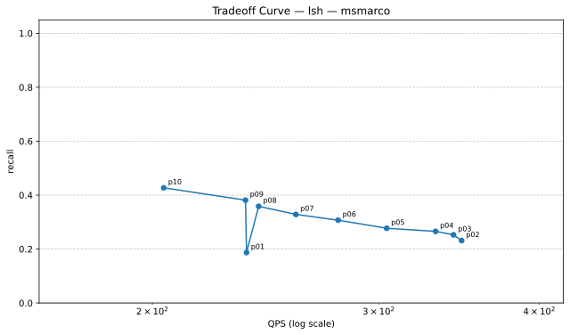

| Variant | QPS | Recall | Parameters |
|---|---:|---:|---|
| p01 | 236.75 | 0.1871 | searcher.candidate_multiplier=16 |
| p02 | 348.05 | 0.2314 | searcher.candidate_multiplier=24 |
| p03 | 343.03 | 0.2529 | searcher.candidate_multiplier=32 |
| p04 | 332.21 | 0.2657 | searcher.candidate_multiplier=48 |
| p05 | 304.32 | 0.2771 | searcher.candidate_multiplier=64 |
| p06 | 278.96 | 0.3071 | searcher.candidate_multiplier=96 |
| p07 | 258.63 | 0.3286 | searcher.candidate_multiplier=128 |
| p08 | 241.97 | 0.3586 | searcher.candidate_multiplier=160 |
| p09 | 236.33 | 0.3814 | searcher.candidate_multiplier=192 |
| p10 | 204.11 | 0.4271 | searcher.candidate_multiplier=256 |

##### Pareto Points (Non-dominated Frontier)

| Variant | QPS | Recall | Parameters |
|---|---:|---:|---|
| p10 | 204.11 | 0.4271 | searcher.candidate_multiplier=256 |
| p09 | 236.33 | 0.3814 | searcher.candidate_multiplier=192 |
| p08 | 241.97 | 0.3586 | searcher.candidate_multiplier=160 |
| p07 | 258.63 | 0.3286 | searcher.candidate_multiplier=128 |
| p06 | 278.96 | 0.3071 | searcher.candidate_multiplier=96 |
| p05 | 304.32 | 0.2771 | searcher.candidate_multiplier=64 |
| p04 | 332.21 | 0.2657 | searcher.candidate_multiplier=48 |
| p03 | 343.03 | 0.2529 | searcher.candidate_multiplier=32 |
| p02 | 348.05 | 0.2314 | searcher.candidate_multiplier=24 |

##### Mermaid Quadrant Chart

_Point IDs ending with `_pareto` mark Pareto points._

```mermaid
quadrantChart
    title "lsh Tradeoff (msmarco)"
    x-axis "Lower QPS" --> "Higher QPS"
    y-axis "Lower Recall" --> "Higher Recall"
    quadrant-1 "Fast + Accurate"
    quadrant-2 "Slow + Accurate"
    quadrant-3 "Slow + Less Accurate"
    quadrant-4 "Fast + Less Accurate"
    %% Point key uses variant IDs from the tables below; '_pareto' marks Pareto points.
    p01: [0.227, 0.001]
    p02_pareto: [0.999, 0.185]
    p03_pareto: [0.965, 0.274]
    p04_pareto: [0.890, 0.327]
    p05_pareto: [0.696, 0.375]
    p06_pareto: [0.520, 0.500]
    p07_pareto: [0.379, 0.589]
    p08_pareto: [0.263, 0.714]
    p09_pareto: [0.224, 0.810]
    p10_pareto: [0.001, 0.999]
```

Mermaid source: `./msmarco/tradeoff_curves/tradeoff_msmarco_lsh_quadrant.mmd`

Data: `./msmarco/tradeoff_curves/tradeoff_msmarco_lsh.json`

#### pq (1 points)

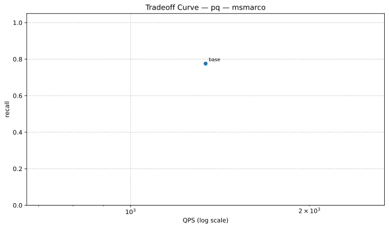

| Variant | QPS | Recall | Parameters |
|---|---:|---:|---|
| base | 1337.29 | 0.7757 | baseline |

##### Pareto Points (Non-dominated Frontier)

| Variant | QPS | Recall | Parameters |
|---|---:|---:|---|
| base | 1337.29 | 0.7757 | baseline |

##### Mermaid Quadrant Chart

_Point IDs ending with `_pareto` mark Pareto points._

```mermaid
quadrantChart
    title "pq Tradeoff (msmarco)"
    x-axis "Lower QPS" --> "Higher QPS"
    y-axis "Lower Recall" --> "Higher Recall"
    quadrant-1 "Fast + Accurate"
    quadrant-2 "Slow + Accurate"
    quadrant-3 "Slow + Less Accurate"
    quadrant-4 "Fast + Less Accurate"
    %% Point key uses variant IDs from the tables below; '_pareto' marks Pareto points.
    base_pareto: [0.500, 0.500]
```

Mermaid source: `./msmarco/tradeoff_curves/tradeoff_msmarco_pq_quadrant.mmd`

Data: `./msmarco/tradeoff_curves/tradeoff_msmarco_pq.json`

| Algorithm | Recall | QPS | Mean Query Time (ms) | Build Time (s) | Status |
|---|---:|---:|---:|---:|---|
| exact | 1.0000 | 641.88 | 1.558 | 0.78 | ok |
| ivf_flat__p10 | 1.0000 | 575.88 | 1.736 | 0.65 | ok |
| covertree_v2_2 | 1.0000 | 7.50 | 133.416 | 4387.85 | ok |
| hnsw__p10 | 0.9971 | 5508.47 | 0.182 | 11.91 | ok |
| hnsw__p09 | 0.9943 | 4117.83 | 0.243 | 12.11 | ok |
| hnsw__p08 | 0.9914 | 2625.03 | 0.381 | 12.02 | ok |
| hnsw__p07 | 0.9871 | 7897.18 | 0.127 | 11.96 | ok |
| ivf_flat__p09 | 0.9857 | 867.55 | 1.153 | 0.66 | ok |
| hnsw__p06 | 0.9857 | 2606.78 | 0.384 | 12.02 | ok |
| ivf_flat__p08 | 0.9771 | 1109.94 | 0.901 | 0.66 | ok |
| hnsw__p05 | 0.9743 | 13432.83 | 0.074 | 12.16 | ok |
| ivf_sq8__p10 | 0.9743 | 5172.68 | 0.193 | 2.85 | ok |
| ivf_sq8__p09 | 0.9686 | 6637.91 | 0.151 | 2.85 | ok |
| hnsw__p04 | 0.9629 | 2734.99 | 0.366 | 11.95 | ok |
| ivf_sq8__p08 | 0.9586 | 9320.08 | 0.107 | 2.84 | ok |
| ivf_flat__p07 | 0.9529 | 1681.63 | 0.595 | 0.65 | ok |
| ivf_sq8__p07 | 0.9486 | 12137.80 | 0.082 | 2.85 | ok |
| hnsw__p03 | 0.9486 | 10087.66 | 0.099 | 11.97 | ok |
| ivf_flat__p06 | 0.9386 | 2404.38 | 0.416 | 0.65 | ok |
| ivf_sq8__p06 | 0.9286 | 16773.38 | 0.060 | 2.85 | ok |
| ivf_flat__p05 | 0.9243 | 3349.05 | 0.299 | 0.66 | ok |
| ivf_sq8__p05 | 0.9071 | 21588.33 | 0.046 | 2.85 | ok |
| hnsw__p02 | 0.9043 | 3679.58 | 0.272 | 12.01 | ok |
| ivf_flat__p04 | 0.9014 | 4724.23 | 0.212 | 0.65 | ok |
| hnsw__p01 | 0.8871 | 3435.82 | 0.291 | 11.88 | ok |
| ivf_sq8__p04 | 0.8700 | 28433.21 | 0.035 | 2.85 | ok |
| ivf_flat__p03 | 0.8600 | 6833.66 | 0.146 | 0.65 | ok |
| ivf_sq8__p03 | 0.8500 | 36323.31 | 0.028 | 2.85 | ok |
| pq | 0.7757 | 1337.29 | 0.748 | 12.70 | ok |
| ivf_sq8__p02 | 0.7743 | 49661.92 | 0.020 | 2.84 | ok |
| ivf_flat__p02 | 0.7600 | 13853.69 | 0.072 | 0.65 | ok |
| ivf_pq__p09 | 0.7143 | 12180.60 | 0.082 | 15.54 | ok |
| ivf_pq__p10 | 0.7143 | 9334.60 | 0.107 | 15.40 | ok |
| ivf_pq__p08 | 0.7100 | 1019.14 | 0.981 | 15.95 | ok |
| ivf_pq__p07 | 0.7086 | 6024.07 | 0.166 | 15.46 | ok |
| ivf_pq__p06 | 0.7043 | 29483.96 | 0.034 | 15.45 | ok |
| ivf_pq__p05 | 0.7029 | 35622.58 | 0.028 | 15.14 | ok |
| ivf_sq8__p01 | 0.6914 | 1623.63 | 0.616 | 3.00 | ok |
| ivf_pq__p04 | 0.6886 | 45540.76 | 0.022 | 15.51 | ok |
| ivf_pq__p03 | 0.6771 | 54441.18 | 0.018 | 15.58 | ok |
| ivf_pq__p02 | 0.6400 | 64231.30 | 0.016 | 15.12 | ok |
| ivf_flat__p01 | 0.5986 | 25203.99 | 0.040 | 0.65 | ok |
| ivf_pq__p01 | 0.5871 | 1962.81 | 0.509 | 14.93 | ok |
| lsh__p10 | 0.4271 | 204.11 | 4.899 | 2.68 | ok |
| lsh__p09 | 0.3814 | 236.33 | 4.231 | 2.65 | ok |
| lsh__p08 | 0.3586 | 241.97 | 4.133 | 2.67 | ok |
| lsh__p07 | 0.3286 | 258.63 | 3.867 | 2.63 | ok |
| lsh__p06 | 0.3071 | 278.96 | 3.585 | 2.65 | ok |
| lsh__p05 | 0.2771 | 304.32 | 3.286 | 2.61 | ok |
| lsh__p04 | 0.2657 | 332.21 | 3.010 | 2.67 | ok |
| lsh__p03 | 0.2529 | 343.03 | 2.915 | 2.69 | ok |
| lsh__p02 | 0.2314 | 348.05 | 2.873 | 2.69 | ok |
| lsh__p01 | 0.1871 | 236.75 | 4.224 | 2.75 | ok |

### Algorithm Implementation Details

| Algorithm | Type | Metric | Indexer | Searcher |
|---|---|---|---|---|
| covertree_v2_2 | CoverTreeV2_2 | cosine | N/A | N/A |
| exact | Composite | cosine | BruteForceIndexer (metric=cosine) | LinearSearcher (metric=cosine) |
| hnsw__p01 | Composite | cosine | HNSWIndexer (M=16, efConstruction=200, efSearch=16, metric=cosine) | FaissSearcher (metric=cosine, nprobe=32) |
| hnsw__p02 | Composite | cosine | HNSWIndexer (M=16, efConstruction=200, efSearch=24, metric=cosine) | FaissSearcher (metric=cosine, nprobe=32) |
| hnsw__p03 | Composite | cosine | HNSWIndexer (M=16, efConstruction=200, efSearch=32, metric=cosine) | FaissSearcher (metric=cosine, nprobe=32) |
| hnsw__p04 | Composite | cosine | HNSWIndexer (M=16, efConstruction=200, efSearch=48, metric=cosine) | FaissSearcher (metric=cosine, nprobe=32) |
| hnsw__p05 | Composite | cosine | HNSWIndexer (M=16, efConstruction=200, efSearch=64, metric=cosine) | FaissSearcher (metric=cosine, nprobe=32) |
| hnsw__p06 | Composite | cosine | HNSWIndexer (M=16, efConstruction=200, efSearch=80, metric=cosine) | FaissSearcher (metric=cosine, nprobe=32) |
| hnsw__p07 | Composite | cosine | HNSWIndexer (M=16, efConstruction=200, efSearch=100, metric=cosine) | FaissSearcher (metric=cosine, nprobe=32) |
| hnsw__p08 | Composite | cosine | HNSWIndexer (M=16, efConstruction=200, efSearch=128, metric=cosine) | FaissSearcher (metric=cosine, nprobe=32) |
| hnsw__p09 | Composite | cosine | HNSWIndexer (M=16, efConstruction=200, efSearch=160, metric=cosine) | FaissSearcher (metric=cosine, nprobe=32) |
| hnsw__p10 | Composite | cosine | HNSWIndexer (M=16, efConstruction=200, efSearch=200, metric=cosine) | FaissSearcher (metric=cosine, nprobe=32) |
| ivf_flat__p01 | Composite | cosine | FaissIVFIndexer (index_type=IVF100,Flat, metric=cosine, nprobe=10) | FaissSearcher (metric=cosine, nprobe=2) |
| ivf_flat__p02 | Composite | cosine | FaissIVFIndexer (index_type=IVF100,Flat, metric=cosine, nprobe=10) | FaissSearcher (metric=cosine, nprobe=4) |
| ivf_flat__p03 | Composite | cosine | FaissIVFIndexer (index_type=IVF100,Flat, metric=cosine, nprobe=10) | FaissSearcher (metric=cosine, nprobe=8) |
| ivf_flat__p04 | Composite | cosine | FaissIVFIndexer (index_type=IVF100,Flat, metric=cosine, nprobe=10) | FaissSearcher (metric=cosine, nprobe=12) |
| ivf_flat__p05 | Composite | cosine | FaissIVFIndexer (index_type=IVF100,Flat, metric=cosine, nprobe=10) | FaissSearcher (metric=cosine, nprobe=16) |
| ivf_flat__p06 | Composite | cosine | FaissIVFIndexer (index_type=IVF100,Flat, metric=cosine, nprobe=10) | FaissSearcher (metric=cosine, nprobe=24) |
| ivf_flat__p07 | Composite | cosine | FaissIVFIndexer (index_type=IVF100,Flat, metric=cosine, nprobe=10) | FaissSearcher (metric=cosine, nprobe=32) |
| ivf_flat__p08 | Composite | cosine | FaissIVFIndexer (index_type=IVF100,Flat, metric=cosine, nprobe=10) | FaissSearcher (metric=cosine, nprobe=48) |
| ivf_flat__p09 | Composite | cosine | FaissIVFIndexer (index_type=IVF100,Flat, metric=cosine, nprobe=10) | FaissSearcher (metric=cosine, nprobe=64) |
| ivf_flat__p10 | Composite | cosine | FaissIVFIndexer (index_type=IVF100,Flat, metric=cosine, nprobe=10) | FaissSearcher (metric=cosine, nprobe=96) |
| ivf_pq__p01 | Composite | cosine | FaissFactoryIndexer (index_key=IVF256,PQ64, metric=cosine, nprobe=48) | FaissSearcher (metric=cosine, nprobe=4) |
| ivf_pq__p02 | Composite | cosine | FaissFactoryIndexer (index_key=IVF256,PQ64, metric=cosine, nprobe=48) | FaissSearcher (metric=cosine, nprobe=8) |
| ivf_pq__p03 | Composite | cosine | FaissFactoryIndexer (index_key=IVF256,PQ64, metric=cosine, nprobe=48) | FaissSearcher (metric=cosine, nprobe=12) |
| ivf_pq__p04 | Composite | cosine | FaissFactoryIndexer (index_key=IVF256,PQ64, metric=cosine, nprobe=48) | FaissSearcher (metric=cosine, nprobe=16) |
| ivf_pq__p05 | Composite | cosine | FaissFactoryIndexer (index_key=IVF256,PQ64, metric=cosine, nprobe=48) | FaissSearcher (metric=cosine, nprobe=24) |
| ivf_pq__p06 | Composite | cosine | FaissFactoryIndexer (index_key=IVF256,PQ64, metric=cosine, nprobe=48) | FaissSearcher (metric=cosine, nprobe=32) |
| ivf_pq__p07 | Composite | cosine | FaissFactoryIndexer (index_key=IVF256,PQ64, metric=cosine, nprobe=48) | FaissSearcher (metric=cosine, nprobe=48) |
| ivf_pq__p08 | Composite | cosine | FaissFactoryIndexer (index_key=IVF256,PQ64, metric=cosine, nprobe=48) | FaissSearcher (metric=cosine, nprobe=64) |
| ivf_pq__p09 | Composite | cosine | FaissFactoryIndexer (index_key=IVF256,PQ64, metric=cosine, nprobe=48) | FaissSearcher (metric=cosine, nprobe=96) |
| ivf_pq__p10 | Composite | cosine | FaissFactoryIndexer (index_key=IVF256,PQ64, metric=cosine, nprobe=48) | FaissSearcher (metric=cosine, nprobe=128) |
| ivf_sq8__p01 | Composite | cosine | FaissFactoryIndexer (index_key=IVF256,SQ8, metric=cosine, nprobe=48) | FaissSearcher (metric=cosine, nprobe=4) |
| ivf_sq8__p02 | Composite | cosine | FaissFactoryIndexer (index_key=IVF256,SQ8, metric=cosine, nprobe=48) | FaissSearcher (metric=cosine, nprobe=8) |
| ivf_sq8__p03 | Composite | cosine | FaissFactoryIndexer (index_key=IVF256,SQ8, metric=cosine, nprobe=48) | FaissSearcher (metric=cosine, nprobe=12) |
| ivf_sq8__p04 | Composite | cosine | FaissFactoryIndexer (index_key=IVF256,SQ8, metric=cosine, nprobe=48) | FaissSearcher (metric=cosine, nprobe=16) |
| ivf_sq8__p05 | Composite | cosine | FaissFactoryIndexer (index_key=IVF256,SQ8, metric=cosine, nprobe=48) | FaissSearcher (metric=cosine, nprobe=24) |
| ivf_sq8__p06 | Composite | cosine | FaissFactoryIndexer (index_key=IVF256,SQ8, metric=cosine, nprobe=48) | FaissSearcher (metric=cosine, nprobe=32) |
| ivf_sq8__p07 | Composite | cosine | FaissFactoryIndexer (index_key=IVF256,SQ8, metric=cosine, nprobe=48) | FaissSearcher (metric=cosine, nprobe=48) |
| ivf_sq8__p08 | Composite | cosine | FaissFactoryIndexer (index_key=IVF256,SQ8, metric=cosine, nprobe=48) | FaissSearcher (metric=cosine, nprobe=64) |
| ivf_sq8__p09 | Composite | cosine | FaissFactoryIndexer (index_key=IVF256,SQ8, metric=cosine, nprobe=48) | FaissSearcher (metric=cosine, nprobe=96) |
| ivf_sq8__p10 | Composite | cosine | FaissFactoryIndexer (index_key=IVF256,SQ8, metric=cosine, nprobe=48) | FaissSearcher (metric=cosine, nprobe=128) |
| lsh__p01 | Composite | cosine | LSHIndexer (hash_size=8, metric=cosine, num_tables=24, seed=42) | LSHSearcher (candidate_multiplier=16, fallback_to_bruteforce=False, metric=cosine) |
| lsh__p02 | Composite | cosine | LSHIndexer (hash_size=8, metric=cosine, num_tables=24, seed=42) | LSHSearcher (candidate_multiplier=24, fallback_to_bruteforce=False, metric=cosine) |
| lsh__p03 | Composite | cosine | LSHIndexer (hash_size=8, metric=cosine, num_tables=24, seed=42) | LSHSearcher (candidate_multiplier=32, fallback_to_bruteforce=False, metric=cosine) |
| lsh__p04 | Composite | cosine | LSHIndexer (hash_size=8, metric=cosine, num_tables=24, seed=42) | LSHSearcher (candidate_multiplier=48, fallback_to_bruteforce=False, metric=cosine) |
| lsh__p05 | Composite | cosine | LSHIndexer (hash_size=8, metric=cosine, num_tables=24, seed=42) | LSHSearcher (candidate_multiplier=64, fallback_to_bruteforce=False, metric=cosine) |
| lsh__p06 | Composite | cosine | LSHIndexer (hash_size=8, metric=cosine, num_tables=24, seed=42) | LSHSearcher (candidate_multiplier=96, fallback_to_bruteforce=False, metric=cosine) |
| lsh__p07 | Composite | cosine | LSHIndexer (hash_size=8, metric=cosine, num_tables=24, seed=42) | LSHSearcher (candidate_multiplier=128, fallback_to_bruteforce=False, metric=cosine) |
| lsh__p08 | Composite | cosine | LSHIndexer (hash_size=8, metric=cosine, num_tables=24, seed=42) | LSHSearcher (candidate_multiplier=160, fallback_to_bruteforce=False, metric=cosine) |
| lsh__p09 | Composite | cosine | LSHIndexer (hash_size=8, metric=cosine, num_tables=24, seed=42) | LSHSearcher (candidate_multiplier=192, fallback_to_bruteforce=False, metric=cosine) |
| lsh__p10 | Composite | cosine | LSHIndexer (hash_size=8, metric=cosine, num_tables=24, seed=42) | LSHSearcher (candidate_multiplier=256, fallback_to_bruteforce=False, metric=cosine) |
| pq | Composite | cosine | FaissFactoryIndexer (index_key=PQ64, metric=cosine) | FaissSearcher (metric=cosine, nprobe=48) |

### Dataset Details

- Config: `benchmark_results/benchmark_20260320_115137/msmarco/msmarco_config.yaml`
- metric: `cosine`
- topk: `20`
- n_queries: `200`
- repeat: `2`
- seed: `42`
- dataset_options.base_limit: `100000`
- dataset_options.cache_dir: `/storage/ice-shared/cs8903onl/vectordb-retrieval/results/cache`
- dataset_options.embedded_dataset_dir: `/storage/ice-shared/cs8903onl/vectordb-retrieval/datasets/msmarco_v1_embeddings`
- dataset_options.ground_truth_k: `200`
- dataset_options.query_limit: `200`
- dataset_options.use_memmap_cache: `True`
- dataset_options.use_preembedded: `True`

## Brief Takeaways

- `random`: best recall `ivf_flat__p10` (1.0000), best QPS `hnsw__p02` (546433.50)
- `glove50`: best recall `ivf_flat__p09` (1.0000), best QPS `hnsw__p01` (671088.64)
- `msmarco`: best recall `exact` (1.0000), best QPS `ivf_pq__p02` (64231.30)
