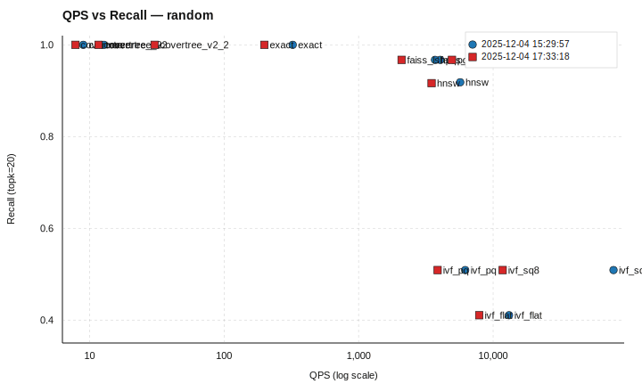

# QPS vs Recall Trade-off Summary (Dec 4, 2025)

**Sources**: `benchmark_results/benchmark_20251204_173318/benchmark_summary.md` (generated 2025-12-04 18:58:34) and `benchmark_results/benchmark_20251204_152957/benchmark_summary.md` (generated 2025-12-04 16:44:04).

## Plots

**Random (64-D synthetic)**

**GloVe50 (50-D word vectors)**

## Algorithms and implementation details

All runs use **L2** distance, **topk=20**, **n_queries=256**, **repeat=2**.

- **exact**: Composite → `BruteForceIndexer` + `LinearSearcher` (L2)
- **hnsw**: Composite → `HNSWIndexer` (M=16, efConstruction=200, efSearch=100) + `FaissSearcher` (nprobe=10)
- **ivf_flat**: Composite → `FaissIVFIndexer` (index_type `IVF100,Flat`, nprobe=10) + `FaissSearcher` (nprobe=10)
- **ivf_pq**: Composite → `FaissFactoryIndexer` (index_key `IVF256,PQ64` for random, `IVF256,PQ50` for glove50) + `FaissSearcher` (nprobe=24)
- **ivf_sq8**: Composite → `FaissFactoryIndexer` (index_key `IVF256,SQ8`) + `FaissSearcher` (nprobe=24)
- **pq**: Composite → `FaissFactoryIndexer` (index_key `PQ64` for random, `PQ50` for glove50) + `FaissSearcher` (nprobe=24)
- **faiss_lsh**: Composite → `FaissLSHIndexer` (num_bits=256) + `FaissSearcher` (nprobe=10)
- **covertree**: `CoverTree` (candidate_limits_enabled=false)
- **covertree_v2**: `CoverTreeV2`
- **covertree_v2_2**: `CoverTreeV2_2`

## Dataset details

**Random** (`benchmark_results/benchmark_20251204_173318/random/random_config.yaml`)
- Synthetic random vectors, **64 dimensions**
- Train size **20,000**, test size **512**, queries **256**
- Ground-truth k **200**, dataset seed **7**

**GloVe50** (`benchmark_results/benchmark_20251204_173318/glove50/glove50_config.yaml`)
- GloVe word vectors, **50 dimensions**
- Train limit **20,000**, test size **256**, queries **256**
- Ground-truth k **200**, dataset seed **11**

## Quick takeaways (from the plots)

- **ivf_sq8** and **ivf_flat** deliver the highest QPS at the cost of lower recall (especially on random).
- **hnsw** and **pq** offer strong recall with high QPS, clustering near the Pareto front on both datasets.
- **covertree** variants reach perfect recall but are orders of magnitude slower (single‑digit to tens of QPS).
- **exact** provides the recall ceiling but is far slower than approximate methods.
